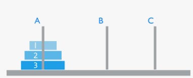

# 18 经典递归过程

* 重点在于抽象出黑盒，理清自我依赖的部分
  * 需要宏观一点看待问题
  * 理清base case

1. 汉罗塔hanoi，只能小压大，全部移动到最右边. 这里假设为三阶hanoi

   * 

     * 方法：

     * 我们需要把3移动到C，就需要先将12移动到B

       ```java
       public void leftToRight(int n) {
           if (n == 1) {
               System.out.println("move 1 from left to right"); // if only one here, move to right
               return;
           }
           leftToMid(n-1); // except last one, move all to middle
           System.out.println("move " + n + " from left to right"); // move last to right
           midToRight(n-1); // move all in middle to right
       }
       ```

     * 上面有两个黑盒需要实现 leftToMid，midToRight

       ```java
       public void leftToMid(int n) {
           if (n == 1) {
               System.out.println("move 1 from left to mid");
               return;
           }
           leftToRight(n-1);
           System.out.println("move " + n + " from left to right");
           rightToMid(n-1);
       }
       
       public void midToRight(int n) {
           if (n == 1) {
               System.out.println("move 1 from mid to right");
               return;
           }
           midToLeft(n-1);
           System.out.println("move " + n + " from mid to right");
           leftToRight(n-1);
       }
       ```

     * 上面又多了两个黑盒需要实现 rightToMid，midToLeft

       ```java
       public void rightToMid(int n) {
           if (n == 1) {
               System.out.println("move 1 from right to mid");
               return;
           }
           rightToLeft(n-1);
           System.out.println("move " + n + " from right to left");
           leftToMid(n-1);
       }
       
       public void midToLeft(int n) {
           if (n == 1) {
               System.out.println("move 1 from mid to left");
               return;
           }
           midToRight(n-1);
           System.out.println("move " + n + " from mid to left");
           rightToLeft(n-1);
       }
       ```

     * 又多了黑盒 rightToLeft

       ```java
       public void rightToLeft(int n) {
           if (n == 1) {
               System.out.println("move 1 from right to left");
               return;
           }
           rightToMid(n-1);
           System.out.println("move " + n + " from right to left");
           midToLeft(n-1);
       }
       ```

     * 至此算法coding结束，但是根据上述，我们可以将六个方法合一 (暴力递归优化)

       ```java
       public void move(int n, String from, String to, String other) {
           if (n == 1) {
               System.out.println("move 1 from " + from + " to " + to);
               return;
           }
           move(n-1, from, other, to);
           System.out.println("move " + n + " from " + from + " to " + to);
           move(n-1, other, to, from);
       }
       ```

2. 打印一个字符串的全部子序列 (序列就是说不能改变顺序)

   * base case 已经遍历完整个字符串，添加result。结束

   * 两种情况

     1. 使用当前char
     2. 不使用当前char

     ```java
     public static void printAllSubString(String str, int idx, List<String> allAns, StringBuilder curStr) {
         // base case
         if (idx == str.length()) {
             allAns.add(curStr.toString());
             return;
         }
         // condition 1: use current char
         curStr.append(str.charAt(idx));
         printAllSubString(str, idx + 1, allAns, curStr);
         curStr.deleteCharAt(curStr.length() - 1);
         // condition 2: do not use current char
         printAllSubString(str, idx + 1, allAns, curStr);
     }
     ```

3. (Q2变种)打印一个字符串的全部子序列，要求不要出现重复字面量的子序列

   * 只需要将all answers 的type换成set就可以了

4. 打印一个字符串的全部排列 (可以改变顺序)

   * 注意观察可变参数

   * 方法一：暴力递归

     * base case: 所有char都被使用时，添加result，结束
     * 每次loop有chars.size()种情况

     ```java
     public static void permutation(List<Character> chars, StringBuilder curStr, List<String> allAns) {
         if (chars.isEmpty()) {
             allAns.add(curStr.toString());
             return;
         }
         for (int i=0;i<chars.size();i++) {
             char c = chars.get(i);
             curStr.append(c);
             chars.remove(i);
             permutation(chars, curStr, allAns);
             chars.add(i, c);
             curStr.deleteCharAt(curStr.length() - 1);
         }
     }
     ```

   * 方法二：使用swap (inplace)

     * base case: 当前idx为最后一位时，添加result，结束
     * conditions：当前idx和后面的每个idx进行swap，每一种都是一个情况

     ```java
     public static void permutation2(List<Character> chars, int curIdx, List<String> allAns) {
         if (curIdx + 1 == chars.size()) {
             StringBuilder sb = new StringBuilder();
             for (char c: chars) {
                 sb.append(c);
             }
             allAns.add(sb.toString());
             return;
         }
         for (int i=curIdx; i< chars.size();i++) {
             swap(chars, curIdx, i);
             permutation2(chars, curIdx + 1, allAns);
             swap(chars, curIdx, i);
         }
     }
     
     public static void swap(List<Character> chars, int i, int j) {
         Character temp = chars.get(i);
         chars.set(i, chars.get(j));
         chars.set(j, temp);
     }
     ```

5. (Q4变种)打印一个字符串的全部排序，要求不要出现重复的排列

   * 方法一：也可以直接将result的类型改为set

   * 方法二：可以进行剪枝

     ```java
     // Q4 方法一 ? 有问题吧
     public static void permutation(List<Character> chars, StringBuilder curStr, List<String> allAns) {
         ...
         boolean[] visited = new boolean[256]; // acsii 的范围
         for (int i=0;i<chars.size();i++) {
             if (!visited[chars.get(i)]) {
                 visited[chars.get(i)] = true;
                 ...
             }
         }
     }
     
     // Q4 方法二
     public static void permutation2(List<Character> chars, int curIdx, List<String> allAns) {
         ...
         boolean[] visited = new boolean[256]; // acsii 的范围
         for (int i=curIdx; i< chars.size();i++) {
             if (!visited[chars.get(i)]) {
                 visited[chars.get(i)] = true;
                 ...
             }
         }
     }
     ```

6. 使用recursion，返还stack的栈底元素

   * 方法：类似前面C03讲的“使用栈实现队列”。但是是将系统栈当作其中一个stack

     ```java
     public static int getLastFromStack(Stack<Integer> stack) {
         int val = stack.pop();
         if (stack.isEmpty()) {
             return val;
         } else {
             int last = getLastFromStack(stack);
             stack.push(val);
             return last;
         }
     }
     ```

7. (Q6延申) 使用recusion reverse stack

   * 方法：

     ```java
     public static void reverseStack(Stack<Integer> stack) {
         if (stack.isEmpty()) {
             return;
         }
         int val = getLastFromStack(stack);
         reverseStack(stack);
         stack.push(val);
     }
     ```

# 19 暴力递归到动态规划 - 1

* 动态规划可以优化有可变参数的递归

  * 是一个渐进过程

    * 递归，有大量重复

    * 自顶向下的dp - 记忆搜索 -  傻缓存，解决大量重复计算的问题

    * 自底向上的dp - 标准的dp

1. 斐波那契数列

2. 有[1,N]的位置可以移动，小人初始位置为I， 小人必须移动K次，且每次移动一格。目标位置为P。求一共有多少种移动方式

   * 方法一：暴力递归

     * base case
       * K = 0 && I = P, 属于有效路径。返回1
       * K = 0 && I != P, 不属于有效路径，返回0
     * conditions
       * 向左走
       * 向右走
       * 需要处理走到1和走到N的时候的特殊情况
         * 1时 只能往右走
         * N时 只能往左走

     ```java
     public static int way1(int N, int I, int K, int P) {
         if (K == 0) {
             return I == P ? 1 : 0;
         }
     
         int count = 0;
         if (I == 1) {
             count =  way1(N, I + 1, K - 1, P);
         } else if (I == N) {
             count =  way1(N, I - 1, K - 1, P);
         } else {
             count = way1(N, I + 1, K - 1, P) + way1(N, I - 1, K - 1, P);
         }
         return count;
     }
     ```

   * 方法二：根据暴力递归优化重复计算, 添加查表（自顶向下dp）

     * 判断可变参数： I和K

     * 基于I和K （当前位置和剩余步数）建表 

       * I 的取值范围是 [1, N]
       * K 的取值范围是 [0, K]

       ```java
       // 将dp初始化为全部-1，表示未计算
       public static int way2(int N, int I, int K, int P, int[][] dp) {
           if (dp[I][K] != -1) {
               return dp[I][K];
           }
           
           ...
               
           dp[I][K] = count;
           return count;
       }
       ```

   * 方法三: 根据方法二，我们直到控制state的变量为I和K。从而可以分析暴力递归各个state的计算，实现自底向上dp

     * 初始化dp全部为0

     * base case

       * 当K=0时(剩余步数=0)， 只有当I == P时为1 ----->  dp\[P]\[0] = 1 （Ref 1）

     * 分析state计算conditions

       * way1(\_, I = 1，K = any, \_) = way1(\_, I + 1, K - 1, \_) = dp\[I + 1]\[K - 1] (Ref 2)
       * way1(\_, I = N，K = any, \_) = way1(\_, I - 1, K - 1, \_) = dp\[I - 1][K - 1] (Ref 3)
       * 其他 = way1(\_, I + 1, K - 1, \_) + way1(\_, I - 1, K - 1, \_) = dp\[I + 1][K - 1] + dp\[I - 1][K - 1] (Ref 4)

     * code

       ```java
       public static int way3(int N, int I, int K, int P) {
           int[][] dp = new int[N+1][K+1];
           dp[P][0] = 1; // Ref 1
       
           for (int k=1;k <= K; k++) {
               dp[1][k] = dp[1 + 1][k - 1]; // Ref 2
               for (int i=2;i<N;i++) {
                   dp[i][k] = dp[i + 1][k - 1] + dp[i - 1][k - 1]; // Ref 4
               }
               dp[N][k] = dp[N - 1][k - 1]; // Ref 3
           }
       
           return dp[I][K];
       }
       ```

3. 有一副手牌，两个玩家A和B。A先拿，B后拿。每次只能拿最左或最右的牌。手牌为0时，数大的赢。

   * 方法一： 暴力递归 - 

     * （mini-max算法 - 相当于只计算玩家A的分数，玩家B的目标是最小化这个分数）

     * 尝试找到可以递归的方式

       * 递归部分：输入：当前牌组arr ---> 输出：最大得分
       * 但是这个可变参数是牌组，明显不好进行dp。所以改动一下
         * 输入：原始数组arr，左边界L，右边界R ---> 输出：最大得分
       * 但是，我们有两个玩家，所以需要分为先手func和后手func。 
         * 先手：输入：原始数组arr，左边界L，右边界R ---> 输出：先手玩家的最大得分
         * 后手：输入：原始数组arr，左边界L，右边界R ---> 输出：先手玩家的最小的分（相当于后手玩家的最大得分）

     * base case

       * 先手L == R，只剩一张牌，选这张牌，返回这张牌的value
       * 后手L==R, 先手会拿走这张牌，后手没牌可拿，返回0

     * conditions，选出最大情况

       * 先手, 主动权在自己手中，所以可以在两种选择中，选最大的。**Max部分**
         * 选左边 arr[L] + 后手(arr, L + 1, R);
         * 选右边 arr[L] + 后手(arr, L, R - 1);
       * 后手，基于如何最小化对方收益来选择。所以选择最小的。**Min部分**
         * 也可以理解成，最小化对手的收益就可以最大化自己的收益。(因为是零和博弈)
         * 选左边 先手(arr, L + 1, R);
         * 选右边 先手(arr, L, R - 1);

       ```java
       public static int f(int[] arr, int L, int R) {
           if (L == R) {
               return arr[L];
           }
       
           int cL = arr[L] + g(arr, L + 1, R);
           int cR = arr[R] + g(arr, L, R - 1);
       
           return Math.max(cL, cR);
       }
       
       public static int g(int[] arr, int L, int R) {
           if (L == R) {
               return 0;
           }
       
           int cL = f(arr, L + 1, R);
           int cR = f(arr, L, R - 1);
       
           return Math.min(cL, cR);
       }
       ```

   * 方法二 - 自顶向下dp - 傻缓存

     * 需要两个dp表

     ```java
     public static int f(int[] arr, int L, int R, int[][] fmap, int[][] gmap) {
         if (fmap[L][R] != -1) {
             return fmap[L][R];
         }
     	
         ...
         
         fmap[L][R] = Math.max(cL, cR);
         return fmap[L][R];
     }
     
     public static int g(int[] arr, int L, int R, int[][] fmap, int[][] gmap) {
         if (gmap[L][R] != -1) {
             return gmap[L][R];
         }
     	
         ...
             
         gmap[L][R] = Math.min(cL, cR);
         return gmap[L][R];
     }
     ```

   * 方法三 - 自底向上dp - 无递归

     * 研究位置依赖，假设一共五张牌 [7, 4, 16, 15, 1].左为fmap 右为gmap

       * fmap对角线为先手的base case，gmap的对角线为后手的base case (只有一张牌时)
       * L > R的情况不存在
       * state计算
         * fmap\[L][R] = MAX(arr[L] + gmap\[L+1][R], arr[R] + gmap\[L][R-1])
         * gmap\[L][R] = MIN(fmap\[L+1][R], fmap\[L][R-1])
       * 结论：两张表相互依赖

       

     * code

       ```java
       public static void dp(int[] arr) {
           int[][] fmap = new int[arr.length][arr.length];
           int[][] gmap = new int[arr.length][arr.length];
       
           for (int i=0; i<arr.length;i++) {
               fmap[i][i] = arr[i];
           }
       
           for (int startCol = 1; startCol < arr.length; startCol++) {
               int row = 0;
               for (int col = startCol; col < arr.length; col++) {
                   fmap[row][col] = Math.max(arr[row] + gmap[row+1][col], arr[col] + gmap[row][col-1]);
                   gmap[row][col] = Math.min(fmap[row+1][col], fmap[row][col-1]);
                   row++;
               }
           }
           System.out.println(fmap[0][arr.length-1]);
           System.out.println(gmap[0][arr.length-1]);
       }
       ```

# 20 暴力递归到动态规划 - 2

* 从左往右递归的尝试模型

1. 背包问题 背包总容量，list of 货物的重量和价值。求背包装载最大价值

   * 方法1 - 暴力递归

     * 探究可能的递归

       * 货物，当前货物idx， 背包剩余容量 ---> 最高价值

       * 可变参数为 当前货物idx，背包剩余容量

     * base case
       * 当没有更多货物时，返回0

     * conditions

       * 装载当前货物

       * 不装载当前货物

     * code

     ```java
     public static int bag1(int[][] arr, int cur, int restCap){
         if (cur == arr.length) {
             return 0;
         }
         int option1 = 0; // add current item to the bag
         if (arr[cur][0] <= restCap) {
             option1 = arr[cur][1] + bag1(arr, cur+1, restCap - arr[cur][0]);
         }
     
         int option2 = bag1(arr, cur+1, restCap); // do not add current item
         return Math.max(option1, option2);
     }
     ```

   * 方法二 - 建表缓存

   * 方法三 - 动态规划

     * 判断dp的range
       * cur: [0, maxLen + 1]
       * restCap: [0, original Bag + 1]
     * 返回状态dp\[0][original Bag]
     * base case 
       * restCap为0时, 装不下任何东西，所以 dp\[any][0] = 0;
       * cur = arr.length时, 没有任何货物，所以dp\[arr.length][any] = 0;
     * state 计算
       * dp\[cur][restCap] = MAX(arr[cur].val + dp\[cur + 1][restCap - arr[cur].wgt], dp\[cur + 1][restCap])

     * code

     ```java
         public static int bag2(int[][] arr, int restCap) {
             int[][] dp = new int[arr.length + 1][restCap + 1];
             // comment 掉是因为初始化的dp本来就都是0
             // 逻辑是没问题的 满足base case
     //        for (int i=0;i<dp.length; i++) {
     //            dp[i][0] = 0;
     //        }
     //        for (int i=0;i<dp[0].length; i++) {
     //            dp[arr.length][i] = 0;
     //        }
     
             for (int row = arr.length - 1; row >= 0; row--) {
                 for (int col = 1; col <= restCap; col++) {
                     int option1 = 0; // add current item to the bag
                     if (arr[row][0] <= col) {
                         option1 = arr[row][1] + dp[row+1][col - arr[row][0]];
                     }
                     int option2 = dp[row+1][col]; // do not add current item
     
                     dp[row][col] = Math.max(option1, option2);
                 }
             }
     
             return dp[0][restCap];
         }
     ```

2. 规定1和A对应 2和B对应，....., 26和Z对应。那么111可以转化为AAA，KA，和AK。找到每个字符串有多少种转化方法。

   * 方法一： 暴力递归 从左往右尝试模型

     * 探索方法 str，curIdx ----> 最大可行数量

       * 可变参数： curIdx

     * base case

       * curIdx == str.length, 返回1
       * 如果str[curIdx] == '0' , 返回0 (这个自己没想到)

     * conditions, 情况相加

       * 使用1个char 
       * 使用2个char

     * code

       ```java
       public static int encrypt(String str, int curIdx) {
           if (curIdx >= str.length()) {
               return 1;
           }
           if (str.charAt(curIdx) == '0') {
               return 0;
           }
       
           int count = 0;
           if (curIdx + 1 < str.length()) {
               int subStr = Integer.parseInt(str.substring(curIdx, curIdx + 2));
               if (subStr >= 10 && subStr <= 26) {
                   count += encrypt(str, curIdx + 2);
               }
           }
           count += encrypt(str, curIdx + 1);
       
           return count;
       }
       ```

   * 方法二 - 建表缓存 - 略

   * 方法三 - dp

     ```java
     public static int encrypt2(String str) {
         int[] dp = new int[str.length() + 1];
         dp[str.length()] = 1;
     
     
         for (int curIdx = str.length() - 1; curIdx >= 0;curIdx--) {
             if (str.charAt(curIdx) == '0') {
                 dp[curIdx] = 0;
                 continue;
             }
     
             int count = 0;
             if (curIdx + 1 < str.length()) {
                 int subStr = Integer.parseInt(str.substring(curIdx, curIdx+2));
                 if (subStr >= 10 && subStr <= 26) {
                     count += dp[curIdx + 2];
                 }
             }
             count += dp[curIdx + 1];
     
             dp[curIdx] = count;
         }
     
         return dp[0];
     }
     ```

3. 给定一个字符串str，一个字符串类型数组arr，都是小写。arr中每一个字符串代表一个贴纸，可以把单个字符剪开使用。目的是拼出目标str至少需要多少张贴纸。贴纸有无穷张 [LT691](https://leetcode.com/problems/stickers-to-spell-word/)

   * 例子：str = “babac”，arr = {"ba", "c", "abcd"}

     * 答：至少需要两张贴纸ba和abcd，从中可以得到2个a 2个b和1个c。可以拼出str。返回2.

   * 方法一 - 暴力递归 -

     * 尝试从左到右递归方法 arr，tally ----> 最小使用数量

     * base case

       * tally all values 都是 0 ，return 0
       * 无效贴纸(一个能用的字母都没有)，return MAX_VALUE

     * conditions  - 求1 + MIN(...)

       * 循环所有贴纸

     * code

       ```java
       public static int minUse(String[] arr, Map<Character, Integer> tally) {
           boolean finished = true;
           for (char key: tally.keySet()){
               if (tally.get(key) > 0) {
                   finished = false;
                   break;
               }
           }
       
           if (finished) {
               return 0;
           }
       
           int count = Short.MAX_VALUE;
       
           for (String each: arr) {
               boolean hasValidChar = false;
               for (char c: each.toCharArray()) {
                   if (tally.containsKey(c)) {
                       if(tally.get(c) > 0) {
                           hasValidChar = true;
                       }
                       tally.put(c, tally.get(c) - 1);
                   }
               }
               if (hasValidChar) {
                   count = Math.min(count, minUse(arr, tally));
                   for (char c: each.toCharArray()) {
                       if (tally.containsKey(c)) {
                           tally.put(c, tally.get(c) + 1);
                       }
                   }
               }
       
           }
       
           return count + 1;
       
       }
       ```

   * 方法二：剪枝优化速度

     * 因为没有顺序要求，我们可以要求每次loop都满足一个更狭义的条件，从而减少分支
       * 比如，要求每次loop使用的词需要包含str中ACSII码最小的char
       * example：
         * str = “aaab”, arr = ["aa", "ba"] 
         * 其中“ba” + "aa" 也是有效组合，但是被剪枝掉了。因为我们一定会摸到“aa” + "ba", 他们是等效的

   * 方法三 - 可以改傻缓存

   * **但是不能**改严格dp，因为可变参数是字符串，没有好管理的边界范围

4. 求两个str的公共子序列的长度 (**有点不太明白**)

   * 举例：s1: "a12bc345def" s2: "MNP123QRS45Z" 最长公共自序列为"12345" 长度为5

   * 方法一 - 

     * 尝试 样本对应模型 两个obj进行比较

       * 讨论当前的结尾

     * 探究递归的结构可能性 f（s1，s2, cur1, cur2 ）----> 最长公共子序列的长度

       * 代表着**s1[0, .., cur1]** 和 **s2[0, ...,cur2]**的公共子序列最长长度
       * 可变参数为cur1 cur2

     * base case

       * 如果cur1 == 0 and cur2 == 0
         * 说明就这俩char了，相同就是1不同就是0
       * 如果cur1 ==  0
         * 如果和s1[cur1] == s2[cur2], return 1. 因为s1[0, cur1] 最长为1
         * 否则 return f(s1, s2, cur1, cur2 -1)
       * 如果cur2 == 0
         * 如果和s1[cur1] == s2[cur2], return 1. 因为s2[0, cur1] 最长为1
         * 否则 return f(s1, s2, cur1 - 1, cur2)

     * condition 找MAX(...)

       * 基于进讨论当前两个数据样本**结尾**的逻辑
       * 考虑cur1不考虑cur2
       * 不考虑cur1考虑cur2
       * 在s1[cur1] == s2[cur2]时，考虑cur1也考虑cur2

     * code

       ```java
       public static int longestCommonSubSequence(char[] s1, char[] s2, int cur1, int cur2) {
           if (cur1 == 0 && cur2 == 0) {
               return s1[cur1] == s2[cur2] ? 1 : 0;
           } else if (cur1 == 0) {
               return s1[cur1] == s2[cur2] ? 1 : longestCommonSubSequence(s1, s2, cur1, cur2-1);
           } else if (cur2 == 0) {
               return s1[cur1] == s2[cur2] ? 1 : longestCommonSubSequence(s1, s2, cur1-1, cur2);
           }
       
           int p1 = longestCommonSubSequence(s1, s2, cur1 - 1, cur2);
           int p2 = longestCommonSubSequence(s1, s2, cur1, cur2 - 1);
           int p3 = s1[cur1] == s2[cur2] ?
                   (1 + longestCommonSubSequence(s1, s2, cur1 - 1, cur2 - 1)) : -1;
           return Math.max(Math.max(p1, p2), p3);
       }
       ```

   * 方法二 - 缓存 - 略

   * 方法三 - dp - 略

# 21 暴力递归到动态规划 - 3

1. 给定一个字符串str，返回这个字符串的最长回文字序列长度 [LT516](https://leetcode.com/problems/longest-palindromic-subsequence/)

   * 举例 str "a12b3c43def2ghi1kpm", 最长为“1234321” 或 “123c321” 长度为7

   * 方法一 - tips：str和reverse(str)的最长公共子序列，就是最长回文子序列

     * 这个可以使用样本对应模型

   * 方法二 - 暴力递归 - 范围尝试模型 (专注于讨论**开头和结尾**)

     * 递归方法 str， left, right  ----> 最长长度

       * 可变参数 left right

     * base case

       * left == right, return 1
       * left + 1 == right, if str[left] == str[right] return 2 otherwise return 1;

     * conditions - 求MAX(...)

       * 左不用，右不用 f(...., left + 1, right -1);
       * 左用，右不用 f(..., left, right -1);
       * 左不用，右用 f(..., left + 1, right);
       * 在str[left] == str[right]时，左用，右用 2 + f(... , left + 1, left - 1)
         * 否则 0

     * code

       ```java
       public static int lpsl(char[] s, int L, int R) {
           if (L == R) {
               return 1;
           } 
           if (L + 1 == R){
               return s[L] == s[R] ? 2 : 1;
           }
           
           int count = Integer.MIN_VALUE;
           count = Math.max(count, lpsl(s, L + 1, R - 1)); //opt1
           count = Math.max(count, lpsl(s, L + 1, R)); //opt2
           count = Math.max(count, lpsl(s, L, R - 1)); //opt3
           count = Math.max(count, s[L] == s[R] ? 2 + lpsl(s, L + 1, R - 1): 0); //opt4
           
           return count;
       }
       ```

   * 方法三 - 缓存

   * 方法四 - dp

     ```java
     public static int lpsl2(char[] s) {
         int N = s.length;
         int[][] dp = new int[N][N];
     
         // base case
         dp[N-1][N-1] = 1;
         for (int i=0;i<N - 1;i++) {
             dp[i][i] = 1;
             dp[i][i+1] = s[i] == s[i+1] ? 2 : 1;
         }
     
         for (int i=N - 3;i>=0;i--) {
             for (int j=i+2;j < N;j++ ) {
                 int count = Integer.MIN_VALUE;
                 count = Math.max(count, dp[i + 1][j - 1]); //opt1
                 count = Math.max(count, dp[i + 1][j]); //opt2
                 count = Math.max(count, dp[i][j - 1]); //opt3
                 count = Math.max(count, s[i] == s[j] ? 2 + dp[i + 1][j - 1]: 0); //opt4
                 dp[i][j] = count;
             }
         }
     
         return dp[0][N-1];
     }
     ```

     * conditions有优化的空间，因为dp\[L+1][R]和dp\[L][R - 1]都和dp\[L+1][R-1]比较过，所以不可能比dp\[L+1][R-1]小。也就是说opt1可以省略

       * 这也是严格dp的意义，能够通过图形空间感进一步优化算法

       ```java
       public static int lpsl2(char[] s) {
       	...
                   int count = Integer.MIN_VALUE;
                   // count = Math.max(count, dp[i + 1][j - 1]); //opt1
                   count = Math.max(count, dp[i + 1][j]); //opt2
                   count = Math.max(count, dp[i][j - 1]); //opt3
                   count = Math.max(count, s[i] == s[j] ? 2 + dp[i + 1][j - 1]: 0); //opt4
                   dp[i][j] = count;
       	...
       }
       ```

2. 给定棋盘大小 10 * 9，马初始位置(x = 0,y = 0)，目标位置(a, b)， 必须走k步。有多少种走法。

   * 方法一 - 递归 - 样本对应模型 - 直接用题中给出的可变参数

     * 递归方法 x, y, K, a, b ----> 方法数量

       * 可变参数x,y,K

     * base case

       * 越界 return 0
       * K == 0 return (x==a && y==b) ? 1 : 0;

     * conditions - 求和

       * 一共八个方向
       * (1, 2),(-1, -2),(1, -2),(-1, 2),(2,1),(-2,-1),(-2,1),(2,-1)

     * code

       ```java
       public static int process(int x, int y, int K, int a, int b) {
           if (x < 0 || y < 0 || x > 9 || y > 8) {
               return 0;
           }
           if (K == 0) {
               return (x==a && y==b) ? 1 : 0;
           }
           
           int count = 0;
           count += process(x + 1, y + 2, K - 1, a, b);
           count += process(x - 1, y - 2, K - 1, a, b);
           count += process(x + 1, y - 2, K - 1, a, b);
           count += process(x - 1, y + 2, K - 1, a, b);
           count += process(x + 2, y + 1, K - 1, a, b);
           count += process(x - 2, y - 1, K - 1, a, b);
           count += process(x + 2, y - 1, K - 1, a, b);
           count += process(x - 2, y + 1, K - 1, a, b);
           
           return count;
       }
       ```

   * 方法二 - 缓存

   * 方法三 - 严格dp

     ```java
     public static int process2(int a, int b, int K) {
         int[][][] dp = new int[10][9][K + 1];
         dp[a][b][0] = 1;
         for (int rest = 1; rest <= K; rest++) {
             for (int x = 0;x<10;x++) {
                 for (int y = 0;y<9;y++) {
                     int count = 0;
                     count += pick(dp, x + 1, y + 2, K - 1);
                     count += pick(dp, x - 1, y - 2, K - 1);
                     count += pick(dp, x + 1, y - 2, K - 1);
                     count += pick(dp, x - 1, y + 2, K - 1);
                     count += pick(dp, x + 2, y + 1, K - 1);
                     count += pick(dp, x - 2, y - 1, K - 1);
                     count += pick(dp, x + 2, y - 1, K - 1);
                     count += pick(dp, x - 2, y + 1, K - 1);
                     dp[x][y][rest] = count;
                 }
             }
         }
     
         return dp[0][0][K];
     }
     
     public static int pick(int[][][] dp, int x, int y, int z) {
         if (x < 0 || y < 0 || x > 9 || y > 8) { // 一部分base case在这里
             return 0;
         }
         return dp[x][y][z];
     }
     ```

3. 给定一个数组arr，arr[i]代表第i号咖啡机泡一杯咖啡的时间。给定一个正数N，表示N个人等待咖啡机泡咖啡，每台咖啡机只能轮流泡咖啡。只有一台洗咖啡杯的机器，一次只能洗一个杯子，耗时a。洗完才能洗下一个杯子。每个咖啡杯可以自己挥发干净，耗时b。咖啡杯可以并行挥发。假设所有人拿到咖啡后立即喝干净。返回从开始等待到所有咖啡杯变干净的最短时间。

   * 新模型：业务限制模型，感觉这个难度应该是笔试题
     * 因为有的可变参数的范围不好估计，所以使用最差情况下的范围来转dp
   * code todo

   * 看到02：09：24

# 22 暴力递归到动态规划 - 4

* 可以通过空间压缩来优化二维数组空间n * m，分几种常见情况
  1. dp\[i]\[j] is related to dp\[i-1]\[j] and dp\[i][j-1]
     * 只需要生成一个长度为m的数组arr，然后从左到右更新
       * arr[i] is related to arr[i-1] arr[i]
  2. dp\[i]\[j] is related to dp\[i-1]\[j], dp\[i][j-1] and dp\[i-1][j-1]
     * 生成长度为m的数组和一个单独变量temp,然后从左到右更新
       * arr[i] is related to arr[i-1], arr[i] and temp(dp\[i-1][j-1])
       * temp = arr[i]
  3. dp\[i]\[j] is related to dp\[i-1]\[j] and dp\[i-1][j-1]
     * 只需要生成一个长度为m的数组arr，然后从右到左更新
       * arr[i] is related to arr[i-1] arr[i]

1. 一个人从左上角出发，走到右下角，只能向下向右移动。每个格子有个数字，求最小累加和。

2. arr是货币数组，其中的值都是正数。在给定一个正数aim。每个值都认为是一张货币，即便是值相同的货币也认为每一张都是不同的，返回组成的aim的方法数

   * 举例：arr = {1,1,1}  aim = 2
     * 1: 0 and 1
     * 2: 1 and 2
     * 3: 2 and 0
     * 所以一共三种

   * 从左往右尝试模型

     * base case 
       * aim == 0 - return 1
       * arr.length == curIdx - return 0
       * aim < 0 - return 0

     * conditions - sum(...)
       * use arr[curIdx]
       * not use arr[curIdx]

   * 可变参数curIdx和rest

     * recursion

       * ```java
         public static int coinWays(int[] arr, int index, int rest) {
             if (rest == 0) {
                 return 1;
             }
             if (arr.length == index || rest < 0) {
                 return 0;
             }
             return 
                 coinWays(arr, index+1, rest-arr[index])
                 +
                 coinWays(arr, index+1, rest);
         }
         ```

     * dp

       * ```java
         public static int coinWays2(int[] arr, int rest) {
             int[][] dp = new int[rest + 1][arr.length + 1];
             dp[0][arr.length] = 1;
             for (int i=arr.length-1;i>=0;i--) {
                 for (int r=0;r<=rest;r++) {
                     if (r - arr[i] >= 0) {
                         dp[r][i] += dp[r-arr[i]][i+1];
                     }
                     dp[r][i] += dp[r][i+1];
                 }
             }
             return dp[rest][0];
         }
         ```

     * dp + 空间压缩

       * ```java
         public static int coinWays3(int[] arr, int rest) {
             int[] dp = new int[rest + 1];
             dp[0] = 1;
             for (int i=arr.length-1;i>=0;i--) {
                 for (int r=rest;r>=0;r--) {
                     if (r - arr[i] >= 0) {
                         dp[r] += dp[r-arr[i]];
                     }
                     // dp[r] += dp[r];
                     // We don't need this one anymore
                 }
             }
             return dp[rest];
         }
         ```

3. Q2变种 - 每一张货币可以无限使用

   * 类似之前的剪纸题

   * 从左到右尝试模型

     * base case
       * rest == 0 - return 1
       * curIdx == arr.length - return 0
     * conditions - sum(...)
       * 使用i张当前货币 $i \in [0, i], i*arr[i] <= rest$
     * 可变参数rest和curIdx

   * dp

     * ```java
       public static void coinWaysVariant(int[] arr, int rest) {
           int[][] dp = new int[rest + 1][arr.length + 1];
           dp[0][arr.length] = 1;
           
           for (int i=arr.length-1;i>=0;i--) {
               for (int r=rest;r>=0;r--) {
                   int val = arr[i];
                   int count = 0;
                   for (int n = 0;n * val <= r;n++) {
                       count += dp[r - n * val][i + 1];
                   }
                   dp[r][i] = count;
               }
           }
          
           return dp[rest][0];
       }
       ```

     * 通过画表，观察我们可以将中间的for loop优化为

       ```java
       ...
       if (arr[i] <= r){
       	dp[r][i] = dp[r][i + 1] + dp[r - arr[i]][i + 1];
       } else {
           dp[r][i] = dp[r][i + 1];
       }
       ...
       ```

     * 也可以这么理解:

     * $$
       dp[r][i] = dp[r][i+1] + dp[r-1*arr[i]][i+1] + .... + dp[r-n*arr[i]][i+1]
       \newline
       dp[r-1*arr[i]][i] = dp[r-1*arr[i]][i+1] + .... + dp[r-n*arr[i]][i+1] 
       \newline
       Therefore:dp[r][i] = dp[r][i+1] + dp[r-1*arr[i]][i]
       $$

       

4. Q2变种 - 每张货币只能用一次，但是顺序does not matter

   * 方法1 - 回溯法

     * 统计每个面值的货币有几张，做成tally，然后按照Q3做，只不过中间的for loop需要多加一个条件，不能超过最大张数。
     * 但是违背了尝试原则 - 可变参数是一个数组 - 突破了整型的范围

   * 方法2 - 改成两个一维数组来控制

     * 一个数组coins记录面额，一个数组nums记录当前面额有几张可用
     * 方便进行dp

   * 方法3 - dp

     * 一维存当前遍历到哪个面值的币种，二维存剩余需要平凑的额度

   * 方法4 - 斜率优化

     * $$
       dp[i][r] = dp[i+1][r] + dp[i+1][r-coins[c]] + ...+dp[i+1][r-nums[c] * coins[c]]
       \newline
       dp[i][r-coins[c]] = dp[i+1][r-coins[c]] + ... dp[i+1][r - (nums[c] + 1) * coins[c]]
       \newline
       dp[i][r] = dp[i+1][r] + dp[i][r-coins[c]] - dp[i+1][r - (nums[c] + 1) * coins[c]]
       $$

5. 给定matrix N*M，给定初始位置X，Y，给定移动次数K。可以上下左右移动，计算移动K次过程中一直在N *  M的范围内的概率
   * 所有可能性$4 ^K$, 求不会走出去的方法有几个
   * base case
     * 如果在任何一步走出去了，return 0
     * 如果K走完还在里面，return 1
   * conditions - sum(...)
     * 四个方向

# 23 暴力递归到动态规划 - 5

1. 打怪兽一共H血，一共打K下，每次掉[0,M]滴血。计算能够成功杀死怪兽的概率。

   * 样本对应方法

   * 总次数$(M + 1) ^ K$

   * 有枚举行为，就有继续优化的可能性
     * 斜率优化

2. arr是面值数组，其中的值都是正数且没有重复。在给定一个正数aim。每个值都认为是一种面值，且认为张数是无限的。返回组成aim的最少货币数。

3. 给定一个正数n，找到所有拆分方式。order does not matter

   * 比如 2 可以拆 {1, 1}和{2} , 3可以拆{1,1,1},{1,2}和{3}

# 24 暴力递归到动态规划 - 6

1. 给定一个正数数组arr，请把arr种所有的数分成两个集合，尽量让两个集合的累加和接近。并返回较小的累加和。
   * 从左到右尝试模型
   * 计算整个arr的累加和S，然后求小于等于S/2的累加和。
2. Q1变种 - 要求两个集合的size一样(如果是奇数就是size最大差1)

## 总结

1. 通过暴力递归方法

   * 面试中设计暴力递归的原则 - 仅限面试 - 根据原则来找到合适的暴力递归方法

     1.  可变参数95%的概率会是整数
        * 原则1可以违反，但是不多。基本只有在1个可变参数的情况下使用。
          * 但是也只有一维线性参数

     1. 如果违反了原则一，那dp基本只能做到记忆化搜索

     1. 可变参数能少则少

   1. 四种尝试模型
      1. 从左到右
      2. 范围尝试模型
      3. 样本对应模型
      4. 业务限制模型

2. 分析有没有重复解

3. 该记忆搜索法 - 非标准动态规划

4. 改严格表结构 - 标准动态规划

5. 看看有无继续优化可能

   1. 空间压缩
   2. 斜率优化

* 存在暴力递归无法改dp的问题，比如n皇后问题
  * N*N的棋盘上，摆放N个皇后，他们需要在不同的行，列和斜线上
    * n=1 - return 1
    * n=2 - return 0
    * n=8 - return 92
  * 这题只能暴力递归
  * 可以通过位运算优化常数时间

