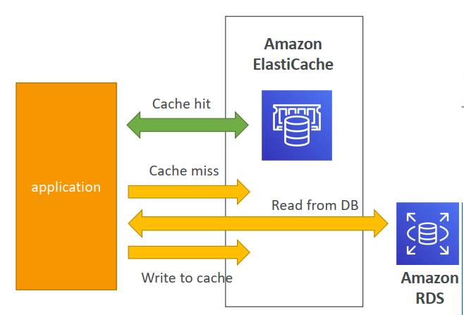

# 4 IAM Users and Groups

* Identity and Access Management Global service

* 不要使用root user

* 将不同的users划分到不同的group中，给予不同的权限

  * 

* AWS遵循least privilege principle: don't give more permissions than a user needs

  * 

  * version: policy language version 通常是"2012-10-17"
  * id (optional): policy的identifier
  * statement: one or more individual statements
    * Sid (optional): statement id
    * Effect: Allow or Deny - 允许action或不允许action
    * Principal： 这些action应用于谁(account / user / role)
    * Action: list of actions
    * Resource: list of resources
    * Condition (optional): conditions for when this policy is in effect

* IAM password policy, 可以设置密码相关的规则

  * minimum password length
  * require specific character types
    * uppercase
    * lowercase
    * numbers
    * non-alphanumeric characters
  * 允许IAM user修改密码
  * password expiration period
  * prevent password re-use

* Multi Factor Authentication - MFA

  * password + security device
  * MFA app (generating token)
    * google authenticator 
    * authy
  * MFA device (usb or display device)

* how to access aws

  * 页面 通过password + security device
    * 为IAM用户创建access key
  * CLI command line interface
    * 需要现在下载AWS CLI
    * 可以达成和页面一样的操作
    * 比如 aws iam list-users，查看所有iam user信息
  * SDK - 通过代码access

* AWS CloudShell - 页面上进行CLI操作

* IAM Roles

  * 也是权限设置，但是不用于实际的使用者。而是对于具体的服务进行权限设置

* IAM security Tools

  * credential report - account level
  * access advisor - user level

## Summary

* **Users**: mapped to a physical user, has a password for AWS Console
* **Groups**: contains users only
* **Policies**: JSON document that outlines permissions for users or groups
* **Roles**: for EC2 instances or AWS services
* **Security**: MFA + Password Policy
* **AWS CLI**: manage your AWS services using the command-line
* **AWS SDK**: manage your AWS services using a programming language
* **Access Keys**: access AWS using the CLI or SDK
* **Audit**: IAM credential Reports & IAM Access Advisor

# 5 EC2 Fundamental

* billing and budgets control
* security group
  * inbound
  * outbound
* classic ports
* ssh 登录 - 需要在security group中打开inbound的ssh端口(默认是打开的)
* ec2 default user name: ec2-user
* 如果想在ec2中执行`aws iam list-users` (章节4讲的内容)
  * 不要在环境中输入密码 (`aws configure`)啥的，可以被找到
  * 可以给ec2挂一个IAM roles，这个role给一个能够操作或者查看IAM的权限

* EC2 instances options
  * 
  * on-Demand instance - more expensive, but no upfront fee
  * reserved (1 & 3 years)
    * reserved instance - long workloads
      * reserve specific instance attributes (Type, Region, Tenancy, OS)
      * reservation period - 1 year (+discount) or 3 year (+++discount)
      * payment options - No upfront(+), partial upfront(++),all upfront(+++)
      * reserve scope - regional or Zonal
      * recommended for steady-state application (database)
      * 可以买卖
    * convertible reserved instances - long workloads with flexible instances
      * 可以改变type，instance family，OS，scope和tenancy(租期)
      * 折扣少一些
  * saving plans
    * 用时间越长discount越多
    * 使用固定花销
      * 比如 固定使用价格($10/hour for a year)
      * 超过部分按照on-demand的价格走
    * 锁instance family和region
    * size OS tenancy不锁
  * spot instances - short workload, can lose instance
    * 折扣很高，会让设定一个最高价格
    * 如果当前spot price超过设定的最高价格，instance就会被停掉
    * recommended for applications with high resilience to failure
      * batch jobs
      * data analysis
      * distributed workloads
      * image processing
    * 绝对不适合critical jobs，比如database
  * dedicated hosts- entire physical server
    * 最贵
    * 可以on-demand
    * 也可以reserve
  * dedicated instances - no other customer share your hardware
    * 可能会和其他instances share hardware
  * capacity reservations - reserve capacity in a specific AZ for any duration
    * 资源保留，运不运行都扣钱
    * 适用于短期不想被打扰的工作，还想有specific的AZ available zone

* spot instance

  * how to terminate spot instance

    * 先看spot instance的状态，如果是open active disabled，才需要关闭
    * 需要先关闭spot instance，再关闭instances
      * 要不然spot instance有可能把instances再拉起来

    

* spot fleets = set of spot instances + on-demand instance
  * 让我们可以总以最低价格launching instance
  * 设定具体需求的capacity
  * 尝试满足需求
    * 设定几种可能的launch pools
    * 持续launching instance直到满足capacity或者达到最大cost
  * 不同的launching策略
    * lowestPrice - 总是选择最便宜的
    * diversified - 尽量launching不一样的pool
    * capacityOptimized - 尽量最大化capacity
    * priceCapacityOptimized - 从满足capacity的pool中选择最便宜的

# 6 EC2 - Solutions Architect Associate Level

* public IP and elastic IP

  * public IP 每次重启时会变化
  * elastic IP 绑定一个elastic IP到instance，这样每次重启public ip就不会变了

* Placement Groups - 置放群组

  * cluster - 集中在一个rack机房

    * 优点：可以容纳大流量，高吞吐，低延迟
    * 缺点，rack机房故障，所有instances一块宕机

  * spread - 各个AZ中都有instance - 到处都是
    * 优点：异地容灾 - 一个机房的instance崩溃，其他机房的instance还是可用状态
      * 保持高可用High availability
      * reduce risk
    * 缺点：limited to 7 instances per AZ per placement group
  * partition - 将instances分成若干partitions，每个partitions在不同的rack(可能在一个AZ中)
    * 介于cluster和spread之间
    * 大数据应用
      * hdfs kafka

* ENI  - Elastic Network Interface
  * logic component in VPC (virtual private cloud)
    * 作为virtual network card
  * 包含
    * primary private IPv4，也可能包含若干secondary IPv4
    * 每个private IPv4 有一个对应的elastic IP
  * ENI 可以被独立创建，并attach到EC2上 (可以直接attach上running的instance)
    * 启动EC2的时候会自动创建，但这种的会在EC2关闭的时候自动删除
    * 但是自己创建的更好控制一点，也不会被自动删除
  * ENI有AZ的归属，只能绑定同AZ的instance
  * 对于故障切换failover很有用
    * 将故障的EC2的ENI绑定到其他instance上
* Hibernate
  * stop & terminate
    * stop - 会保留disk
    * terminate - 啥啥都没了
  * start
    * first start: OS boost， initial user data script is run
    * following start: the os boots up
    * 总之需要时间
  * hibernate 用于缩短这个时间
    * in-memroy state (RAM)会被保存
    * boot速度会更快
    * RAM state会被写入root EBS volume的file中
    * 且会被加密
    * 在需要保存RAM状态或long running processing时很有用
    * 必须小于150GB

# 7 EC2 Instance Storage

* EBS Volume - Elastic Block Store Volume

  * network drive - 可以在instance运行时绑定
  * 用于数据持久化， even after termination
  * CCP level - Certified Cloud Practitioner
    * 只能1对1 mounting
    * Associate Level可以multi attach (超纲了)
  * EBS有具体的AZ所属
  * 可以理解成网络USB，可插拔
  * free tier： 30GB
  * 有一定的延迟
    * 因为和instance可以不在一个硬件组上
    * 仅通过网络链接
  * 有预设capacity
  * 可以控制EBS在instance terminate时的行为
    * Delete on Termination attribute
      * root EBS 默认删除
      * 其他EBS默认不删除

  * EBS volumes types
    * feature分三个维度
      * size - throughout - IOPS (I/O Ops per Sec)
    * 只有GP和IO可以用于启动instance (boot volume)
    * GP2/GP3 (SSD): general purpose - balance price and performance 
      * **cost effective storage, low-latency**
      * 1GiB - 16TiB
      * GP2:
        * IOPS up to 3000
        * **size of volume and IOPS are linked**, max IOPS = 16000
        * 3 IOPS per GB, 5334GB能够到达理论最大值
      * GP3:
        * baseline: 3000 IOPS, 125MiB/s throughput
        * can increase IOPS up 16000 and throughput to 1000MiB/s **independently**
    * IO1/IO2 (SSD): high-performance - low-latency or high-throughput workloads
      * 用于critical business applicaion或对IOPS的需求大于16000的application
        * 比如数据库
      * support EBS Multi-attach
        * 只能在同一个AZ中
        * 一个EBS最多挂16个EC2 instances
        * 需要使用cluster-aware的文件系统
      * IO1/IO2
        * 4GiB - 16TiB
        * MAX PIOPS: 64000 for Nitro EC2 (高性能的EC2), 32000 for other
          * PIOPS - Provisioned IOPS
        * 可以提升单独PIOPS
        * IO2在同等价位下，比IO1的durability稳定性更好，且IOPS per GB更高
      * IO2 Block Express
        * 4GiB - 64TiB
        * sub-millisecond latency
        * MAX PIOPS: 256000 with an IOPS:GiB ratio of 1000:1
    * ST1 (HDD): low-cost HDD for frequently access
      * Throughput OPtimized HDD
      * 125GiB - 16TiB
      * 用于Big Data, Data Warehouses, Log Processing
      * Max throughput 500 MiB/s - max IOPS 500
    * SC1 (HDD): low-cost HDD for less frequently access
      * cold HDD
      * 125GiB - 16TiB
      * cheapest
      * Math throughput 250 MiB/s - max IOPS 250

* EBS snapshot
  * EBS的backup
  * snapshot有AZ所属
  * 尽管不强制要求detach volume，但最好还是detach在生成snapshot
  * 可以跨AZ
  * features
    * archive
      * 价格更便宜，但是restore的时间更长 - 24-72hours
      * recycle bin for EBS snapshots
        * 可以recover删掉的snapshot
        * retention时间可以设置1天到1年
      * FSR - fast snapshot restore
        * 快速snapshot，no latency
        * 但是很贵

* AMI - Amazon Machine Image
  * EC2 instance的customization
    * 可以添加software configuration OS
    * faster boot，因为可以pre install
  * AMI有所属AZ，但是可以在regions之间copy
  * 三个主要来源
    * AWS 官方 AMI
    * own AMI
    * marketplace AMI
* EC2 Instance Store
  * 和EBS差不多，但是高性能
  * 不能用于数据持久化。一位stop的时候会lose storage
  * 常用于buffer/ cache/ scratch data/ temporary content
  * rack崩了数据就没了

* EBS Encryption
  * 特性
    * volume中的数据是加密的
    * instance和volume之间数据的传输是加密的
    * 创建的snapshot是加密的
    * 通过加密snapshot创建的volume是加密的
    * 未加密的snapshot可以加密 (通过 copy)
  * 几乎产生延迟
  * 全部由平台完成，不感知
  * 使用KMS(AES-256)加密
* Amazon EFS - Elastic File System
  * NFSv4.1
  * 仅兼容Linux AMI
  * managed NFS (network file system) that can be mounted on many EC2
  * EFS works with EC2 instances in **multi**-AZ
  * highly available, scalable, expensive （3x gp2）, pay per use
  * 使用security group to control access to EFS
  * 可以加密
  * 有standard file API
  * EFS scale 
    * automatically scale
    * baseline: 1000s of concurrent NFS client, 10 GB+/s throughput
    * up to Petabyte-scale
  * performance Mode
    * General Purpose (default) - latency-sensitive use cases
      * webserver
    * Max IO - higher latency, throughput, highly parallel 
      * big data, media processing
  * Throughput Mode
    * Bursting - 1TB = 50MiB/s + burst of up to 100MiB/s
    * Provisioned - set your throughput regardless of storage size 1GiB/s for 1TB storage
    * Elastic - automatically scales 
  * Storage Classes
    * storage tier
      * Standard: for frequent access
      * Infrequent Access (EFS-IA): 
        * 超过X天没有被访问的过的文件会进入EFS-IA
        * 成本更低
    * Availability and durability
      * standard (Reginal)：
        * multi-AZ - synchronous replication
        * great for production environment 
      * one zone：
        * one-AZ
        * great for dev environment
        * backup enabled by default
        * compatible with IA (EFS One Zone-IA)

* EFS vs EBS vs instance store

  * EBS

    * EBS only bond one instance (除了IO)
    * 有AZ所属
    * IOPS跟着disk size上涨 (GP2)
    * IOPS也可以单独上涨 (IO1)

    * 使用snapshot 跨AZ
    * backup需要用到IO，所以会和application抢网
    * 在EC2 terminate时root EBS 默认terminate 

  * EFS

    * 链接多个instances，且跨AZ
    * share website files
    * only for linux
    * 更贵
    * 使用EFS-IA来省钱

  * Instance Store

    * physically attached to instance
      * instance terminate时，就丢了

# 8 High Availability and Scalability: ELB & ASG

* Scalability

  * adapting to handle greater loads
    * two types of scalability
      1. vertical scalability (scale up / down)
         * increase size (performance) of instance
         * limited by hardware
      2. horizontal scalability - elasticity (scale out / in)
         * increase the number of instances
         * Auto Scaling group
         * Load Balancer

  * scalability 和HA相关，但是不同

* High Availability

  * similar with horizontal scaling
  * 在至少两个data centers (AZ)有instances
  * passive or active
  * Auto-scaling group multi AZ
  * Load Balancer multi AZ

* Load Balancing

  * forward (转发) traffic to multiple servers
  
  * 优点
    * spread load across instances
    * only expose a single point of access
    * seamlessly 无缝地 handle failures of downstream instances
    * regular health checks
      * 通过http port+route (e.g. 4567 /health) 
      * 如果回复不是200，说明unhealthy。那么接下来不会给他forward了
    * SSL
    * 增加cookie粘性？
    * HA
    * separate public traffic from private traffic
  
  * Elastic Load Balancer优点
    * AWS负责ELB的维护，升级和HA
    * 自己搞虽然便宜，但是维护成本高
    * 和许多AWS的功能和服务高度集成
  
  * AWS load balancer的四个种类
    1. classic load balancer - 2009 - CLB (deprecated)
       * HTTP, HTTPS, TCP, SSL
       
    2. Application Load Balancer - 2016 - ALB
       * HTTP, HTTPS, webSocket
       * on layer 7 (http)
       * load balancing to multiple HTTP applications across machines (target groups)
       * load balancing to multiple applications on the same machine (ex: containers)
       * 将client的ip包含在header中“X-Forwarded-For”
       * routing
         * based on path in URL (xxx/**users**)
         * based on hostname in URL (**one.example.com**)
         * based on Query String and headers (xxx/xxx?**id=123&order=456**)
       * 用于micro services & container-based application
       * target groups
         * 包含的对象
           * EC2 instances
           * ECS tasks
           * Lambda functions
           * IP addressess - must be private
         * health check在target group level
         * ALB可以route多个target groups
         * 有static dnsname
       * 基于参数可以route到不同target groups
         * 
       
    3. Network Load Balancer - 2017 - NLB
       * TCP, TLS, UDP
       * target groups
         * EC2 instances
         * IP Addresses
         * Application Load Balancer
       * health check支持三种protocols
         * TCP, HTTP and HTTPS
       * 可以提供极佳的性能 - 低延迟 - 高性能
       * 可以为每个AZ提供一个static ip address
       
    4. Gateway load Balancer - 2020 - GWLB
       * operates at layer 3 - ip protocol
       * 主要作用
         1. transparent network gateway
         2. load balancer
            * 连接防火墙等第三方appliance
       * target group
         * EC2
         * IP Address - must be private IPs
       
       * 使用GENVE protocol
       
       
  
  * Sticky Sessions
  
    * 通过balancer会均匀分配所有请求到所有instances
    * 我们可以使用cookies控制每次都将同一个user的request发到固定的instances - 用于保存session information
      * 两种cookies
        1. Application-based Cookies
           * custom cookie
             * generated by the target
             * can include any custom attributes
             * name 由用户自己定义
               * 不能使用AWSALB AWSALBAPP AWSALBTG
           * Application cookie
             * generated by load balancer
             * name：AWSALBAPP
        2. duration-based Cookies
           * genrated by load balancer
           * name: AWSALB | AWSELB
    * 可以在除了gateway load balancer以外的所有balancer中使用
  
  * Cross-Zone Load Balancing
  
    * enabled by default for ALB - free
    * disabled by default NLB & GWLB -need to pay
    * **with** cross zone load balancing
      * 均匀分配所有requests到所有AZ中的所有instances
      * 
      * 如果AZ1有两个instances，AZ2有八个instances
        * 每个instances handle 10%的requests
    * **without** cross zone load balancing
      * 同一个AZ中的instances均匀分配同一个AZ中的requests
      * 
  
  * SSL/TLS
    * SSL is Secure Sockets Layer
    * TLS is Transport Layer Security, which is a newer version of SSL
    * 通常就当作一种东西了
    * Load Balancer 可以使用X.509 certificate
    * 可以使用ACM (AWS Certificate Manager) 管理certificate
      * 也可以上传自己的certificate
    * HTTPS listener
      * 需要有一个default certificate
      * client使用SNI (Server Name Indication) 来规定要访问的hostname
      * 可以支持older version of SSL
    * SNI
      * 用于加载多个SSL到一个web server
      * 在SSL 握手是，client需要明确目标服务器的hostname
        * server会找到对应的certificate，或default certificate
      * 只在ALB，NLB和CloudFront上生效
  * Connection Draining
    * 有两个名字
      * connection Draining for CLB
      * Deregisration Delay for ALB and NLB
    * 在instance处理in-flight requests时，设定一个time。
      * 在这个时间内instance时de-registering or unhealth
  * Auto Scalling Group - ASG
    * 根据实际流量 自动增加或减少instance
    * scale out - 增加
    * scale in - 减少
    * 可以设定一个最大和最小instance数量
    * 可以自动注册到load balancer中
    * 免费！
    * attributes
      * launch template
      * min/max/initial size
      * auto scalling policy - based on CloudWatch Alarm
    * Dynamic Scaling Policies
      * Target Tracking Scaling
        * 设定需要达成的指标
        * 比如：保持平均CPU使用率为40%
      * Simple / Step Scaling
        * 设置scaling up/down的触发条件
        * 比如：CPU使用率大于70%时，添加两个instances
      * Scheduled Action
        * 设置具体时间段的需求
      * predictive scaling
        * AWS自动预测
      * 常用的指标metrics
        * CPUUtilization: Average CPU
        * RequestCountPerTarget: Average number of (on-fly) requests
        * Average Network In/Out
        * any customized metrics is acceptable
      * Scalling Cooldown
        * 默认300sec，用于让metrics稳定一下
        * 可以用ready-to-use AMI来加速部署过程，从而缩短cooldown

# 9 RDS + Aurora + ElastiCache

## RDS

* Relational Database Service

* data engine - Postgres, MySQL, MariaDB, Oracle, Microsfot SQL Server, Aurora(aws自研的数据库)

* 和直接部署在instance中的DB的区别

  * 优点
    1. automated provisioning 自动提供
    2. continuous backups and restore to specific timestamp
    3. dashboard monitor
    4. “read replicas” for improving read performance
       * need to modify SQL connection string
    5. multi AZ setup for DR (Disaster Recovery)
    6. Maintenance windows for upgrades ？
    7. scaling capability (vertical & horizontal)
    8. storage backed by EBS (gp2 or io1)
  * 缺点
    * 无法ssh登录

* Storage Auto Scaling

  * 用于在检测到剩余storage不够时，自动增加storage
    * 减少手动操作
  * 必须设置一个**maximum storage threshold**
  * 自动扩容条件
    1. free storage低于10%
    2. low-storage持续了至少5分钟
    3. 6小时内没有其他扩容操作
  * 用于unpredictable workloads

* Read Replicas

  * up to 15 read replicas
  * 可以cross AZ，也可以cross region
    * cross AZ不cross region - 免费
  * ASYNC，最终会consistent
  * replicas可以直接变成一个独立的数据库
  * 需要update connection string to leverage replicas
  * 常见use cases
    * 分离reporting application和production application
      * 防止report application拖慢生产环境数据库速度

* multi AZ - Disaster Recovery

  * 和read replicas是两个不同的东西

  * SYNC replication

  * 和主数据库使用同一个DNS name

  * increase availability

  * 能够处理一下几种情况的failover

    * loss of AZ, network
    * instance or storage failure

  * 不需要人工干预

  * 不能用于scaling

  * Note：read replicas can be setup as Multi AZ

  * how to change from single AZ to multi AZ

    * zero downtime operation - 不需要shutdown DB

    * 只需要click modify 

    * internally steps:

      1. snapshot is taken
      2. new DB in new AZ restored from snapshot
      3. synchronization is established between the two databases

      

* RDS Custom

  * 让用户可以直接access database和OS
    * configure settings
    * install patches
    * enable native features
    * 通过SSH和SSM Session Manager登录
  * 可以de-activate automation mode
  * RDS vs RDS custom
    * RDS：managed by AWS
    * RDS custom: customer can access all (OS and database)

* Aurora - AWS proprietary technology - not open sourced

  * Aurora **supports** Postgres and MySql
  * cloud-optimized - better performance
  * automatic scaling, 10GB each time, up to 128TB
    * therefore do not need monitoring
  * the replication process is faster
  * failover is instantaneous(瞬间完成的) - HA native
  * more expensive (20% more)
  * one instance takes writes
  * master + up to 15 replicas
  * support cross region replication
  * client always update data through writer endpoint
  * reader endpoint
  * backtrack, can rollback to any specific time
  * customer endpoint
    * subset of aurora instances for handling different replicas
    * reader endpoint is generally not used after defining custome endpoint

  * aurora serverless
    * good for infrequent, intermittent(间歇地), unpredictable workloads
    * pay per second, more cost-effective

  * Multi-Master
    * continuous write availability for writer
    * if writer goes down, other reader will be promoted as new master
  * Global Aurora
    * cross region read replicas
      * useful for disaster recovery
      * simple to put in place
    * global database
      * 1 primary region (R/W)
      * up to 5 secondary regions (R only)
      * up to 16 read replicas per secondary region
      * it can decrease latency
      * promoting another region within 1 min
      * cross-region replication less than 1 sec
  * Machine Learning

* RDS/Aurora Backups

  * automated backups
    * daily full backup
    * transaction logs are backed-up by RDS every 5 mins
      * ability to restore to any point in time

    * 1 to 35 days of retention, set 0 to disable automated backups

  * manual DB snapshots
    * triggered by user
    * retention of backup for as long as you want

  * trick: stopped RDS still needs to be paid for storage. you should snapshot and restore for a long time stop.
  * restoring 
    * restore will create a new database
    * RDS 
      * create backup of on-premises（本地的） database
      * store it on Amazon S3
      * restore backup file onto new RDS

    * Aurora
      * create backup of on-premises database using Percona XtraBackup
      * store on S3
      * restore backup file onto a new aurora cluster

  * cloning
    * create a new DB cluster from a existing one
    * faster than snapshot and restore
    * use copy-on-write protocol
    * very fast and cost-effective
    * useful to create a "staging" database from a "production" database 

* RDS security

  * At-rest Encryption
    * using KMS 0 must be defined as launch time
    * if master is not encrypted, replicas cannot be encrypted
    * to encrypt an un-encrypted database, go through a DB snapshot and restore as encrypted

  * in-flight encryption
    * TLS-ready by default, use the AWS TLS root certificates clients-side

  * IAM Authentication
    * IAM roles to connect to your database
    * Oracle do not support this.

  * security Groups
    * control network access to your RDS / Aurora

  * No SSH available
    * except on RDS Custom

  * Audit Logs can be enabled and sent to CloudWatch for longer retention

* RDS proxy

  * full managed database proxy for RDS
  * allows apps to pool and share DB connections
  * improving database efficiency by reducing the stress on database resources and minimizing open connections
  * Serverless, autoscaling, highly available (multi-AZ)
  * Reduced RDS & Aurora failover time by up 66%
  * Supports RDS and Aurora
  * no code changes required
  * enforce IAM authentication for DB and securely store credentials in AWS secrets Manager
  * RDS proxy is never publicly accessible


* Amazon ElastiCache Overview

  * managed Redis or Memcached
  * caches are in-memory databases with really high performance, low latency
  * helps reduce load off of database
  * make application stateless
  * AWS takes care of OS maintenance/patching, optimizations, setup, configuration, monitoring, failure recovery and backups
  * it will cause heavy application code changes

  * architecture - DB cache
    * 
    * applications queries elastiCache, if not available, get from RDS and store in ElastiCache
    * cache must have invalidation strategy to make sure only the most current data is used in there.
  * architecture - DB cache
    * 
    * user logs into any of the application
    * the application writes the session data into ElastiCache
    * the user hits anther instance of our application
    * the instance retrieves the data and the user is already logged in 
  * redis vs memcached
    * redis
      * multi AZ with auto failover
      * read replicas to scale reads
        * high availability
      * Data durability with AOF(Append Only File) persistence
      * backup and restore feature
      * support sets and sorted-sets
    * memcached
      * multi-node for partitioning of data - sharding
      * no high availability
      * non persistent
      * no backup and restore
      * multi-threaded architecture
  * security
    * supports IAM Authentication for Redis
      * only for API-level security
    * redis AUTH
      * can set password/token when creating a redis cluster
      * extra level of security
      * support SSL
    * memcached
      * support SASL-based authentication
    * pattern
      * lazy loading
        * all the read data is cached, data can become stale in cache
      * write loading
        * adds or update data in the cache when written to a DB
          * no stale data
      * Session store
        * sotre temporary session data in a cache (using TTL features)
    * redis use case
      * gaming leaderboards are computationally complex
      * redis sorted sets guarantee both uniqueness and element ordering
      * each time a new element added, it's ranked in real time, then added in correct order 

# 10 Route 53

* what is DNS

  * domain Name System which translates the human friendly hostnames into the machine IP addresses

* terminologies

  * domain registrar: Amazon Route 53, GoDaddy
  * DNS records: A, AAAA, CNAME, NS
  * Zone File: contains DNS records
  * Name Server: resolves DNS queries
  * Top Level Domain TLD: com, us, in, gov, org
  * Second Level Domain SLD: amazon.com, google.com
  * 

* how DNS works

  * request order: Local -> Root -> Top -> Secondary

* Amazon Route53

  * high availability, scalability, fully managed, authoritative

  * records

    * how you want to route traffic for a domain
    * each record contains
      * domain/subdomain Name - example.com
      * Record Type - A or AAAA
      * Value - 12.34.56.78
      * Routing Policy - how Route 53 responds to queries
      * TTL - time to live
    * supports the following DNS record types
      * A/AAAA/CNAME/NS - must know
        * A - maps a hostname to IPv4
        * AAAA - maps a hostname to IPv6
        * CNAME - maps to hostname to another hostname
          * the target is a domain name which must have an A or AAAA record
          * Can't create a CNAME record for the top node of DNS namespace
            * can't create for example.com, but can create for www.example.com
        * NS - Name Servers for the Hosted Zone
          * Control how traffic is routed for a domain
      * CAA/DS/MX/NAPTR/PTR/SOA/TXT/SPF/SRV - advanced

  * Hosted Zones

    * public hosted Zone
      * contains records that specify how to route traffic on the internet (public domain names)
    * private hosted Zone
      * contains records that specify how you route traffic within one or more VPCs (private domain names)
    * $0.5 per month per hosted zone

  * TTL - time to live

    * If client requested the hostname, Route53 will reply IP address and TTL.
    * This IP will be stored in cache of client's device.
    * if client requested again and TTL is greater than 0, it can directly get target IP address from cache
    * high TTL - 24hrs
    * low TTL - 60 sec
    * TTL is mandatory for each DNS record, except Alias

  * CNAME vs Alias

    * CNAME
      * points a hostname to any other hostname
        * only for non root domain (xxx.example.com)
    * Alias
      * points a hostname to an AWS resource
        * works for root domain and non root domain (example.com)
        * AWS resources
          * 
          * can't set an Alias record for an EC2 DNS name
      * free of charge
      * automatically recoginizes changes in the resource's IP addresses
      * Alias records is always of type A/AAAA for AWS resources
      * can't set TTL, it is set by Route53

  * Routing Policy

    * define how route 53 responds to DNS queries

    * Don't get confused by the word "routing"

      * not the same as load balancer routing which routes the traffic
      * DNS only responds to the DNS queries

    * health checks

      * HTTP health checks are **only** for public resources
      * health check => Automated DNS Failover:
        1. Health checks that monitor an endpoint
           * about 15 global health checkers will check the endpoint health
             * Healthy/Unhealthy Threshold - 3 (default)
             * Interval - 30 sec
             * Supported protocol: HTTP, HTTPS and TCP
             * If > 18% of health checkers report the endpoint is healthy, Route53 considers it healthy
             * Ability to choose which locations you want Route53 to use
           * Health Checks pass only when the endpoint responds with the 2xx and 3xx status codes
           * Health Checks can be setup to pass/fail based on the text in the first 5120 bytes of the response
           * Configure your router/firewall to allow incoming requests from Route53 Health Checkers
        2. Health checks that monitor other health checks
           * Calculated Health Checks
             * Combine the results of multiple Health Checks into a single Health Check
             * You can use OR, AND or NOT
             * Can monitor up to 256 Child Health Checks
             * Specify how many of the health checks need to pass to make the parent pass
             * Usage: perform maintenance to your website without causing all health checks to fail
        3. Health checks that monitor CloudWatch Alarms
           * Route 53 health checkers are outside the VPC.
           * They can't access private endpoints.
           * Can create a CloudWatch Metric and associate a CloudWatch Alarm, then create a Health Check that checks the alarm itself.

      * Simple
        * can specify multiple values in the same record
        * If multiple values are returned, a random one is chosen by the client
        * When Alias enabled, specify only one AWS resource
        * Can't be associated with Health Checks
      * Weighted
        * control the % of the requests that go to each specific resource
        * assign each record a relative weight:
          * traffic (%) = $\frac{Weight \ for \ a \ specific \ record}{Sum \ of \ all \ the \ weights \ for \ all \ records} $
          * weights do not need to sum up to 100
        * DNS records must have the same name and type 
        * Can be associated with Health Checks
        * Use cases: load balancing between regions, testing new application versions
        * Assign a weight of 0 to a record to stop sending traffic to a resource
        * If all records have weight of 0, then all records will be returned equally
      * Failover
        * associated with health check
        * primary one works when it is healthy
        * secondary one works when it is unhealthy
      * Latency
        * redirect to the resource that has the least latency close to us
        * super helpful when latency for users is a priority
        * latency is based on traffic between users and AWS regions
        * Germany users may be directed to the US if that is the lowest latency
        * can be associated with health checks
      * IP - Based
        * routing is based on clients' IP addresses
        * You provide a list of CIDRs (Classess Inter-Domain Routing) for your clients and the corresponding endpoints/locations
        * Use cases: Optimize Performance, reduce network costs...
        * Example: route end users from a particular ISP to a specific endpoint
      * Geolocation
        * Different from Latency-based
        * This routing is based on user location
        * Specify locationn by Continent, Country or by US State
        * Should create a "default" record
        * Use cases: website localization, restrict content distribution, load balancing
        * Can be associated with Health Checks
      * Multi-value answer
        * Use when routing traffic to multiple resources
        * Route 53 returns multiple values/resources
        * Can be associated with Health Checks
        * Up to 8 healthy records are returned for each Multi-Value query
        * Multi-Value is not a substitute for having an ELB
      * Geoproximity
        * Route traffic to resources based on the geographic location of users and resources
        * Ability to shift more traffic to resources based on the defined bias
          * to change the size of the geographic region, specify bias values
            * to expand (1 to 99) - more traffic to the resources
            * to shrink (-1 to -99) - less traffic
        * Resources can be
          * AWS resources
          * Non-AWS resources (latitude and longitude)
        * You must use Route 53 Traffic Flow (advanced) to use this feature

* Third party domain and Route 53
  * buy or register domain name with a domain registrar typically by paying annual charges
  * The Domain Registrar usually provides you with a DNS service to manage your DNS records
  * But you can use another DNS service to manage your DNS records
  * Example: Purchase the domain from GoDaddy and use Route 53 to manage your DNS records

# 11 Classic Solutions Architecture Discussions

## Demo Projects

* Project: www.whattimeisit.com
  * A single user sends a request to the server, and the server replies the current time.
    * one public EC2 instance (T2) with an elastic IP address
  * More users
    * vertically scale (T2 -> M5)
    * but has some downtime while upgrading to M5
  *  More and More users and users dislike downtime
    * horizontal scale (M5 -> M5 M5 M5)
  * But each EC2 has its own Elastic IP address
    * using Route53 to shrink multi-IP addresses into one host name
  * But TTL will let some users think the server is down when the server with IP they previously got goes down
    * Using the Load Balancer + health check, and converting public EC2 instances into private instances
      * using security groups rules to manage
      * Put an alias record to route 53 for redirecting to the load balancer
  * Adding and remove instances manually is bad
    * auto-scaling group
  * All instances in a single AZ, so this application cannot handle some unexpected disasters (earthquake)
    * Multi-AZ - distributing load balancers and instances into multi AZs
  * Needs at least two instances are working all time during the year.
    * reserve capacity and set minimum to 1 instances

* Project: www.myclothes.com

  * Based on previous project architecture

  * users need to add items into shopping cart

    1. method1 - stickiness (Session Affinity) - requests from the same user direct to the same server

    2. method2 - cookies

       * adv - keep server stateless

       * disadv

         1. has security risk - need to validate

         2. heavier HTTP request
         3. no more than 4KB

    3. method3 - server session

       * ElastiCache - store / retrieve session data
       * Amazon DynamoDB (alternative)
       * this is much more secure than cookies

  * storing user data

    * Amazon RDS

  * Scaling reads

    1. Method1 - RDS Master (writes) + replicas (reads)
    2. Method2 - Lazy Loading (cache)

  * Handle Disasters

    * Route53 is highly available, so we do not need to handle it/
    * Multi-AZ
      * ELB
      * auto-scaling group - EC2 instances
      * RDS
      * ElastiCache

* Project: www.MyWordPress.com

  * based on previous project architecture
    * upgrade database to Aurora for better scaling 
  * Storing images with single instances
    * EBS - Elastic Blob Storage

  * Storing images with multi instances
    * EFS - attach ENI to instances and use EFS to store images

## Instantiating applications quickly

* EC2 Instances
  * **Use a Golden AMI**: Install your applications, OS, dependencies, etc. beforehand and launch your EC2 instance from the Gloden AMI
  * **Bootstrap using User Data:** For dynamic configuration, use User Data scripts
  * **Hybrid:** Mix Golden AMI and User Data (Elastic Beanstalk)
* RDS Database:
  * **Restore from a snapshot:** The database will have schemas and data ready
* EBS Volumes:
  * **Restore from a snapshot:** The disk will already be formatted and have data.

## Beanstalk Overview

* Elastic Beanstalk is a developer centric view of deploying an application on AWS
* It uses all the component's we've seen before: EC2, ASG, ELB, RDS, ....
* Managed service
  * Automatically handles capacity provisioning, load balancing, scaling, application health monitoring, instance configuration, ....
  * Just the application code is the responsibility of the developer
* We still have full control over the configuration
* beanstalk is free but you pay for the underlying instances
* components
  * Application: collection of Elastic Beanstalk Components (environments, versions, configurations, ...)
  * Application Version: an iteration of your application code
  * Environment: 
    * collection of AWS resources running an application version (only one application version at a time)
    * Tiers: Web server environment Tier & Worker Environment Tier(SQS Queue)
    * You can create multiple environments (dev, test, prod, ...)
    * 

# 12 Amazon S3 Introduction

* use cases

  * backup and storage
  * disaaster recovery
  * archive
  * hybrid cloud storage
  * application hosting
  * media hosting
  * data lakes & big data analytics
  * software delivery
  * static website

* buckets

  * Amazon S3 allows people to store objects (files) in "buckets" (directories)
  * Buckets must have a globally unique name (across all regions all accounts)
  * buckets are defined at the region level
  * S3 looks like a global service but buckets are created in a region
  * Naming convention
    * No uppercase, No underscore
    * 3-63 characters long
    * Not an IP
    * Must start with lowercase letter or number
    * Must Not start with the prefix **xn--**
    * Must not end with the suffix **-s3alias**

* Objects

  * objects (files) have a key
  * the key is the FULL path:
    * s3://my-bucket/my_file.txt
    * s3://my-bucket/my_folder/another_folder/my_file.txt
  * The key is composed of ***prefix*** + <u>object name</u>
    * s3://my-bucket/***my_folder/another_folder*/**<u>my_file.txt</u>
  * There's no concept of "directories" within buckets (although the UI will trick you to think otherwise)
  * Just keys with very long names that contain slashes ("/")
  * Object values are the content of the body
    * max object size is 5TB (5000GB)
    * if uploading more than 5GB, must use "multi-part" upload
  * Metadata (list of text key/value pairs -- system or user metadata)
  * Tags (Unicode key / value pair -- up to 10) -- useful for security / lifecycle
  * Version ID (id versioning is enabled)

* Security

  * **User-based**

    * IAM Policies - which API calls should be allowed for a specific user from IAM

  * **Resource-based**

    * Bucket Policies - bucket wide rules from the S3 console - allows account (most common)

      * JSON based policies

        * resources: buckets and objects
        * effect: allow / deny
        * actions: set of API to allow or deny
        * principal: the account or user to apply the policy to 

      * Use S3 bucket for policy to 

        * grant public access to the bucket
        * force objects to be encrypted at upload

      * example: 

        * ```json
          {
              "Version": "2012-10-17",
              "Statement": [
                  {
                      "Sid": "PublicRead",
                      "Effect": "Allow",
                      "Principal": "*",
                      "Action": [
                          "s3:GetObject"
                      ],
                      "Resource": [
                          "arn:aws:s3:::examplebucket/*"
                      ]
                  }
              ]
          }
          ```

    * Object Access Control List (ACL) - finer grain (can be disabled)

    * Bucket Access Control List (ACL) - less common (can be disabled)

  * **Note**: an IAM principal can access an S3 object if

    * The user IAM permissions ALLOW it OR the resource policy ALLOWS it
    * AND there's no explicit DENY

  * **Encryption**: encrypt objects in Amazon S3 using encryption keys

* Static website hosting
  * S3 can host static websites and have them accessible on the Internet
  * The website URL will be (depending on the region)
    * http://***bucket-name***.s3-website-***aws-region***.amazonaws.com
    * or
    * http://***bucket-name***.s3-website.***aws-region***.amazonaws.com
  * if getting a 403 forbidden error, make sure the bucket policy allows public reads
* Versioning
  * You can version your files in Amazon S3
  * It is enabled ar the bucket level
  * Same key overwrite will change the "version": 1,2,3,...
  * It is best practice to version your buckets
    * protect against unintended deletes (ability to restore a version)
    * Easy roll back to previous version
  * Notes:
    * Any file that is not versioned prior to enabling versioning will have version "null"
    * Suspending versioning does not delete the previous versions

* Replication
  * must enable versioning in source and destination buckets
  * CRR - Cross Region Replication
  * SRR - Same Region replication
  * Buckets can be in different AWS accounts
  * Copying is asynchronous
  * Must give proper IAM permissions to S3
  * User cases
    * CRR - compliance, lower latency access, replication across accounts
    * SRR - log aggregation, live replication between production and test accounts
  * After you enable replication, only new objects are replicated
  * Optionally, you can replicate existing objects using S3 Batch Replication
    * Replicates existing objects and objects that failed replication
  * For Delete Operations
    * Can replicate delete markers from source to target (optional setting)
    * Deletions with a version ID are not replicated (to avoid malicious deletes)
    * permanent deletion are not replicated
  * There is no "chaining" of replication
    * If bucket 1 has replication into bucket 2, which has replication into bucket 3
    * Then objects created in bucket 1 are not replicated to bucket 3
* S3 storage classes overview
  * classes can be assigned to objects in S3 and can be changed manually or set in lifecycle rules
  * two main features of classes
    * Durability
      * 11 nines (loss of single object once every 10000 years)
      * **same for all storage classes**
    * Availability
      * Measures how readily available a service is
      * **Varies Depending on storage class**
      * Example: S3 standard has 99.99% availability = not available 53 minutes a year
  * Amazon S3 standard - General Purpose
    * 99.99% availability
    * used for frequently accessed data
    * low latency and high throughput
    * Sustain 2 concurrent facility failures
    * Use cases: Big data analytics, mobile and gaming applications, content distribution ....
  * Amazon S3  Infrequent Access (IA)
    * For data that is less frequently accessed, but requires rapid access when needed
    * lower cost than S3 standard
    * Amazon S3 Standard-Infrequent Access (S3 Standard-IA)
      * 99.9% availability (3 nines)
      * use cases: disaster recovery, backup
    * Amazon S3 One Zone-Infrequent Access (S3 One Zone-IA)
      * High Durability (11 nines) in a single AZ, data lost when AZ is destroyed 
      * 99.5% availability
      * Use cases: storing secondary backup copies of on-premise data, or data you can recreate
  * Amazon S3 Glacier
    * Low-cost project storage meant for archiving / backup
    * Pricing: price for storage + object retrieval cost
    * Amazon S3 Glacier Instant Retrieval
      * Milissecond retrieval, great for data accessed once a quarter
      * Minimum storage duration of 90 days
    * Amazon S3 Glacier Flexible Retrieval
      * Expedited (1 to 5 minutes), Standard (3 to 5 hours), Bulk (5 to 12 hours) - free
      * Minimum storage duration of 90 days
    * Amazon S3 Glacier Deep Archive
      * standard (12 hours), bulk (48 hours)
      * minimum storage duration of 180 days
    * Amazon S3 Intelligent Tiering
      * Small monthly monitoring and auto-tiering fee
      * Moves objects automatically between Access Tiers based on usage
      * There are no retrieval charges in S3 Intelligent-Tiering
      * Tiers
        * Frequent Access tier (automatic): default tier
        * Infrequent Access tier (automatic): objects not access for 30 days
        * Archive Instant Access tier (automatic): objects not access for 90 days
        * Archive Access tier (optional): configurable for 90 days to 700+ days
        * Deep Archive Access tier (optional) : configurable for 180 days to 700+ days

# 13 Advanced Amazon S3

* S3 Lifecycle Rules (with 3 Analytics)
  * Moving between Storage Classes
    * You can transition Objects between storage classes
    * For infrequently accessed object, move them to Standard IA
    * For archive objects that you don't need fast access to, move them to Glacier or Glacier Deep Archive
    * Move objects can be automated using Lifecycle Rules
  * Lifecycle Rules
    * Transition Actions - configure objects to transition to another sotrage class 
      * Move objects to standard IA class 60 days after creation
      * Move to Glacier for archiving after 6 months
    * Expiration actions - configure objects to expire (delete) after some time
      * Access log files can be set to delete after a 365 days
      * Can be used to delete old versions of files (if versioning is enabled)
      * Can be used to delete incomplete Multi-Part uploads
    * Rules can be created for a certain prefix (example: s3://mybucket/mp3/*)
    * Rules can be created for a certain objects Tags (example: Department: Finance)
  * Storage Class Analysis
    * Help you decide when to transition objects to the right storage class
    * Recommendations for Standard and Standard IA
      * Does not work for One-Zone IA or Glacier
    * Report is updated daily
    * 24 - 48 hours to start seeing data analysis
    * Good first step to put together Lifecycle Rules

* S3 - Requester Pays
  * In general, bucket owners pay for all amazon S3 storage and data transfer costs associated with their bucket
  * With Requester Pays buckets, the requester instead of the bucket owner pays the cost of the request and the data download from the bucket
  * Helpful when you want to share large datasets with other accounts
  * The requester must be authenticated in AWS (cannot be anonymous)
* S3 Event Notificatios
  * S3:ObjectCreated, S3:ObjectRemoved, S3:ObjectRestore, S3: Replication...
  * Object name filtering possible (*.jpg)
  * <u>Use case</u>: generate thumbnails of images uploaded to S3
  * Can create as many "S3 events" as desired
  * S3 event notifications typically deliver events in seconds but can sometimes take a minute or longer
  * events can trigger SNS, SQS, lambda function and Amazon EventBridge

* S3 Performance

  * baseline performance

    * Amazon S3 automatically scales to high request rates, latency 100 - 200 ms
    * Your application can achieve at least 3500 PUT/COPY/POST/DELETE or 5500 GET/HEAD requests per second per prefix in a bucket
    * There are no limits to the number of prefixes in a bucket
    * Example (object path => prefix)
      * bucket/folder/sub1/file => /folder1/sub1/
      * bucket/folder/sub2/file => /folder1/sub2/
      * bucket/1/file                 => /1/
      * bucket/2/file                 => /2/
      * If you spread reads across all four prefixes evenly, you can achieve 22000 requests per second for GET and HEAD

  * Performance optimization

    * Multi-part parallel upload
      * recommended for files > 100 MB, must user for files > 5GB
      * Can help parallelize uploads (speed up transfers)
    * S3 Transfer Acceleration
      * Increase transfer speed by transferring files to an AWS edge location which will forward the data to the S3 bucket in the target region
      * Compatible with multi-part upload

    * S3 Byte-Range Fetches
      * Parallelize GETs by requesting specific byte ranges
      * Better resilience in case of failures
      * use cases:
        * to speed up downloads
        * to retrieve only partial data 

* S3 select & Glacier Select
  * Retrieve less data using SQL by performing **server-side filtering**
  * Can filter by rows & columns (simple SQL statements)
  * Less network transfer, less CPU cost client-side
  * 
* S3 Batch Operations
  * Perform bulk operations on existing S3 objects with a single request, example:
    * modify object metadata & properties
    * Copy objects between S3 buckets
    * encrypt un-encrypted objects
    * Modify ACLs, tags
    * Restore objects from S3 Glacier
    * Invoke Lambda function to perform custom action on each object
  * A job consists of a list of objects, the action to perform , and optional parameters
  * S3 Batch Operations manages retries, tracks progress, sends completion notifications, generate reports ...
  * You can use S3 Inventory to get object list and ues S3 Select to filter your objects

# 14 Amazon S3 Security

* Object Encryption
  * You can encrypt objects in S3 buckets using one of 4 methods
    * Server-side Encryption (SSE)
      * Server-side Encryption with amazon S3-Managed-Keys (SSE-S3) - enabled by Default
        * using keys handled, managed and owned by AWS
        * Object is encrypted server-side
        * Encryption type is AES-256
        * Must set header "x-amz-server-side-encryption": "AES256"
        * Enabled by default for new buckets & new objects
      * Server-side Encryption with KMS Keys stored in AWS KMS (SSE-KMS)
        * using keys handled and managed by AWS KMS (Key Management Service)
        * KMS advantages: user control + audit key usage using CloudTrail
        * Object is encrypted server side
        * Must set header "x-amz-server-side-encryption": "aws:kms"
        * Limitation
          * If you use This, you may be impacted by the KMS limits
          * when you upload, it calls the GnerateDataKey KMS API
          * When you download, it calls the Decrypte KMS API
          * Count towards the KMS quota per second 
            * 5500, 10000, 30000 req/s based on regions
            * can be a bottleneck for the high throughput scenario
          * You can request a quota increase using the Service Quotas Console
      * Server-side Encryption with Customer-Provided Keys (SSE-C)
        * using keys fully managed by the customer outside of AWS
        * Amazon S3 does NOT store the encryption key you provide
        * HTTPS must be used
        * Keys must be provided in HTTP headers, for every HTTP request made
        * cannot set on webpage, only sdk
    * Client-Side Encryption
      * Use Client libraries such as Amazon S3 Client-Side Encryption Library
      * Clients must encrypt data themselves before sending to Amazon S3
      * Clients must decrypt data themselves when retrieving from Amazon S3
      * Customer fully manages the keys and encryption cycle

* Encryption in Transit
  * Encryption in flight is also called SSL/TLS
  * Amazon S3 exposes two endpoints
    * HTTP endpoint - non encrypted
    * HTTPS endpoint - encryption in flight
  * HTTPS is recommended
  * HTTPS is mandatory for SSE-C
  * Most clients would use the HTTPS endpoint by default

* S3 CORS - Cross-Origin Resource Sharing
  * Origin - scheme (protocol) + host (domain) + port
    * example: https://www.example.com (implied port is 443 for HTTPS, 80 for HTTP)
  * Web Browser based mechanism to allow requests to other origins while visiting the main origin
  * Same origin: https://www.example.com/app1 & https://www.example.com/app2
  * Different origins: https://www.example.com & https://www.other.example.com
  * The request won't be fulfilled unless the other origin allows for the requests, using CORS Headers (example: Access-Control-Allow-Origin)
* S3 MFA (Multi-Factor Authentication) Delete
  * force users to generate a code on a device (usually a mobile phone or hardware) before doing important operations on S3
  * MFA will be required to o
    * Permanently delete an object version
    * Suspend Versioning on the bucket
  * MFA won't be required to 
    * Enable Versioning
    * List deleted version
  * To use MFA Delete, Versioning must be enabled on the bucket
  * Only the bucket owner (root account) can enable/disable MFA Delete

* S3 Access Logs
  * For audit purpose, you may want to log all access to S3 buckets
  * Any request made to S3, from any account, authorized or denied, will be logged into another S3 bucket
  * That Data can be analyzed using data analysis tools
  * The target logging bucket must be in the same AWS region
  * The log format is at: https://docs.aws.amazon.com/AmazonS3/latest/dev/LogFormat.html  
* S3 Pre-signed URLs
  * Generate ore-signed URLs using the S3 Console, AWS CLI or SDK
  * URL Expiration
    * S3 Console - 1 min up to 720 mins (12 hrs)
    * AWS CLI - configure expiration with --expires-in parameter in seconds
  * Users given a pre-signed URL inherit the permissions of the user that generated the URL for GET/PUT
  * Examples:
    * Allow only logged-in users to download a permium video from your S3 bucket
    * Allow an ever-changing list of users to download files by generating URLs dynamically
    * Allow temporarily a user to upload a file to a precise location in your S3 bucket

* S3 Glacier Vault Lock
  * Adopt a WORM (Write Once Read Many) model
  * Create a Vault Lock Policy
  * Lock the policy for future edits
    * can no longer be changed or deleted
  * Helpful for compliance and data retention
  * S3 Object Lock
    * must enable versioning
    * can block an object version deletion for a specified amount of time
    * **Retention mode - Compliance**
      * Object versions can't be overwritten or deleted by any user, including the root user
      * Object retention modes can't be changed, and retention periods can't be shortened
    * **Rentention mode - Governance**
      * Most users can't overwrite or delete an object version or alter its lock settings
      * Some users have special permissions to change the retention or delete the object
    * Retention Period:
      * protect the object for a fixed period, it can be extended 
    * Legal Hold
      * protect the object indefinitely, independent from the retention period
      * can be freely placed and removed using the s3:PutObjectLegalHold IAM permission

* S3 Access points
  * Access points simplify security management for S3 buckets
  * Each Access point has:
    * its own DNS name (Internet Oruigin or VPC Origin)
    * an access point policy (similiar to bucket policy - manage security at scale)
  * can grant different permission to different files on acess points
  * different users use different access points to access S3 files
  * VPC Origin
    * we can define the access point to be accessible only from within the VPC
    * You must create a VPC Endpoint to access the Access Point (Gateway or Interface EndPoint)
    * The VPC Endpoint Policy must allow access to the target bucket and Access Point
* S3 Lambda
  * Use AWS Lambda Functions to change the object before it is retrieved by the caller application
  * Only one S3 bucket is needed, on top of which we create S3 Access Point and S3 Object Lambda Access Points
  * use cases:
    * Radacting personally identifiable information for analytics or non-production evnrionments
    * Converting across data formats, such as converting XML to JSON
    * Resizing and watermarking images on the fly using caller-specific details, such as the user who requested the object

# 15 AWS CloudFront

* Content Delivery Network
* Improves read performance , content is cached at the edge
* Improves users experience
* 216 Point of Presence globally (edge locations)
* DDoS protection (because worldwide), integration with Shield, AWS Web Application Firewall
* CloudFront -Origins
  * S3 bucket
    * For distributing files and caching them at the edge
    * Enhanced security with CloudFront Origin Access Control (OAC)
    * OAC is replacing Origin Access Identity (OAI)
    * CloudFront can be used as an ingress (to upload files to S3)
  * Custom Origin (HTTP)
    * Application Load Balancer
    * EC2 instance
    * S3 website (must first enable the bucket as a static S3 website)
    * Any HTTP backend you want 
* CloudFront VS S3 Cross Region Replication
  * CloudFront
    * Global Edge network
    * Files are cached for a TTL (maybe a day)
    * Great for static content that must be available everywhere
  * S3 Cross Region Replication
    * Must be setup for each region you want replication to happen
    * Files are updated in near real-time
    * Read only
    * Great for dynamic content that needs to be available at low-latency in few regions
  * CloudFront Geo Restriction
    * You can restrict who can access your distribution
      * Allowlist: Allow your users to access your content only if they're in one of the countries on a list of approved countries
      * Blocklist: Prevent your users from accessing your content if they're in one of the countries on a list of banned countries
    * The "country" is determined using a 3rd party Geo-IP database
    * Use case: Copyright Laws to control access to content
  * Pricing
    * CloudFront Edge locations are all around the world
    * The cost of data out per edge location varies
    * Price Class
      * You can reduce the number of edge locations for cost reduction
      * Three price classes
        1. price class all: all regions - best performance
        2. price class 200: most regions, but excludes the most expensive regions
        3. price class 100: only the least expensive regions
  * Cache Invalidations
    * in case you update the back-end origin, CloudFront doesn't know about it and will only get the refreshed content afteer the TTL has expired
    * However, you can force an entire or partial cache refresh (thus bypassing the TTL) by performing a CloudFront Invalidation
    * You can **invalidate** all files(*) or a special path (/images/*)
  * AWS Global Accelerator - overview
    * You have deployed an application and have global users who want to access it directly
    * They go over the public internet, which can add a lot of latency due to many hops
    * We wish to go as fast as pussible through AWS network to minimize latency
    * Unicast IP vs Anycast IP
      * Unicast IP: one server holds one IP address
      * Anycast IP: all servers hold the same IP address and the client is routed to the nearest one
    * Leverage the AWS internal network to route to your application
    * 2 Anycast IP are created for your application
    * The anycast IP send traffic directly to Edge locations
    * The edge locations send the traffic to your application 
    * works with Elastic IP, EC2 instances ALB, NLB, public or private
    * consistent Performance
      * Intelligent routing to lowest latency and fast regional failover
      * No issue with client cache (because the IP doesn't change)
      * internal AWS network
    * Heath Checks
      * Global Accelerator performs a health check of your applications
      * Helps make your application global (failover less than 1 min for unhealthy)
      * great for disaster recovery (thanks to the health check)
    * Security
      * only 2 external IP need to be whitelisted
      * DDoS protection thanks to AWS Shield
  * Global accelerator VS CloudFront
    * same:
      * they both use the AWS global network and its edge locations around the world
      * they both services integrate with AWS Shield for DDoS protection
    * different
      * CloudFront
        * improves performance for both cacheable content (such as images and videos)
        * dynamic content (such as API accelration and dynamic site delivery)
        * content is served at the edge
      * Global Accelerator
        * Improves performance for a wide range of applications over TCP or UDP
        * Proxying packets at the edge to applications running in one or more AWS regions
        * Good fit for non-HTTP use cases, such as gaming (UDP), IoT (MQTT), or Voice over IP
        * Good for HTTP use cases that require static IP addresses
        * Good for HTTP use cases that required deterministic, fast regional failover

# 16 AWS Storage Extras 

## Snow Family

* Highly-secure, portable devices to collect and process data at the edge, and migrate data into and out of AWS.
* Data migration: 
  * snowcone
  * snowball edge
  * snowmobile
* edge computing 
  * snowcone
  * snowball edge
* If it takes more than a week to transfer over the network, use snowball devices
* Diagrams
  * direct upload to S3
    * 
  * With Snow Family  (physically)
    * 

* SnowBall Edge (for data transfers)
  * Physical data transport solution: move TBs or PBs of data in or out of AWS
  * Alternative to moving data over the network (and paying network fees)
  * Pay per data transfer job
  * Provide block storage and Amazon S30compatible object storage
  * Snowball Edge Storage Optimized
    * 80 TB of HDD capacity for block volume and S3 compatible object storage
    * 42 TB of HDD or 28TB NVMe capacity for block volume and S3 compatible object storage
  * Use cases: large data cloud migrations, DC decommission, disaster recovery
* Snowcone and Snowcone SSD
  * Small, portable computing, anywhere, rugged & secure, withstands harsh environments
  * Light (4.5 pounds, 2.1 kg)
  * Device used for edge computing, storage, and data transfer
  * **Snowcone** - 8TB of HDD storage
  * **Snowcone SSD** - 14TB of SSD Storage
  * Use Snowcone where Snowball does not fit (space-constrained environment)
  * Must provide your own battery / cables
  * Can be sent back to AWS offline, or connect it to internet and use AWS DataSync to send data
* Snowmobile
  * a actual truck to deliver those devices
  * Transfer exabytes of data (1 EB = 1000 PB = 1000000TBs)
  * Each Snowmobile has 100 PB of capacity (use multiple in parallel)
  * High security: temperature controlled, GPS, 24/7 video surveillance
  * Better than Snowball if you transfer more than 10 PB
* summary
  * 

* Usage Process
  1. Request Snowball devices from the AWS console for delivery
  2. Install the snowball client / AWS OpsHub on your servers
  3. Connect the snowball to your servers and copy files using the client
  4. ship back the device when you're done (goes to the right AWS facility)
  5. Data will be loaded into an S3 bucket
  6. Snowball is completely wiped
* What is Edge Computing
  * process data while it's being created on an edge location
  * a truck on the road, a ship on the sea, a mining station underground
  * Those locations my have 
    * limited / no internet access
    * limited/ no easy access to computing power
  * we setup a snowball edge/ snowcone device to do edge computing
  * Use cases of Edge Computing
    * Preprocess data
    * Machine learning at the edge
    * Transcoding media streams
  * Eventually (if need be) we can ship back the device to AWS (for transferring data for example)
  * Snowcone & snowcone SSD (smaller)
  * Snowball Edge - Compute Optimized
    * 104 vCPUs, 416 GiB of RAM
    * Optional GPU (useful for video processing or machine learning)
    * 28 TB NVMe or 42TB HDD usable storage
    * Storage Clustering available (up to 16 nodes)
  * Snowball Edge - Storage Optimized
    * Up to 40 vCPUs, 80 GiB of RAM, 80 TB storage
  * All: can run EC2 Instances & AWS Lambda functions (using AWS IoT Greengrass)
  * Long-term deployment options: 1 and 3 years discounted pricing
  * AWS OpsHub
    * Historically, to use Snow Family devices, you needed a CLI (Command Line Interface Tool)
    * Today, you can use AWS OpsHub (a software you install on your computer/laptop) to manage your Snow Family Device
      * Unlocking and configuring single or clustered devices 
      * Transferring files
      * Launching and manageing instances running on Snow Family Devices
      * Monitor device metrics (storage capacity, active instances on your device)
      * Launch compatible AWS services on your devices 
        * ex: CE2 instance, AWS DataSync, Network file System NFS


* Amazon FSx - Overview

  * Launch 3rd party high-performance file systems on AWS

  * Fully managed service

    * FSx for Lustre

      * Lustre is a type of parallel distributed file system, for large-scale computing
      * The name Lustre is derived from "Linux" and "cluster"
      * Machine Learning, High Performance Computing (HPC)
      * Video Processing, Financial Modeling, Electronic Design Automation
      * Scales up to 100s GB/s, millions of IOPS, sub-ms latencies
      * Storage Options:
        * SSD - low latency, IOPS intensive workloads, small & random file operations
        * HDD - throughputs-intensive workloads, large & sequential file operations
      * Seamless integration with S3
        * Can "read S3" as a file system (through FSx)
        * Can write the output of the computations back to S3 (through FSx)
      * Can be used from on-premises servers (VPN or Direct Connect)

    * FSx for NetApp ONTAP

      * Managed NetApp ONTAP on AWS
      * File System Compatible with NFS, SMB, iSCSI Protocol
      * Move workloads running on ONTAP or NAS to AWS
      * Works with 
        * Linux
        * Windows
        * MacOS
        * VMware Cloud on AWS
        * Amazon Workspaces & Appstream 2.0
        * Amazon EC2, ECS and EKS
      * Storage shrinks or grows automatically
      * Snapshots, replication, low-cost, compression and data de-duplication (eliminate redundant data)
      * Point-in-time instantaneous 瞬时的 cloning (helpful for testing new workloads)

    * FSx for Windows File Server

      * FSx for Windows is a fully managed Windows file system drive
      * Supports SMB protocol & Windows NTFS
      * Microsoft Active Directory Integration, ACLs, user quotas
      * Can be mounted on Linux EC2 instances
      * Supports Microsoft's Distributed File System (DFS) Namespaces (group files across multiple FS)

      * Scale up to 10s of GB/s, millions of IOPS, 100s PB of data
      * Storage Options
        * SSD
        * HDD
      * Can be accessed from your on-premises infrastructure (VPN or Direct Connect)
      * Can be configured to be Multi-AZ (high availability)
      * Data is backed-up daily to S3

    * FSx for OpenZFS

      * Managed OpenZFS file system on AWS
      * File System compatible with **NFS** (v3, v4, v4.1, v4.2)
      * Move workloads running on ZFS to AWS
      * Works with
        * Linux
        * Windows
        * MacOS
        * VMware Cloud on AWS
        * Amazon Workspaces & Appstream 2.0
        * Amazon EC2 ECS and EKS
      * Up to 1,000,000 IOPS with 0.5 ms latency
      * Snapshots, compression and low-cost
      * Point-in-time instantaneous cloning (helpful for testing new workloads)

  * FSx File System Deployment Options

    * Scration File System
      * Temporary storage
      * Data is not replicated
        * doesn't persist if file server fails
      * high burst (6x faster 200MBps per TiB)
      * Usage: short-term processing, optimize costs
    * Persistent File System
      * Long-term storage
      * Data is replicated within same AZ
      * Replace failed files within minutes
      * Usage: long-term processing, sensitive data

* Storage Gateway
  * AWS is pushing for "bybrid cloud"
    * part of your infrastructure is on the cloud
    * part of your infrastructure in on-premises
  * This can be due to 
    * Long cloud migrations
    * Security requirements
    * Compliance requirements
    * IT strategy
  * S3 is a propeietary storage technology (unlike EFS/NFS), so how do you expose the S3 daata on-premises
    * AWS Storage Dateway!
  * Bridge between on-premises data and cloud data
  * Use Cases
    * disaster recovery
    * backup & restore
    * tiered storage
    * on-premises cache & low-latency files access
  * Types of Storage Gateway
    * S3 File Gateway
      * Configured S3 buckets are accessible using the NFS and SMB protocol
      * Most frequently used data is cached in the file gateway
      * Supports S3 Standard, S3 Standard IA, S3 One Zone IA, S3 Intelligent Tiering
      * Transition to S3 Glacier using a Lifecycle Policy
      * Bucket access using IAM roles for each File Gateway
      * SMB Protocol has integration with Active Directory (AD) for user authentication
    * FSx File Gateway
      * Native access to Amazon FSx for Windows File server
      * Local cache for frequently accessed data
      * Windows native compatibility (SMB, NTFS, Active Directory...)
      * Useful for group file shares and home directories
    * Volume Gateway
      * Block Storage using iSCSI protocol backed by S3
      * Backed by EBS snapshots which can help restore on-premises volumes
      * Cached volumes: low latency access to most recent data
      * Stored volumes: entire dataset is on premise, scheduled backups to S3
    * Tape Gateway
      * Some companies have backup processes using physical tapes
      * with Tape Gateway, companies use the same processes but, in the cloud
      * Virtual Tape Library (VTL) backed by Amazon S3 and Glacier
      * Back up data using existing tape-based processes (and iSCSI interface)
      * Works with leading backup software vendors
  * Hardware appliance
    * using Storage Gateway means you need on-premises virtualization
    * Otherwise, you can use a storage Gateway Hardware Appliance
    * You can but it on amazon.com
    * Works with File Gateway, Volume Gateway, Tape Gateway
    * Has the required CPU, memory, network, SSD cache resources
    * Helpful for daily NFS backups in small data centers

* AWS Transfer Family
  * A fully-managed service for file transfers into and out of Amazon S3 or Amazon EFS using the ETP protocol
  * Supported Protocols
    * AWS Transfer for FTP (File Transfer Protocol)
    * AWS Transfer for FTPS (File Transfer Protocol over SSL)
    * AWS Transfer for SFTP (Secure File Transfer Protocol)
  * Managed infrastructure, Scalable, Reliable, Highly Available (multi-AZ)
  * Pay per provisioned endpoint per hour + data transfers in GB
  * Store and manage user's credentials within the service
  * Integrate with existing authentication system (Microsoft Active Directory, LDAP, Okta, Amazon Cognito, custom...)
  * Usage: sharing files, public datasetsm CRM, ERP, ...
* DataSync - Overview
  * Move large amount of data in and from
    * On-preemises / other cloud  to AWS (NFS, SMB, HDFS, S3 API) - needs agent
    * AWS to AWS (different storage services) - no agent needed
  * Can synchronize to:
    * Amazon S3 (any storage classes - including Glacier)
    * Amazon EFS
    * Amazon FSx (Windows, Lustre, NetApp, OpenZFS...)
  * Replication tasks can be scheduled hourly, daily, weekly
  * File permissions and metadata (e.g. security setting) are preserved (NFS POSIX, SMB...)
  * One agent task can use 10 Gbps, can setup a bandwidth limit

## AWS Storage Summary

* S3: object storage
* S3 Glacier: object Archival
* EBS volumes: Network storage for one EC2 instance at a time
* Instance Storage: Physical Storage for your EC2 instance (high IOPS)
* EFS: Network File System for Linux instances, POSIX filesystem
* FSx for Windows: Network File System for Windows servers
* FSx for Lustre: High Performance Computing Linux file system
* FSx for NetApp ONTAP: High OS Compatibility
* FSx for OpenZFS: Managed ZFS file system
* Storage Gateway: S3 & FSx file Gateway, Volume Gateway (cache & stored), Tape Gateway
* Transfer Family: FTP, FTPS, SFTP interface on top of Amazon S3 or Amazon EFS
* DataSync: Schedule data sync from on-premises to AWS, or AWS to AWS
* Snowcone/Sonwball/Snowmobile: to move large amount of data to the cloud, physically
* Database: for specific workloads, usually with indexing and querying

# 17 SQS, SNS, Kinesis, ActiveMQ

## SQS - Standard Queue

* Oldest Offering (over 10 years old)
* Fully managed service, used to decouple applications
* Attritbutes
  * Unilimited throughput, unlimited number of messages in queue
  * Default retention of messages: 4 days, maximum of 14 days
  * Low latency (< 10 ms on publish and receive)
  * Limitation of 265 kb per message sent
* Can have duplicate message (at least once delivery, occasionally)
* Can have out of order messages (best effort ordering)
* SQS - Producing Messages
  * Produced to SQS using the SDK (SendMessage API)
  * The message is persisted in SQS until a consumer deletes it
  * Message retention: default 4 days, up to 14 days
  * Example: send an order to be processed
    * Order id
    * Customer id
    * Any attributes you want
  * SQS standard: unlimited throughput
* SQS - Consuming Messages
  * Consumers (running on EC2 instances, servers)
  * Poll SQS for messages (receive up to 10 messages at a time)
  * Process the message (example: insert the message into an RDS database)
  * Delete the message using the DeleteMessage API
* SQS - multiple EC2 Instances Consumers
  * Consumers receive and process messages in parallel
  * At least once delivery
  * Best-effort message ordering
  * Consumers delete messages after processing them
  * We can sccale consumers horizontally to improve throughput of processing
* SQS with Auto Scaling Group (ASG)
  * 

* SQS - Security

  * Encryption
    * In-flight encryption using HTTPS API
    * At-rest encryption using KMS keys
    * Client-side encryption if the client wants to perform encryption/decryption itself
  * Access Control: IAM policies to regulate access to the SQS API

  * SQS Access Policies (similar to S3 bucket policies)
    * Useful for cross-account access to SQS queues
    * Useful for allowing other services (SNS, S3...) to write to an SQS queue

* SQS - Message Visibility Timeout
  * After a message is polled by a consumer, it becomes invisible to other consumers
  * By default, the "message visibility timeout" is 30 seconds
  * That means the message has 30 seconds to be processed
  * After the message visibility timeout is over, the message is "visible" in SQS
  * If a message is not processed within the visibility timeout, it will be processed twice
  * A consumer could call the ChangeMessageVisibility API to get more time
  * If visibility timeout is high (hours), and consumer crashes, re-processing will take time 
  * If visibility timeout is too low (seconds), we may get duplicates
* SQS - Long Polling
  * When a consumer requests messages from the queue, it can optionally "wait" for messages to arrive if there are none in the queue
  * This is called Long Polling
  * LongPolling decreases the number of API calls made to SQS while increasing the efficiency and latency of your application.
  * The wait time can be between 1 sec to 20 sec (20 sec preferable)
  * Long Polling is preferable to short polling
  * Long polling can be enabled at the queue level or at the API level using WaitTimeSeconds

* SQS - FIFO Queue
  * Limited throughput: 300 msg/s without batching, 3000 msg/s with
  * Exactly-once send capability (by removing duplicates)
  * Messages are processed in order by the consumer

* SQS + Auto Scaling Group
  * without SQS, the information may lost due to the crash or other issues
  * SQS can work as a buffer to temporarily store the information


## SNS - Simple Notification Service

* what is SNS
  * The "event producer" only sends message to one SNS topic
  * As many "event receivers" (subscriptions) as we want to listen to the SNS topic notifications
  * Each subscriber to the topic will get all the messages (note: new feature to filter messages)
  * Many AWS services can send data directly to SNS for notifications
* Topic Publish (using the SDK)
  * Create a topic
  * Create a subscription (or many)
  * Publish to the topic
* Direct Publish (for mobile apps SDK)
  * Create a platform application
  * Create a platform endpoint
  * Publish to the platform endpoint
  * Works with Google GCM, Apple APNS, Amazon ADM
* Encryption
  * In-flight encryption using HTTPS API
  * At-rest encryption using KMS keys
  * Client-side encryption if the client wants to perform encryption/decryption itself
* Access Controls: IAM policies to regulate access to the SNS API

* SNS Access Policies (similar to S3 bucket policies)
  * Useful for cross-account access to SNS topics
  * Useful for allowing other services (S3 ...) to write to an SNS topic

* SNS + SQS: Fan out pattern
  * 
  * Push once in SNS, receive in all SQS queues that are subscribers
  * Fully decoupled, no data loss
  * SQS allows for: data persistence, delayed processing and retries of work
  * Ability to add more SQS subscribers over time
  * Make sure your SQS queue access policy allows for SNS to write
  * Cross-Region Delivery: works with SQS Queues in other regions
  * applications - S3 Events to multiple queues
    * for the same combination of: 
      * event type (e.g. object create)
      * prefix (e.g. images/) 
      * you can only have one S3 Event rule
    * If you want to send the same S3 event to many SQS queues, use fan-out

* SNS - FIFO Topic
  * Similar features as SQS FIFO
    * Ordering by Message Group ID (all messages in the same group are ordered)
    * Deduplication using a Deduplication ID or Content Based Deduplication
  * Can only have SQS FIFO queues as subscribers
  * Limited throughput (same throughput as SQS FIFO)
* SNS - Message Filtering
  * JSON policy used to filter messages sent to SNS topic's subscriptions
  * If a subscription doesn't have a filter policy, it receives every message

## Kinesis

* Overview
  * Makes it easy to collect, process, and analyze streaming data in real-time
  * Ingest real-time data such as: Application logs, Metrics, Website clickstreams, IoT telemetry data
  * services
    * Data Streams: capture, process, and store data streams
      * Retention between 1 dy to 365 days
      * ability to reprocess (replay) data
      * once data is inserted in Kinesis, it can't be deleted (immutability)
      * Data that shares the same partition goes to the same shard (ordering)
      * Producers: 
        * AWS SDK, Kinesis Producer Library (KPL), Kinesis Agent
      * Consumers:
        * Write your own: Kinesis Client Library (KCL), AWS SDK
        * Managed: AWS Lambda, Kinesis Data Firehose, Kinesis Data Analytics
      * Capacity Modes
        * Provisioned Mode
          * You choose the number of shards provisioned, scale manually or using API
          * Each shard gets 1MB/s in (or 1000 records per second)
          * Each shard gets 2MB/s out (classic or enhanced fan-out consumer)
          * You pay per shard provisioned per hour
        * On-demaned mode
          * No need to provision or manage the capacity
          * Default capacity provisioned (4 MB/s in or 4000 records per second)
          * Scales automatically based on observed throughput peak during the last 30 days
          * Pay per stream per hour $ data in/out per GB
      * Security
        * Control access / authentication using IAM policies
        * Encryption in flight using HTTPS endpoints
        * Encryption at rest using KMS
        * You can implement encryption/decryption of data on client side (harder)
        * VPC Endpoints available for Kinesis to access within VPC
        * Monitor API calls using CloudTrail
    * Data Firehose: load data streams into AWS data stores
      * Fully Managed Service, no administration, automatic scaling, serverless
        * AWS: Redshift / Amazon S3 / OpenSearch
        * 3rd party partner: Splunk / MongoDB / DataDog / NewRelic / ...
        * Custom: send to any HTTP endpoint
      * Pay for data going through Firehose
      * Near Real Time
        * 60 seconds latency minimum for non-full batches
        * Or minimum 1 MB of data at a time
      * Supports many data formats, conversions, transformations, compression
      * Supports custom data transformations using AWS Lambda
      * Can send failed or all data to a backup S3 bucket
      * data streams VS data firehose
        * 
    * Data Analytics: analyze data streams with SQL or Apache Flink
    * Video Streams: capture, process, and store video streams
* 


# Other

* script

  ```shell
  #!/bin/bash
  
  yum update -y
  yum install -y httpd
  systemctl start httpd
  systemctl enable httpd
  echo "<h1>Hellow World from $(hostname -f) </h>" > /var/www/html/index.html
  ```

