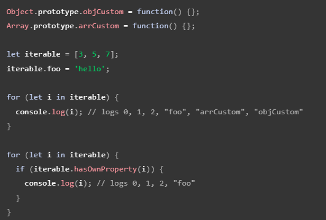

# JavaScript

## feature

* high-level 
* garbage-collected
* interpreted or just-in-time compiled
* multi-paradigm 多范型
  * procedural programming
  * object-oriented programming
  * functional programming
* first-class functions
  * functions are simply treated as variables
    * we can pass them into other functions and return them from functions
* dynamics
  * dynamic type
* single-threaded
* non-blocking event loop
  * 因为是单线程，不能让某个task堵死程序，所以需要callback

## JS Engine and runtime

* compilation: 需要先转成机器码，之后才能运行
* interpretation：执行一行转一行
* just-in-time interpretation （JS Engine）: 转成机器码之后马上运行
  1. parsing
     * generated AST abstract syntax tree
  2. compilation 把AST转换成machine code
  3. execution 执行machine code

### runtime in the browser

* it is the container including all the things that we need to use javaScript (in this case in the browser)
  * JS engine
    * HEAP, 存variable的地方
    * call stack
  * web APIs
  * callback queue
    * event loop - essential for non-blocking concurrency model
      * JS was single thread application, it will categorize code into sync and async
      * JS will directly run sync code and send async code to running environment (browser or node.JS)
      * sync code will be directly sent to executing queue,  async code will be sent to executing queue when conditions are satisfied.
      * if executing queue is empty, it will check whether any sync code is ready to be executed **(event loop)**

### runtime in NodeJS

* JS Engine
  * HEAP, 存variable的地方
  * call stack
* C++ Bindings & Thread Pool
* callback queue
  * event loop - essential for non-blocking concurrency model

## Execution contexts and the call stack

* procedure
  1. creation of global execution context (for top-level code)
     * which is not inside a function

ES5 - ES6 - .... - ES11

ES就是JS的别名 ECMAScript

## tag

1. script


# fundamental

1. let, const, var

   * const 常量
   * let 变量
   * var 
   * 也可以不用声明关键词（会默认使用var），但是最好不要这样 (**在strict mode下不可以**)
     * 因为这样默认建立global variable

2. operators

   * = assignment operator
   * +-*/ 加减乘除
     * +可以用于合并str
     * += -= *= /=
     * ++ --
   * 2 ** 3 = 2 * 2 * 2 power
   * `< > <= >= ==`comparison operator

3. operator precedence

   * https://developer.mozilla.org/en-US/docs/Web/JavaScript/Reference/Operators/Operator_precedence

4. Strings and Template literals

   * string concatenation `"AAA " + "BBB " + Variable` 

   * template 

     ```
     `AAA BBB ${ss}` 
     ```

5. type conversion and coercion

   * coercion 强迫
     * ‘1’ + 1 = ‘11’ **加号**会把数字强转str
     * ‘23’ - ‘10’ - 3 = 10 **减号**会把str强转数字

6. truthy and **falsy** values

   * 5 falsy value
     * 0， ‘’， undefined，null， NaN

7. === VS ==

   * === strict equal  '18' == 18 --> False
   * == **coercion** equal '18' == 18 --> True

8. prompt

   * 弹出框的输入框
   * `const input = prompt("how old are you?");`

9. logic operator

   * ! && ||

10. switch statement

    ```
    switch (statement){
    	case 'AAA':
    		...
    		break;
    	case 'BBB':
    		...
    		break;
    	default:
    		...
    }
    ```

11. statements and expressions

12. ternary operator

    `<statement> ? <true part>: <false part>`

13. strict mode

    `'use strict'` 打开就对了

    * 有两个好处 (让这个语言更加formal)
      1. 会禁止一部分行为
      2. 不会存在silent fail 的情况

14. function

    ```javascript
    // function declaration
    function <functionName>(<params>) {
    	...
    }
    
    // function expression
    const <functionName> = function (<params>) {
        ...
    }
    
    // Arrow function
    const <functionName> = (<params>) => {
        ...
    }
    ```

    * arrow function 是function expression的语法糖
    * function declaration 可以在声明前使用 (hoisting)
      * 但是我仍然不觉得这个是个好的选择

15. arrays

    ```js
    const <valName> = new Array(<params1>， )
    // or
    const <valName> = []
    // 甚至
    const <valName> = Array(<initial params>)
    ```

    * [Array, New Array(), []的区别和使用](https://www.jianshu.com/p/75a45851b655)

    ```
    .push() 结尾塞一个
    .unshift() 开头塞一个
    .pop() remove & return 结尾的一个
    .shift() remove & return 开头的一个
    .indexOf() return第一个匹配的element的index
    .includes() return是否存在匹配的element
    ```

16. objects

    ```js
    // declaration
    const <objName> = {
    	<key1>: <val1>,
    	<key2>: <val2>,
    	...
       <funcName>: function(){
           // 可以直接使用obj中的variable
           // 通过 this
           // 但是 arrow function 不可以用this
           console.log(this.<key1>)
       },
    }
    
    // retrieve
    .<keyName> // dot notation 不可拼接
    ['<keyName>'] // bracket notation 可以拼接
    
    
    ```

17. loop

    ```
    for(let i=0;i<10;i++){
    	...
    }
    for(let i of <array>) {
    	...
    }
    
    while() {
    	...
    }
    
    // break
    // continue
    ```

# Editor Setup

## VS Code

1. prettier

   1. formatting code

   * .pretierrc

     ```
     {
     	"singleQuote": true
     }
     ```

     

2. snippet

   1. 输入简写

   * file -> preference -> config user snippets

3. live server

   1. 根据代码修改 实时刷新带页面

4. nodejs

# HTML & CSS

## HTML

1. html
   1. head - head中的东西不会直接显示在页面中
      1. title - 就是个title
      2. meta - 做基础config的地方
      3. style - 写css的地方
      4. link - import css文件
         * href： 文件路径
   2. body
      1. h1 - heading
         * 还有h2- h6，越来越小
      2. p - paragraph
         * class - 设置样式和定位
         * id - 设置样式和定位，必须unique
      3. a - anchor 超链接
         * href - 要跳转的链接
      4. img - image
         * src - 图片的链接
      5. input
         * type：text，password, email ...
         * placeholder

## CSS

* features

  * background-color
  * font-family
  * font-size
  * color
  * border
  * box-sizing
  * box model
    * margin
    * padding
    * width
    * height
    * border

* selector

  * tag

    `<tagName> {...}`

  * class

    `.<className> {...}`

  * id

    `#<Id> {...}`

  * all

    `* {...}`


# DOM Manipulation

* Document Object Model
  * structures representation of html document
  * allows JavaScript to access html elements and styles to manipulate them

* `document.querySelector('<param>')`
  * `document.querySelectorAll('<param>')`
    * 会返还所有匹配的element
  * `getElementById`
    * 用这个就不需要在开头写#了
  * param和css的selector一样
  * textContent: 显示的内容
  * value: 存储的val
  * style
    * feature 都是camel style
      * background-color -> backgroundColor
  * classList
    * 所有class的list
    * 可以想list一样操作，比如`remove("<className>")`
      * `toggle('<className>')` 没有就加上 有就删掉
  * `.addEventListener('<type>', <callbackFunc>)`
    * type can be:
      1. click
      2. keydown
    * callback function有入参
      * event：包含所有需要的信息
* emoji `windows + .`
* refactor code
  * [Dry principle](https://en.wikipedia.org/wiki/Don%27t_repeat_yourself) (**Don't repeat yourself**)
* modal window
  * 弹窗

# How JS works

## variable environment

## scope

1. global scope

   * 对let const 和 var都生效

2. function scope

   * 对let const 和 var都生效

3. block scope (ES6)

   * if loop

   * 这个scope仅对let 和 const生效
     * var声明的变量在scope外仍然生效

* scope chain
  * inner scope can access the outer scope
  * the order of call does not affect the scope chain

## Hosting [变量提升](https://juejin.cn/post/7007224479218663455)

* 在执行代码前，js会进行预编译。这个阶段js收集了所有的variable name并declare。

  * 这样可以有效提升js脚本的运行速度。

  * var和function关键词是早期js语言的产物，所以存在比较特殊的问题：可以先使用 后定义
    * 变量 var
    
      ```js
      num = 6;
      console.log(num); // returns 6
      var num;
      --------------------------------------------
      console.log(num); // returns undefined
      var num = 6;
      ```
    
    * 方法 function
      ```javascript
      testFunc(); // return 2
      function testFunc() {
          console.log(2);
      }
      ```
    
    * 并且var和function声明的变量和方法**xxx**可以通过**window.xxx**的方式获取到

  * 通过**let**和**const**变量声明的变量和方法不可以进行上述操作

    * 因为let和const从设计上避免了一些反直觉的编程习惯(ES6)

      ```js
      num = 6;
      console.log(num); // Uncaught ReferenceError: Cannot access 'num' before initialization
      var num;
      --------------------------------------------
      console.log(num); // Uncaught ReferenceError: Cannot access 'num' before initialization
      let num = 6;
      ```

      * 增加一个在hoisting时的状态TDZ （temporal dead zone）
        * 用于检查代码是否执行到变量已经声明的位置。

    * 这也是为什么**推荐let**而不是var的原因

## this keyword

* 如果method属于某个object时，this指代这个object

  ```js
  const obj = 
  {
      name: "test",
      testFunc: function() {
          console.log(this.name);
      }
  }
  obj.testFunc(); // return "test"
  ```

* 如果是正常声明的method，那么this没有任何指代，就是undefined

  ```js
  function testFunc () {
    console.log(this);
  }
  testFunc(); // return undefined
  ```

* arrow method的this是定义这个method时的scope中的this，比如在global scope中，arrow method的this会获取到window。

  * object declaration并不是一个scope，所以obj中的arrow method的this还是window
    * scope recap：global，function and block（ES6）

* 在事件Event Hanlder中，this 表示接收事件的元素。

* 可以自行绑定object （感觉没啥用）

  ```js
  let person1 = {
    firstName: "Test",
    fullName: function() {
      return this.firstName + " " + this.lastName;
    }
  }
  let person2 = {
    firstName:"John",
    lastName: "Doe",
  }
  console.log(person1.fullName.call(person2));  // return "John Doe"
  ```

## primitives VS objects (reference types)

* primitives 
  * number string boolean undefined null symbol bigint
  * 直接存在call stack中
  * variable指向的是具体的值
* obejcts
  * array object set map ....
  * 存在heap中
  * variable指向的是一个heap中的地址
  * clone一个object
    * 浅拷贝：`let newObj = Object.assign({}, <preObj>)`
    * 深拷贝： // todo

# Data structure & modern operators and strings

## De-structuring Array

* basic

  ```js
  const arr = [1,2,3];
  // destructure
  const [a,b,c] = arr;
  // 等价于
  const a = arr[0];
  const b = arr[1];
  const c = arr[2];
  ```

* 也不用必须全取出来

  ```js
  let arr = [1,2,3];
  // 可以只取一部分
  const [a,b] = arr; // a = 1, b = 2
  // 可以跳着取
  const [a, , c] = arr; // a = 1, c = 3
  ```

* 可以用于swap
  ````js
  [arr[0], arr[1]] = [arr[1], arr[0]]
  ````

* nested de-structuring

  ```js
  const nested = [2,4,[5,6]]
  const [i, , [j, k]] = nested; // i = 2, j = 5, k = 6
  ```

* default values

  ```js
  const [p,q,r] = [8, 9] // p = 8, q = 9, r = undefined
  const [p=1, q=1, r=1] = [8, 9] // p = 8, q = 9, r = 1
  ```

## De-structuring Object

* basic

  ```js
  const obj = {
      name: "Mike",
      age: 24,
      gender: "male"
  }
  const {name, gender} = obj; // name = "Mike", gender = "male"
  // 可以换名字
  const {name: newName, gender: newGender} = obj; // newName = "Mike", newGender = "male"
  ```

* default value

  ```js
  const {job="None"} = obj; // job = "None"
  ```

* mutating variables

  ```js
  let a = 111;
  let b = 999;
  cosnt obj = {a:23, b:7, c:14};
  // 不是声明 仅为赋值时，需要加括号，要不然会被识别为block
  ({a, b} = obj); // a = 23, b = 7
  ```

* nested de-structuring

  ```js
  let obj = {a:{b:2}, c:3};
  let {a: {b}} // b = 2;
  ```

* function parameters de-structuring

  ```js
  // 好处是可以不用考虑顺序问题 （也可以设置default value）
  function testFunc({name, time, age}) {
      console.log(`${name} ${time} ${age}`);
  }
  const obj = {
      name: "Mike",
      age: 24,
      time: "10:00 am"
  }
  
  testFunc(obj) // return "Mike 10:00 am 24"
  ```

## The spread operator (ES6)

* basic

  ```js
  const arr = [7,8,9];
  const newArr = [1, 2, ...arr]; // newArr = [1, 2, 7, 8, 9]
  // 等价于
  const newArr = [1, 2, arr[0], arr[1], arr[2]]
  ```

* shallow copy

  ```js
  // array
  const arr = [7,8,9];
  const copyArr = [...arr];
  
  // object
  const obj = {
      name: "Mike",
      age: 27
  }
  const copyObj = {...obj}
  ```

* join two arrays

  ```js
  const arr1 = [7,8,9];
  const ar2 = [10, 11, 12];
  const joinedArr = [...arr1, ...arr2]
  ```

* 拆String为Char array

  ```js
  const name = "Mike";
  const charName = [...name]; // charName = ['M', 'i', 'k', 'e']
  ```

## REST pattern and parameters

* REST basic （...用在等号左边就是REST）

  ```js
  // array
  const [a, b, ...others] = [1,2,3,4,5]; // a = 1, b = 2, others = [3,4,5]
  // object
  const obj = {
      name: "Mike",
      age: 24,
      time: "10:00 am"
  }
  const {name, ...others} = obj; // name = "Mike", others = {age:24, time: "10:00 am"}
  ```

* function parameter

  ```js
  const add = function(...numbers) {
      console.log(numbers)
  }
  
  add(1,2,3,4,5,6) // return [1,2,3,4,5,6]
  ```


## short circuiting

* A || B: 
  * A 为true时，直接return A
  * A为false，B为true时， return B
  * return 第一个truly value， 如果没有truly value，return最后一个falsy value
* A && B:
  * A为false时，直接return A
  * A为true，B为false时，return B
  * return 第一个falsy value，如果没有falsy value，return 最后一个truly value

## Nullish Coalescing Operator

* https://blog.csdn.net/lzfengquan/article/details/120302244

* ?.

  * 判断obj中是否存在某成员，\<obj_name\>?.<variable_name>

  * ```js
    const obj = null
    
    obj.testVar; // Error: Cannot read properties of null
    obj?.testVar; // return undefined
    ```

* ??

  * return？？后面的值，如果？？前面是null或undefined

  * ``` js
    null ?? "123"; // return "123"
    undefined ?? "123";  // return "123"
    "" ?? "123" // return ""
    ```

  ## logical assignment operator

  * ||=, &&=, ??=, ...

  * ```js
    let a = null;
    a = a ?? 1;
    // 等价于
    a ??= 1;
    ```

  ## looping Arrays: the for-of loop

  * 基本就是java 的for in loop

  * ```js
    for (const item of items) {
        ...
    }
        
    for (const item of items.entries()) { // item = [idx, item]
        ...
    }
        
    for (const [idx, item] of items.entries()) { // using de-constructing
        ...
    }
    ```

  * 注意：js也有for in，但是含义完全不一样

    * let in & let of
      * let in是随机顺序把目标对象中的成员都遍历一遍
      * 
      * let of 是正常的遍历目标对象中存储的内容 (**这个是常用的那个**)  

## Enhanced Object literals （ES6）

* ```js
  let subObj = {};
  let arr = ["name1","name2","name3"]
  let obj = {
      // function literal
      func: function () {
          ...
      },
      // 上下等效
      func() {
          ...
      },
          
      // variable
      subObj: subObj,
      // 上下等效
      subObj,
          
          
      // variable name
      name1: xxx,
      // 上下等效
      [arr[0]]: xxx,
  };
  
  // variable
  
  ```

## Optional Chaining ?.

* 可以避免处理报错，只需要处理是不是undefined就行了

* ```js
  if (obj && obj.subObj && obj.subObj.subSubObj){
  	console.log(obj.subObj.subSubObj.xxx);
  } else {
      console.log(undefined);
  }
  // 上下等效
  console.log(obj?.subObj?.subSubObj?.xxx);
  ```

* ?. 可以也可以用于access array 或 function

* ```js
  let obj = {}
  
  obj?.testFunc?.(param)  // return undefined
  obj?.testArr?.[1] // return undefined
  
  obj?.testFunc?.(param) ?? "no such function" // return "no such function"
  obj?.testArr?.[1] ?? "no such value" // return "no such value"
  ```

## Looping Objects: Object Keys, Values, and Entries

* Object.keys - return list of keys

  * ```js
    let obj = {one: 1, two: 2, three: 3};
    Object.keys(obj); //return ["one", "two", "three"]
    ```

* Object.values - return list of values

  * ```js
    let obj = {one: 1, two: 2, three: 3};
    Object.values(obj); //return [1, 2, 3]
    ```

* Object.entries - return list of pair of key and value

  * ```js
    let obj = {one: 1, two: 2, three: 3};
    Object.entries(obj); //return [[one, 1], [two, 2], [three, 3]
    ```

## Sets & Maps

* Set
  * has, add, delete, clear
  * iterable `for(let each of <setName>) { ... }`
* Maps
  * 和obj很像，但是key可以是任意type
  * set, get
  * iterable `for (let [key, value] of <mapName>) { ... }`
  * 和obj相比
    * 有更好的性能
    * key的type不限
    * iterable
    * size可以直接获取

## other data structure

* built-in

  * weakMap

  * weakSet

* non built-in:

  * stacks
  * queues
  * linked lists
  * trees
  * hash tables

## String

* indexing

  * `'123'[0] // return '1'`

* length

* indexOf

  * `'1223'.indexOf(2) // return 1`
  * `'1223'.lastIndexOf(2) // return 2`

* slicing

  * `'123'.slice(<start> = 0, <end(exclusive)> = 3)`
  * `'123'.slice(-2) // return '23'`

* toUpperCase & toLowerCase

* trim 删除所有空格和回车

* replace

  * https://developer.mozilla.org/en-US/docs/Web/JavaScript/Reference/Global_Objects/String/replace
  * 可以用regex，也可以str

* includes

* startsWith & endsWith

* split(' ')

* join 

  * `['12', '34'].join(' ') // return '12 34'`

* padding

  * ```js
    let test = "123"
    console.log(test.padStart(5, '+')) // return "++123"
    ```

* repeat(<times>)

# Advanced Function

## default parameter

* 不设置默认值的param，如果不传入的话就是undefined

## passing value & reference

* reference 可以在function scoop中修改外边的variable
* value 不可以
* PS: JS 不存在pass by reference，但是可以pass reference
  * 也就是说，我们不能传入一个variable的pointer
  * 但是obj本身可以直接传入

## first class and higher-order functions

* higher-order function
  * 就是function里传入function
  * 有点像控制反转，把控制process的权利交给具体的使用者

## Function returning function

* function 可以return function
* closure

## The call and apply Methods

* call 可以重新绑定this

  ```js
  <functionName>.call(<targetObject>, arg1, arg2,....,argn)
  // first argument is target object that can be used inside the function as this.
  // rest arguments are the original inputs for this function.
  ```

* apply 和call基本一致，只不过后面inputs部分变成一个array

  ```js
  <functionName>.apply(<targetObject>, [arg1, arg2,....,argn])
  // first argument is target object that can be used inside the function as this.
  // second argument is the original inputs for this function.
  ```

* 这俩functions等效

## bind method

* bind用于绑定this到一个具体的object，并返还一个绑定好this的function

  ```js
  const newFunc = <functionName>.bind(<targetObject>);
  newFunc(arg1, arg2,....,argn);
  
  // 也可以给部分arg fix value
  const newFunc = <functionName>.bind(<targetObject>, arg1);
  newFunc(arg2,....,argn);
  ```

## IIFE Immediately Invoked Function Expressions

* ES6之前的技巧，用function创建block scope。
* 现在没啥用了

## closure

* 有点类似面向对象编程了

  ```js
  function makeFunc() {
      var name = "Mozilla";
      function displayName() {
          alert(name);
      }
      return displayName;
  }
  
  // 按理说makeFunc完成后，应该就从stack里抹掉了
  // 但是因为里面的一部分东西(reference)被拿到了外层scope中，所以其实保留下来了
  var myFunc = makeFunc(); 
  
  myFunc(); // 这里可以正常运行
  // 使用variable时，会优先检查closure中是否有匹配
  ```

* a closure gives a function access to all the variables of its parent function

* 更多是处理callback的情况

  ```js
  const func = function() {
      let var1 = 1;
      setTimeout(function() {
          console.log(var1);
      }, 1000)
  }
  let var1 = 100;
  
  // 尽管setTimeout里面的function是在global EC中运行的，但是console.log的结果还是1
  // 这就是closure的作用
  ```

# Advanced Arrays

## some method

* slice and splice

  * slice 不会修改original array

  * splice会修改原本的array

    ```js
    let arr = [1,2,3,4,5];
    let subArr = arr.splice(2); // subArr = [3,4,5] and arr = [1,2]
    
    let arr = [1,2,3,4,5];
    let subArr = arr.splice(2, 2); // subArr = [3,4] and arr = [1,2,5], 后面的2代表切几个
    ```

* reverse 

  * 会修改原本的array

* concat 

  * 拼接两个arrays
  * 不会修改原本array

* join

  * 拼接array中所有的elements
  * 不会修改array

* at

  * 和[]一样，不过可以直接用-1，-2这样的index倒着取element

* forEach

  ```js
  let arr = [1,2,3,4,5]
  arr.forEach(function(curEle, curIndex, OriginalArray) { // 顺序是固定的
      ...
  })
  ```

  * P.S. forEach就是一个higher order function，里面这个callback就是个closure scope(虽然没用到)

  * P.P.S. forEach也可以用于map和set

* map & filter & reduce

  * 不会修改original array

    ```js
    let arr = [1,2,3,4,5]
    // map method
    arr.map(function(each, idx, arr) {
        return -1 * each;
    }) // return [-1,-2,-3,-4,-5]
    
    // filter method
    arr.filter(function(each, idx, arr) {
        return each > 3;
    }) // return [4,5]
    
    // reduce method
    arr.reduce(function(acc, cur, idx, arr) {
        return acc + cur;
    }, 0) // return 15, 0 is the initial value
    ```


* find method

  * 返还第一个满足条件的element

    ```js
    let arr = [1,2,3,4,5]
    arr.find(function(each, idx, arr) => {
             return each > 3;
    }) // return 4
    ```

* findIndex, 顾名思义

* some & every

  * some用于判断arr中是否有满足条件的element

  * every用于判断arr中是否**所有**element都满足条件

    ```js
    let arr = [1,2,3,4,5];
    arr.some(cur => cur >= 5) // return true, because 5 >= 5
    arr.every(cur => cur >= 5) // return false, because 1 < 5
    ```

* flat，nested arr 压平，默认压一层

* flatMap - 就是obj.map(..).flat()

* sorting arrays

  * 会默认将所有element转成str然后sort
  * 要不就传入一个comparator function

* creating arrays and fill array

  * new Array(...)

  * [...]

  * fill() 填空用的

  * ```javascript
    Array.from({length: 7}, (cur, idx) => 1); // return [1,1,1,1,1,1,1]
    ```


# Numbers, Dates, Intl and Timers

* converting and check numbers
  * 字符串转数字
    * Number(str)
    * +str - js看到+号会默认把后边的变量转换成数字
  * js不适用于精确的数字比较
    * 0.1 + 0.2 === 0.3 - return false
  * parsing
    * 可以转换不仅包含数字的str
      * Number.parseInt("30px", 10) - return 30
  * Number.isNaN - 检查obj是不是仅包含数字的str
    * return false代表是数字
  * Number.isFinite - 检查是否为number 类型
    * 还有isInteger和isFloat很多
* Math and arounding
  * sqrt
  * min & max
  * random
  * trunc
  * round
  * cell
  * floor
  * toFixed - 保留多少位小数，范围类型为str (会rounding)
* reminder operator 余数
* numeric separators
  * 1000 --> 1,000 方便查看
  * 代码中可以添加"_" 1000 = 1_000
* BigInt
  * js能正常且准确记录的整数最大值是 2 ^ 53 - 1 （54bit储存 ）
    * Number.MAX_SAFE_INTEGER
    * 超过这个范围做数值运算会不精确
  * 新版js可以使用BigInt - 在结尾加个n就行了
    * 23423432432342343235324324324323n
    * 也可以BigInt(23423432432342343235324324324323)
      * 但是作为参数的这个数字本身还是js的int，还是影响精度，所以最好就是用第一种方法
    * 这个不能用在Math lib中的方法里
* Dates
  * new Date() - get current date
  * new Date("Aug 02 2020 18:00:00") - parse
  * new Date(Y, M, D, H, M, S) - parse
  * new Date(0) - 1970 01 01 01:00:00
  * new Date(millisecond)
  * methods
    * getFullYear()
    * getMonth()
    * getDate() - return day of the month
    * getDay() - return day of week
    * getHour&getMinutes&getSecond()
    * toISOString() - 标准格式
    * getTime() - return timestamp
    * setXXX
      * FullYear & Month & .......
  * operations on dates
    * 通常可以直接使用Date.js
    * +可以将date直接转成timestemp
    * 两个date相减 - return是timestemp
* Intl - 国际化
  * date internationalizing 
    * new Intl.DateTimeFormat('en-US').format(dateObj)
    * code可以查到 - iso language table
  * numbers
    * new Intl.NumberFormat(\<code>).format(\<num>)
    * 可以处理各种单位

* timers
  * setTimeout(callback, \<milliseconds>)
    * clearTimeout(timer) - 可以提前停止timer 
  * setInterval() - 循环触发


# DOM

* insertAdjacentHTML
* innerHTML


1. 如何原生获取某一个dom节点
2. 如何原生插入一个dom element
3. css in js
4. what is SOLID
5. front end debug 工具
6. callback function的event 周期
7. git - merge 和 rebase的区别
8. 开发流程
9. css selector的specificity
10. 


# 其他topic

1. prototypal inheritance
2. event loop
3. how the dom really works

# 一些发现

* * 
  
* [map和{}的区别](https://blog.csdn.net/muzidigbig/article/details/121995777#:~:text=Map%20%E6%98%AF%E7%BA%AF%E7%B2%B9%E7%9A%84hash,key%20%E7%9A%84%E7%B1%BB%E5%9E%8B%E7%9A%84%E6%83%85%E5%86%B5%E3%80%82)
  * map是es6的产物，更接近其他语言中的map
  * object 删除的效率不如map
  * object 只能把比较基础的类型作为key，但是map没有限制


# TypeScript

# Types

* 只在编译阶段和js有区别，编译后就是js文件

* 两种运行方式

  * 将ts编译成js文件然后使用node运行js文件
  * 直接使用ts-node运行ts文件

* type cast

  ```typescript
  const input = document.getElementById("Name") ! as HTMLInputElement;
  ```

* type declaration

  ```typescript
  let var: number;
  ```

* Type

  * number: 1, 5.3, -10
  * string: 'Hi', "Hi", \`Hi\`
  * boolean: true, false, typescript 没有truthy or falsy value
  * 

* Type Inference

  * ts有一定的类型推断能力。

    ```js
    let val = 1;
    var = "1"; // 编译错误
    ```

  * 如果没有initial value，最好有个类型声明。否则会infer到any type上。

    ```js
    let val: number;
    val = 1;
    val = "1" // 编译错误
    
    let val;
    val = 1;
    val = "1" // 不会报错
    ```

* object

  * object或者{}

  * 可以自定义object type

    ```typescript
    let person: {name: string; age: number;} = {
    	name: "Some Name",
    	age: 30
    } // 仅作演示，让ts自动infer就行了
    ```

* array

  * <type_name>[]
    * e.g. string[], number[]，any[], (number|string)[]

* tuple

  * 固定长度，固定类型 [\<type1>,\<type2>, ....]

    * ```typescript
      let val: [number, string] = [1, "2"];
      val[0] = 10; // 不会报错
      val[0] = "1"; // 编译报错
      ```

* enum

  * enum \<enum_name> { \<NAME1>, \<NAME2>, ...... }
  * 默认value是从零开始的incremental number， 可以自定义

* any
  * 尽量别用，因为这相当于在写js，ts的特性一点没用。

* union type

  * \<type1> | \<type2> | ...
  * function的param也可以用

* literal types

  * 可以只接受具体的值，而不是类型

    ```typescript
    function test(input1: 'Tag1', input2: 2|3) {
        console.log(input1 + input2);
    }
    
    test("Tag1", 2);
    ```

* Type aliases / custom types

  * ```typescript
    type MyType = string | number;
    let val: MyType = "test";
    ```

* Function return type

  * void可以在这用， void的意思是不强迫return内容

    ```typescript
    function test(): void {
        ...
    }
    ```

* function as types

  * function type最好别让ts自动infer，容易出问题

  ```typescript
  function test() {
      ...
  }
      
  let val = test;
  val = 1;
  val(); // 编译不报错，runtime 报错
      
  let val2:Function = test;
  val = 1; // 编译报错
      
  let val3: () => void = test; // 也可以定义更具体的function
  let val4: (a: number) => void; // 带参数的也可以定义
  ```

  * 常用于定义callback function
    * 但是return 如果定义为void的话，你放入一个可以return的function也没关系。
      * 只是定义告诉你return 也没啥用，我不使用callback的return

* unknown type

  * 类似any，但不完全一样。需要检查type

    ```typescript
    let val1: unknown;
    let val2 = "1";
    
    val1 = 1; // 正常运行
    val1 = "1"; // 正常运行
    
    val2 = val1; // 编译报错
    
    if (typeof val1 === "string") {
      val2 = val2; // 正常运行, 就是使用前需要强制检查一下unknown的type
    }
    ```

  * 所以尽量不要用any的解决方案

* never type

  * void的子类
  * 如果function因为throw Error而停止，就会return never;
  * 只能用于type inference，不能当值用

# Compiler

* tsc <file_name> -watch
  * -watch 遇到change 自动recompile
* tsc --init
  * 初始化所在文件夹为ts project
    * 会创建一个tsconfig.json文件，用于定制compile规则
      * target - 设定js的版本
      * lib - 依赖，基本不用动，有default 
      * exclude - 哪些文件不编译
      * include - 可以指定哪些文件会被编译，如果有这个字段，就不会自动编译所有在这之外的文件了
      * sourceMap - for debugging， default=false
      * outDir - 指定compiled js file的路径
      * rootDir
      * noEmitOnError - 如果报错就不生成js文件，默认是false
      * strict - 检查所有type option，默认是true
  * 之后tsc命令可以直接compile所有在这个文件夹中的ts文件(基于tsconfig.json的配置)
    * `tsc` 

* ## debugging

  * [vs code](https://code.visualstudio.com/docs/typescript/typescript-debugging)
    * 需要安装javascript debugger插件
    * run -> start debugging -> (如果首次)选择运行浏览器 -> 配置url
    * 启动live-server
    * run -> start debugging

# New in JavaScript and TypeScript

* 和前面js的差不多，只mention不同的地方

* rest parameter

  ```typescript
  function test (...items: string[]) {
      ...
  }
  ```

* tsc也可以用于编译转换不同版本的js

# Class and Interface

## class

* creating class

  ```typescript
  class Test {
      name: string;
      
      constructor(p1: string) {
          this.name = p1;
      }
  }
  const instance = new Test("test");
  ```

* this keyword && function this && privacy control

  * privacy control
    * private protected public 

  ```typescript
  class Test {
      private name: string;
      public val: string;
      
      constructor(p1: string) {
          this.name = p1;
      }
      
      func1() {
          console.log(this.name);
      }
  }
  const instance = new Test("test");
  
  instance.func1(); // this is instanace
  
  const instance2 = {describe: instance.func1}
  instance2.describe(); // runtime error， because this is instance2 and it does not have name vairbale
  
  // so we can give func1 a param named this: Test. similiar to python class "self"
  ...
  	func1(this: Test) {
      	...
  	}
  ...
  // therefore instance2 will have compiling error
  ```

* shorthand initialization

  ```typescript
  class Test {
      private name: string;
      public val: string;
      
      constructor(p1: string, p2: string) {
          this.name = p1;
          this.val = p2;
      }
      ...
  }
      
  // shortcut
  class Test {
      constructor(private name: string, public val: string) {
      }
      ...
  }
  ```

* readonly - 只能在初始化时赋值

* inheritance - 只能extends一个class

  * override methods and properties is allowed

  ```typescript
  class TestA {
      constructor(private name: string, public val: string) {
      }
      ...
  }
      
  class TestB extends TestA {
      // can directly use testA's constructor
      // also can define its own constructor
      constructor(public newVal: number) {
          // you have to call super first in constructor
          super("name", "val");
          ...
      }
  }
  ```

* getter and setter - 和java的概念基本一致，但是语法不一样

  ```typescript
  class TestA {
      constructor(private name: string, public val: string) {
      }
      
      get name(){
          return this.name;
      }
      set name(val: string) {
          this.name = val;
      }
      ...
  }
      
  const instance = new TestA();
  instance.name; // use as variable instead of method
  instance.name = "new Name"; // use as variable instead of method
  ```

* Static properties and methods

* Abstract methods and properties

  * Abstract method 可以用在abstract class中

    ```typescript
    class Test {
        private static instance;
        ...
        static getInstance() {
            if (Test.instance) {
                return this.instance;
            }
            this.instance = new AccountingDepartment();
            return this.instance;
        }
    }
    ```

* Singleton & private constructor

## Interface

* can be used as type

```typescript
interface Test {
    name: string;
    age: number;
    greet(para1: string): void;
}

let user1: Test;
user1 = {
    name: "Max",
    age: 30,
    greet(para1: string) {
        console.log(para1);
    }
};
```

* can be implemented by other class

```typescript
interface Doable {
    name: string;
    age: number;
    greet(para1: string): void;
}

class Test implements Doable {
    name: string;
    age = 30;
    constructor(n: string) {
        this.name = n;
    }  
    greet() {
        console.log(`${this.name} ${age}`);
    }
}

let val1: Doable;
val1 = new Test("test");
```

* 可以implement多个

* interface也可以当type

* optional properties

  ```type
  interface Test {
  	name?: string;
  }
  ```

* function para with ? 代表default value是undefined

  ```typescript
  function test(a?: string) {
      console.log(a);
  }
  ```


# advanced type

* intersection types

  ```typescript
   type newType = <type1> & <type2>;
  ```

* union types

  ```typescript
   type newType = <type1> | <type2>;
  ```

  

 