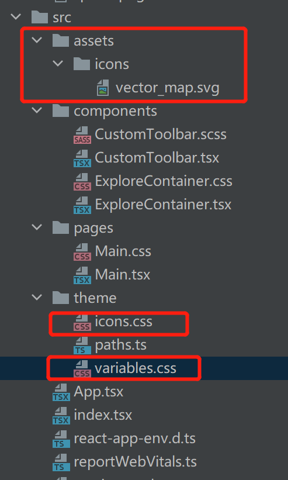

# react 笔记

* 快速初始化一个app

  ```tsx
  import { createRoot } from 'react-dom/client'
  const container = document.getElementById('root')
  const root = createRoot(container!)
  root.render(<App />)
  ```

  * 通过上面的方法将\<App/> 顶级元素绑定到dom节点中


# Ionic 开发

## App initialization

```tsx
  <IonApp>
    <IonReactRouter>
      <IonRouterOutlet>
        <Route path="/home" component={Home} exact={true} />
        <Route exact path="/" render={() => <Redirect to="/home" />} />
      </IonRouterOutlet>
    </IonReactRouter>
  </IonApp>
```

* \<IonApp> 最外层元素

* \<IonReactRouter> 就是react的router，功能基本一样
* \<IonRouterOutlet> 就是层皮，最好写上
* \<Route> 根据path参数进行页面跳转
* \<Redirect> 直接就跳转

## LifeCycle Methods

* ionViewWillEnter **进入**某页面**时**触发(包括从堆栈返回)

* ionViewDidEnter **进入**某页面**后**触发(应该是指加载完？)
* IonViewWillLeave **离开**页面**时**触发

* ionViewDidLeave **离开**页面**后**触发

## Global Config

```tsx
setupConfig({
  rippleEffect: false,
  mode: 'md',
});
```

* 这个可以和isPlatform结合，用于配置不同平台的settings

* https://ionicframework.com/docs/v5/react/config

## progressive web apps

* ionic可以配置service worker。他们会拦截所有发送的请求，如果本地已经缓存，可以直接使用本地资源。提升效率
* https://ionicframework.com/docs/v5/react/pwa

## overlay component

* 弹窗，警告之类的

* https://ionicframework.com/docs/v5/react/overlays

## customized icon

* 需要将图片放在src文件下(子文件夹也可以，但是不能放在src外边)

* 

* 创建icons.css文件写入

  ```css
  .vectorMap {
      content: url("../assets/icons/vector_map.svg");
  }
  ```

* 在variables.css文件中import icons.css变成全局样式

  ```css
  @import 'icons.css'
  ```

* 在文件中调用时，使用class参数

  ```tsx
  <IonIcon class="vectorMap"/>
  ```


# CSS

## 选择器

* element.class 选择当前class中所有的element

## 实现

1. 横向滚动 https://juejin.cn/post/6844904087943643144


# 好用的组件库

[swiper](https://swiperjs.com/demos) 横向滚动组件库，有丰富的设置。
