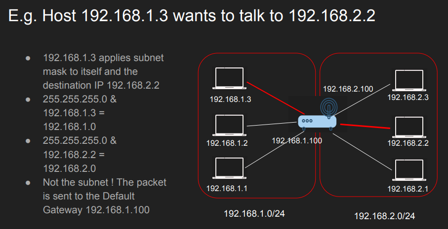
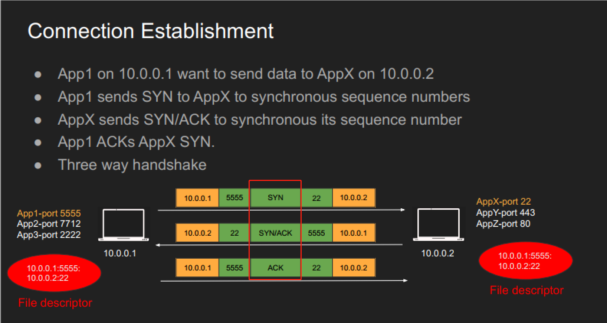
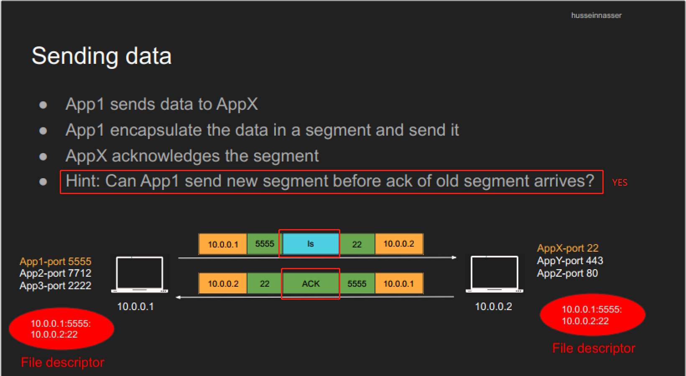
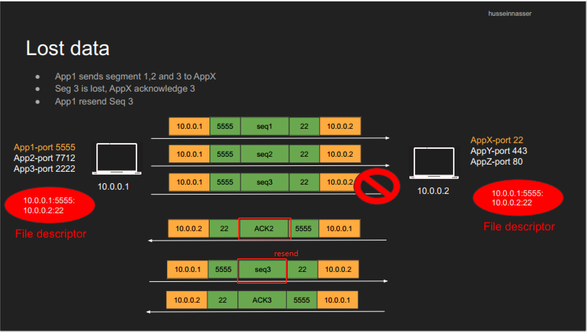
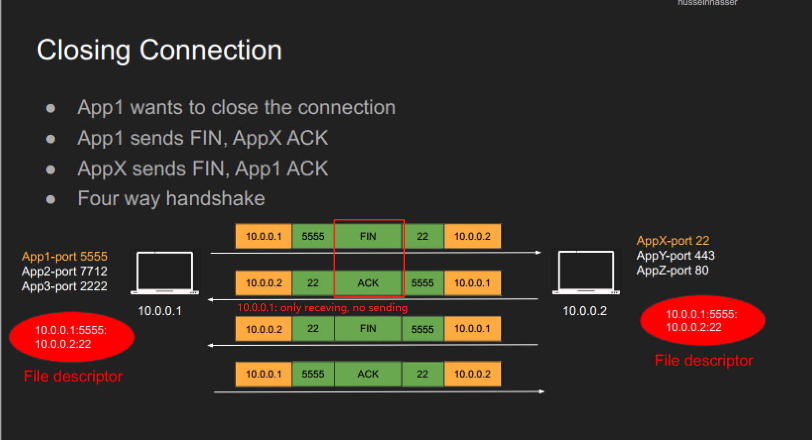
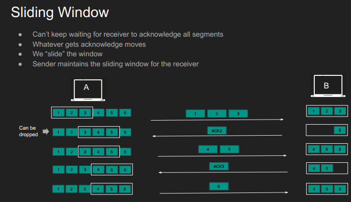

# Networking Knowledge

# Fundamentals of Networking

## Client-Server Architecture Benefits

* Servers have beefy hardware 
* Clients have commodity hardware 
  * 多个client使用同一个server
* Clients can still perform lightweight tasks 
* Clients no longer require dependencies 
* **However**, we need a communication model

## OSI model

* we need communication model
  * 统一不同传播介质 wifi fiber LTE ethernet
  * 升级也方便
* decoupled innovation
  * 解耦后，底层发生革新和变化时  不影响上层结构
* model
  * L7 application - HTTP, FTP, gRPC
  * L6 Presentation  - Encoding, Serialization
  * L5 Session - Connection establishment, TLS
  * L4 Transport - UDP/TCP (Segment) (Src / des port)
  * L3 Network - IP (Packet) (src / des IP)
  * L2 Data link - Frames, Mac address Ethernet (Frame) (src / des MAC)
  * L1 Physical - Electric Signals, fiber or radio waves
* switch 看两层（MAC） 
* router, VPN 看三层（IP）
* proxy, firewall 看四层 (port)
* load balancer, CDN, reverse proxy 看七层 (application)

### TCP/IP model是OSI的简化

* L7 L6 L5
* L4
* L3
* L2 L1

## Host to Host Communication

* MAC: lowest level of communication
  * Every device has the unique MAC
  * **但是**MAC本身不具备IP的归纳性，并且不够灵活
    * e.g. 在使用MAC发送消息时，我们没办法通过前几位缩小搜索范围
* IP: 由两部分组成，一部分定位网络，一部分定位host
  * 能够有效缩小搜索范围
  * **但是**同一个host会同时存在多个application

* Port: 用于区分不同application

# IP Address

## IP building block

* a.b.c.d/x (a.b.c.d are integers) x is the network bits and remains are host
  * Example 192.168.254.0/24 
    * The first 24 bits (3 bytes) are network the rest 8 are for host 
    * This means we can have 2^24 (16777216) networks and each network has 2^8 (255) hosts 
  * Also called a **subnet**
* subnet mask
  * 192.168.254.0/24 的 mask是255.255.255.0
  * 用于判断两个ip是否属于一个subnet
* default Gateway
  * 如果两个IP在同一个subnet中，可以直接通信
  * 如果不在，会将请求发送到gateway去
    * 这个gateway要是不知道，他会发给别的gateway，总能找到的hhh
* 

## ICMP, PING, TraceRoute

* ICMP
  * Internet Control Message Protocol
  * use IP directly, 无关port
  * ping 和 traceroute
  * 不需要listener只要这个功能没禁用就行

* Ping
  * firewall可能会挡
* traceroute
  * 显示packet传输到destination的过程中所经历的所有结点

## IP Packet

* https://study-ccna.com/ip-header/#:~:text=An%20IP%20header%20is%20a,and%20destination%20IP%20addresses%2C%20etc.

## ARP address resolution protocol

* 知道IP但是不知道MAC时，需要ARP 转换IP -> MAC
  * 流程
    1. 查看host的ARP map有没有需要的ip的MAC
    2. 如果没有，在当前network中广播
    3. 对应host会进行回复并带着它的MAC
    4. 收到后写入自己的ARP map中
  * 有可能出现ARP Poisoning

## tcpdump使用

* tcpdump [-n -v -i] [protocol] [src \<ip address\>]
* 就是没有wireshark的时候用一下

# User Datagram Protocol

## What is UDP

* Layer 4 protocol
* Ability to **address processes** in a host **using ports**
* **Simple** protocol to send and receive data
* Prior communication **not** required (double edge sword)
* **Stateless** no knowledge is stored on the host
* **8 byte** header Datagram  

### Multiplexing and Demultiplexing

* IP target hosts only
* Hosts run many apps each with different requirements
* Ports now identify the “app” or “process”
* Sender multiplexes all its apps into UDP
* Receiver demultiplex UDP datagrams to each app  

## User Datagram Structure

* [header](https://en.wikipedia.org/wiki/User_Datagram_Protocol)

### pros and cons

* pros
  * simple
  * header is small
  * use less bandwidth
  * stateless
  * less memory required (因为没有state)
  * low latency （因为没有握手，没有顺序，没有重发，没有guarantee）
* cons
  * no acknowledgement （回复）
  * no guarantee delivery
  * connection-less
  * no flow control
  * no congestion control
  * no ordered packets
  * bad security (can be easily spoofed诈骗)

# TCP Transmission Control Protocol

## What is TCP

* Layer 4 protocol
* Ability to **address** **processes** in a host **using ports**
* **“Controls” the transmission** unlike UDP which is a firehose
* **Connection**
* Requires **handshake**
* **20** bytes headers Segment (can go to 60)
* **Stateful**  

### TCP connection

* Sometimes called socket or file descriptor  
  * 需要3-way handshake
  * sequenced and ordered
  * 所有segment都需要acknowledged
  * lost segment需要retransmission

* connection 属于 layer 5 (sessions)
* client和server之间的agreement
* must create a connection to send data
* identified by 4 features
  * src/dst port
  * src/dst IP

### Multiplexing and demultiplexing  

* 和udp差不多，用port识别app
* 发送发将所有app都转成tcp链接
* 接收方再将所有tcp链接转给对应app

### connection establishment

* 

### send data

* 

* 

### closing connection

* 

## TCP segement

* [header](https://en.wikipedia.org/wiki/Transmission_Control_Protocol)

### Maximum segment size

* 通常是512 bytes，最大是1460
  * MTU maximum transmission Unit
    * default MTU是1500
    * 减去IP和TCP的header，最大是1460

## Flow Control

* receiver window（**RWND**）receiver 在header的wind size部分写下剩余的bytes

* sliding window

  

* scaling 

  * basic window size是 64KB
  * window size可以倍数膨胀
    * 1-14倍
    * 在3-way handshake的时候决定

## congestion control

* flow control可以调整服务器的请求堵塞问题，但是处理不了网络中节点的堵塞问题
* 所以我们需要一个新的window：congestion window （CWND）

### congestion notification

* 在达到上限时，中间节点会标记header中的flag ECN (Explicit Congestion Notification)
* 然后receiver会在ACK中保留flag并发送给sender
* 这个包不会丢掉，但是在后面的应该就不行了

### Algorithms

* slow start
  * CWND通常从1MSS开始
  * 在每个ACK之后CWND += 1 MSS（Maximum Segment size ）
    * 相当于一轮round-trip下来翻倍
* congestion avoidance
  * 在达到某个设定好的slow start threshold后，策略从slow start转congestion avoidance
  * 每轮round-trip后 CWND += 1 MSS
* fast recovery
  * 
* CWND不能超过RWND

### How to detect congestion

* time out，duplicate ACKs 都认为当前处于congestion
* 如果出现congestion，roughly slow start threshold 减半 (因为还包括unacknowledged packet)
  * slow start threshold 最小是 2MMS
* CWND reset to 1MSS，重新slow start

## NAT network address translation

* IPv4太少了，找了个折中的解决方案
  * 其实就是提高了port的使用率
* local network中的设备使用private IP，这些IP不能在公网中使用
* gate拥有一个private IP和一个public IP
  * 所有内部设备想要通信的话，需要先和gate通信
  * gate找一个没人用的port，和他自己的public IP重新发送这个request到公网
  * 然后收到response的时候，再把这个转给local network里的设备

* 缺点就是对外链接的上限是port的数量，但是通常也用不了那么多。没啥事

### application of NAT

* local network
* port forwarding 端口映射？
  * 比如80 -> 443 （http 转 tls）
* Layer 4 load balancing
  * HA proxy高可用
  * reverse proxying

## TCP connection states

## TCP Pros and Cons

* pros
  * **Guarantee** delivery
  * No one can send data without prior knowledge
  * **Flow Control** and **Congestion Control**
  * **Ordered Packets** no corruption or app level work
  * **Secure** and can’t be easily spoofed  
* cons
  * larger header
  * more bandwidth
  * more memory required for keeping state
  * higher latency
  * TCP meltdown?

# Overview of Popular Networking

## DNS

* host name -> ip address

* is not encrypted by default

* 4 levels (for narrating the searching range)

  * local (Resolver)

  * ANS authoritative DNS

  * TLD top level DNS

  * Root Root DNS

    | Name                  | Level       | Visit Order |
    | --------------------- | ----------- | ----------- |
    | local (Resolver)      | 4 (lowest)  | 1 (first)   |
    | ANS authoritative DNS | 3           | 4 (lastest) |
    | TLD top level DNS     | 2           | 3           |
    | Root Root DNS         | 1 (highest) | 2           |

* 很容易被攻击

  * 也有一些防御措施：DoT DoH

* dns查询工具

  * nslookup
  * dig

## TLS transport layer security

* Diffie-Hellman key exchange

  * TLS1.2：单侧加密

  * TLS1.3：双侧加密

# Networking concepts that affect backend performance

* MTU - maximum transmission unit
* 待续