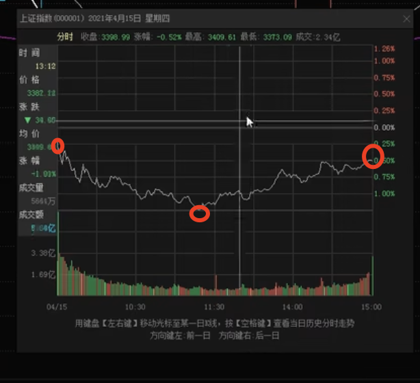
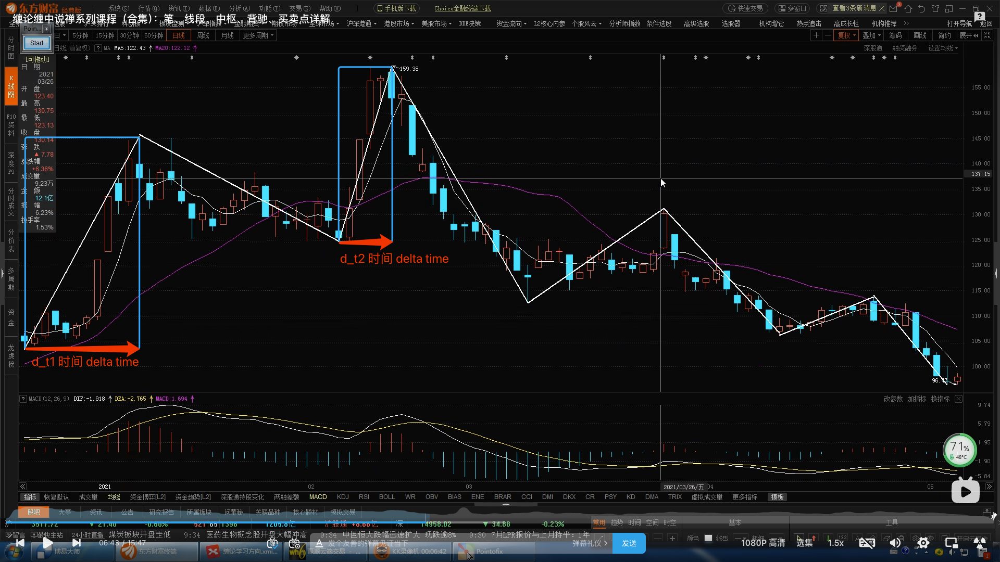
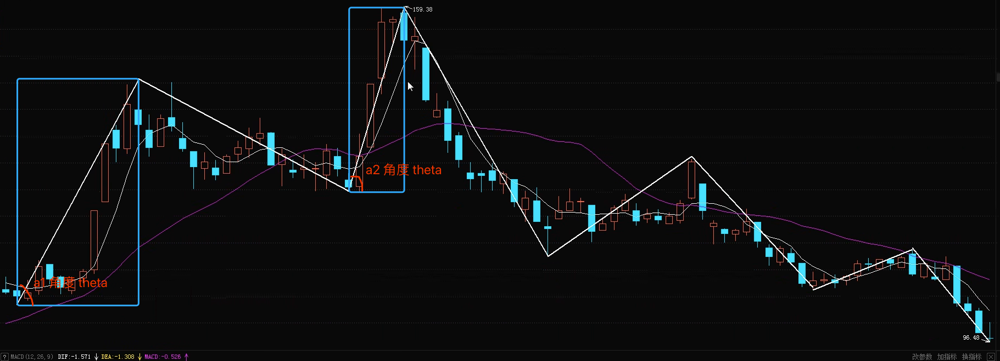
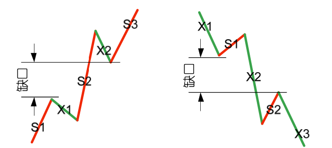
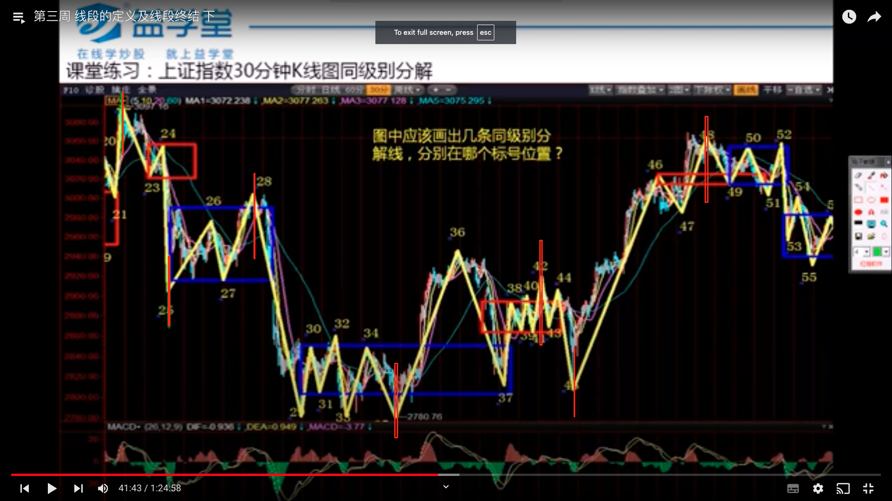
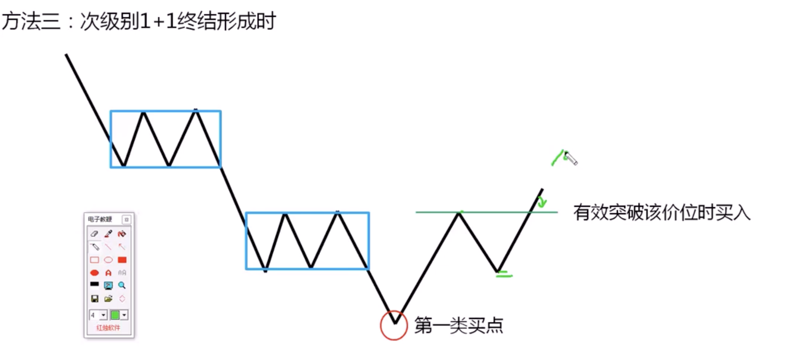
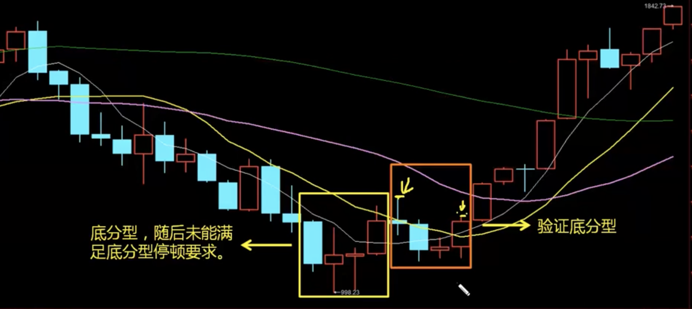

# Chanlun

# 基本概念 （非原著内容）

## K 线组合

### 单根K线

* 简化日内行情
* 使用K线简化分时图 - 停盘价，开盘价，最高价，最低价
  * 上影线 - 探高 - 和下影线相反
  * 下影线 - 探底
    * 
  * 顶分型 - 底分型 
    * 
    * 经典形态
      * 核心是第三根：实体饱满有力度，收盘在第二根线极值下（上）方； 
      * 次核心是第二根：长影线、十字星、低（高）开阳（阴）线佳； 
      * 
    * 非经典形态
      * 大阴大阳之后跟随小阴小阳，通常是中继顶底分型概率高； 
        * 大/小 阴/阳 没有具体的量化标准
          * 比如使用相对长度： 可以指代比过往x根k线的平均长度更长/更短
            * 例如：大阳线 - 大于过去20天的k线的均值的1.5倍
            * 例如：小阳线 - 小于过去20天的k线的均值的0.5倍
          * 又或者使用价格变动范围：涨跌幅(当前k线的最高-最低)占当日(至少是比当前k线区间大的级别)价格波动(大级别的最高-最低)比例较高
            * 例如：大阳线 - 70%以上
            * 例如：小阳线 - 30%以下
      * 第三根线实体力度不够； 
      * 

### 笔

* 使用笔简化K线 
  * 三种方式 chanlun仅使用k线，其他做参考
* 利用k线划分笔
  * 顶/底分型 + [1, n) 根k线 + 底/顶分型

* 利用均线走势 + k线划分笔
  * 上行笔 包含 小均线上穿大均线 （五日均线上穿二十日均线）
  * 下行笔 包含 小均线下穿大均线 
* 利用MACD走势 + k线划分笔
  * 上行笔 包含 MACD上穿0点
  * 下行笔 包含 MACD下穿0点

### 线段 

* 使用线段简化笔 - 至少需要三个笔才能组成线段

  * 将连续的**高点**和**低点**同时上移（下移）的笔合并为线段
  * 
  * 

* 如何确定线段的结束？- 用于分割历史行情

  * 当新的线段产生时，旧的线段一定结束
    * 也就是说，当上行线段后面出现连续下移的高点和低点

* 如何预测线段的结束？- 用于判断未来行情

  * todo

  

### 走势类型

* 使用走势简化线段 - 至少三个线段才能组成走势
  * 和笔 --> 线段的逻辑是一样的。在更大时间维度对趋势进行总结

## 背驰

### 走势强弱 - 可以在任意级别分析 （笔，线段，走势...）

* 空间  - 就是delta price 

  * 
  * 如果`d_p1`  > `d_p2`  = 走弱
  * 如果`d_p2` > `d_p1` = 走强
* 时间 - delta time

  * 

  * 如果 `d_t1` > `d_t2` = 变急 (走强？)
  * 如果 `d_t2` > `d_t1` = 变缓 (走弱？)
* 速度 - 上涨/下跌角度
  * 
  * $tan \theta = \frac{d_p}{d_t}$
  * $\theta = tan^{-1}\frac{d_p}{d_t}$​ 
  * 是否可以直接使用 $\frac{d_p}{d_t}$ ?
    * 可能是使用tan来处理异常，从而减少异常会模型的影响
  * 如果 a1 > a2 = 变缓 (走弱)
  * 如果 a2 > a1 = 变急 (走强)

### 背驰情况

* 任意级别趋势上行，力度(3围)走弱
* 任意级别趋势下行，力度(3围)走强
* 问题 时间空间速度并不同步走强/走弱
  * 速度是一阶导数，不需要独立分析吗？

#### MACD背驰补充分析，在3围不同步走强或走弱时

* 看柱状线面积的大小 $A^{macd}$
  * $A^{macd}_1$ > $A^{macd}_2$ = 走弱
  * $A^{macd}_2$ > $A^{macd}_1$ = 走强
  * 在$A_2$出现持平或转折的柱状后开始分析背驰
  * 

#### 均线背驰补充分析

* 均线面积 $A^{ma}$​​​
  * 通过缩口来判断划分
    * 出现缩口后分析背驰
  * $A^{ma}_1$ > $A^{ma}_2$ = 走弱
  * $A^{ma}_2$ > $A^{ma}_1$ = 走强
  * 需要在均线交点出现前判断，否则可能会追高
  * 

#### 量价VOL背驰

* 时间区间内交易总量（？均值） $A^{vol}$​​
* $A^{vol}_1$ > $A^{vol}_2$​ = 走弱
* $A^{vol}_2$ > $A^{vol}_1$ = 走强
* 但是量价只能用于顶背驰，也就是上行趋势的背驰（因为国内股票市场不能做空，其他市场都可以）
* 

## 市场节奏

### 应对上涨节奏

* 观察上涨
  * 高点上移，低点上移 （整体情况即可，不用同时）
  * 笔/线段/走势都适用，只是周期问题
* 不建议追高，等笔/线段/走势**回踩**
* 然后看次级别线段止跌
  * 看次级别背驰情况

### 应对下跌节奏

* 观察下跌
  * 同理
  * 

* 等待下跌转折
  * 新笔/线段/走势高点超过前一个的高点
  * 等回踩，且回踩不创新低 - 第二类买入点
    * 顺势而为
* 然后看次级别线段止跌 （日线笔 -》30分钟线线段？）
  * 是否出现背驰或二买的情况
  * 二买
    * 次级别不需要创新高，但是也不能创新低的回踩

### 应对盘整节奏

* 观察盘整
  * 没有明确的向上向下移动
  * 体现为震荡和没有明确移动方向
  * 

* 高抛低吸
  * 中枢上边附近离场，中枢下边附近进入
  * 中枢？
    * 中枢是由至少三笔构成的一段走势中，前后两笔在价格上有重叠部分形成的价格区间。这个价格区间展现了市场在这段时间内买卖双方力量的相对平衡，是未来走势变化的关键依据。
    * **中枢的价格区间**：具体的价格区间由**第一笔和第三笔的重叠部分确定**。如果第一笔是上涨的笔，第三笔是下跌的笔，那么中枢的价格区间为第一笔的高点与第三笔的低点之间的重叠区域；反之亦然。
  * 谨慎入，激进出
* 进入点需要看次级别线段*止跌
  * 是否出现背驰或者二买

## 投资 or 投机

* 如果有分红，且年化超过定期存款利率。可以尝试价值投资

# 缠论主要内容（基于原著和都业华教程部分）

## 分型/笔/线段

* Assumptions
  * k线，不分阳线和阴线，只看k线高低点

### 分型定义 - 顶分型&底分型

* 顶分型 (顶)： 第二k线高点是相邻三k线高点中最高的，而低点也是相邻三k线低点中最高的
* 底分型 (底)： 第二k线高点是相邻三k线高点中最低的，而低点也是相邻三k线低点中最低的
* 相邻分型之间必须满足结合律 - 不能有k线同时属于不同的分型
  * 

### 笔定义

#### 严格笔

* 两个**相邻的**顶和底之间构成一笔
* 顶与底之间的其他波动，都可以忽略不计
* 笔要满足结合律

  * 如果顶底之间必须公用一个k线，那么就违反了结合律
  * 如果顶底之间没有其他k线，最好也不要成笔
  * 所以通常笔至少为5根
  * 
* 处理包含关系 (数学公式在65课)

  * 有时会存在一k线的高低点全部都在另一个相邻k线的范围内 （图6）
  * 向上时，高点取两k线最高点，低点也取两k线最高点
  * 向下时，高点取两k线最低点，低点也取两k线最低点
    * 如何判断向上还是向下
    * 
  * 处理完所有包含关系后，3k线一共存在三种情况 （图7）
    * 分别为上升的一笔，顶分型，下降的一笔，底分型
    * 注意：上升和下降的一笔不一定为3根k线 - [1,inf)
  * 

  * 注意，分析包含关系需要按照顺序原则
    * 先用1，2根k线的包含关系确定新的k线
    * 然后再用新的k线和第三根比。
    * 
* 讨论：有可能两顶或两底成笔吗？
  * 情况一，两顶/底之间**有**其他顶和底，说明把好几笔当作一笔来看了，需要继续划分笔
  * 情况二，两顶/底之间**没有**其他顶和底，说明第一个顶或低的转折级别太小，所以忽略第一个顶或底
    * 下面是**我的理解**，因为这里的底分型不符合结合律，所以可以说是不存在
      * 然后根据情况2忽略第一个顶
      * 然后这时底就符合结合律了
      * 然后就形成了先底后顶的向上一笔
    * 
* 注意：一笔的最高点和最低点一定在两端（两个分型的顶点）
  * （原著定义）一个底不经过一个顶后就有一个更低的底，这是最典型的笔没有完成的情况
  * 

##### 严格笔的特殊笔处理 

* **WARNING！！！** 看图需要在下除权或者前除权的状态下

* 次高/低点成笔:  （要在**前复权**k线下画笔）
  * 最低底分型只有四根k线的情况
  * 后面的次低点和当前最低点之前的回弹不超过最高点和最低点的50%
  * 那么我们可以在次低点成笔
  * 
* 修正笔：行情出现变化，使得之前的笔需要进行修改或延续
  * 所有笔必须满足严格笔的定义
  * 下图答案为01 - 12 - 27
  * 47 不能成笔，因为6比4低 & 36 不能成笔，因为5比3高
    * 所以34 需要修正
  * 
* 打横笔：股价横着走，且分型是明显的对称结构
  * 什么是对称结构？
    * 在同个价格区间内反复横跳
  * **这是次级别中枢，可以不画笔直接跳过这里**
    * 相当于次级别中枢震荡
      * 也就是次级别可以成笔，且在同范围内不断往复
  * 经验 - 打横笔 - 如果次级别9-12 笔（相当于两中枢）- 那么相当于本级别一中枢
* 跳空成笔  - 前一天的收盘价和第二天的开盘价比较
  * 规定：日线不能使用这个方法
  * 针对指数： 缺口必须超过3根k线不回补
    * 30分钟/60分钟 缺口超过高点/低点的2%可成笔
    * 5分钟/15分钟 超过1%可成笔
  * 针对个股：缺口必须超过3根k线不回补
    * 30分钟/60分钟 5%
    * 5分钟/15分钟  2.5%
  * 1分钟为5分钟一半，15分钟=5分钟， 60分钟=30分钟

#### 推笔

* 首先定义走势中的最小级别，然后在最小级别上使用严格笔画出每一笔的走势，然后用笔构成线段。当前级别的线段为更大级别的笔。然后以此类推直到我们的想要的级别。 
* * 

##### 分型辅助成笔

* 大级别分型 约等于 次级别笔
* 关于周期的选择
  * 从操作的角度看，操作时只需要思考做什么周期的一笔，而不需思考配合的次级别是哪个周期合适。
  * 所以分型辅助成笔能够一定程度简化操作，提升效率

### 段定义

* 至少由三笔组成，且**前三笔**必须有重叠部分
  * 再次强调线段至少有三笔，但**并不是**连续的三笔就一定构成线段，这三笔必须有重叠部分。下图是不成线段的例子
    * 

* **被笔破坏划分**，使用分型（顶/底）序列描述，一共两种情况

  * 向上一笔开始的线段：d1g1d2g2d3g3...dngn (di为第i个底，gi为第i个顶)
    * 向上线段**被笔破坏**: 任意 i，j 且j >= i+2 and dj <= gi
    * 图中d3 g1没有形成破坏，d4 g2 形成了破坏
    * 
  * 向下一笔开始的线段：g1d1g2d2g3d3...gndn (di为第i个底，gi为第i个顶)
    * 向上线段**被笔破坏**: 任意 i，j 且j >= i+2 and gj <= di
    * 图中g3 d1没有形成破坏，g4 d2形成了破坏
    * 

* 线段被破坏，只可能发生在**有重叠部分的连续三笔中** 

  * 比如上1图的g2 - d4 （貌似要开始向下了）和2图的 d2 - g4 （貌似要开始向上了）
  * 所以也可以理解为线段破坏的充分条件为**被另一个线段破坏**
    * 充分条件定义：**如果有事物情况A，则必然有事物情况B；如果没有事物情况A而未必没有事物情况B，A就是B的充分而不必要条件，简称充分条件**
    * 所以这里指如果有另一个线段，那么前一线段必然被破坏
    * 如果没有没有另一个线段，无法确定前一线段是否被破坏

* **被线段破坏划分**，更标准的线段划分，使用笔序列描述， S为向上笔，X为向下笔

  * 选择反弹笔（上升段中的向下笔/下降段中的向上笔）作为**特征序列** (包含主要判断信息的list)

    * 因为相邻主旋律笔中一定有重叠部分，但是相邻反弹笔不一定有重叠，因为反弹笔更能代表线段性质
    * 并且，我们把特征序列中**相邻**两元素**没有重叠**的区间称为**缺口**
    * 
    * 并且把特征序列中每个元素看作一个**k线**，并将处理完**包含关系**的序列称为**标准特征序列**
      * 除非特别说明，默认后面所有特征序列都是标准特征序列

  * 向上笔开始的线段S1X1S2X2S3X3...SnXn (S为主旋律，X为特征序列)

    * 考察特征序列中的**顶分型**
      * 情况一 构成顶分型的三个元素中 （X1，X2，X3）第一(X1)和第二(X2)元素**不**存在**缺口**
        * 相当于X2出现了第一种划分的**被笔破坏**的情况，并走成了新的线段
        * 这里的顶分型X1和X2可能并不严格，会存在X1被X2包含的可能 （原文没找到相关的点，存疑）
          * 解：这里讨论的是**标准**特征序列，所以没有这个问题
          * 尽管这里是标准特征序列，但是实际情况下还是会遇到这种情况
          * 根据71课给出的定义，顶分型前后是不属于同一个特征序列的，所以不能处理包含关系
            * 只要第一和第二元素**没有缺口**就行
        * 线段在X2的最高点被破坏
        * 
      * 情况二 构成顶分型的三个元素中 （X1，X2，X3）第一(X1)和第二(X2)元素存在**缺口**
        * 相当于X3出现了第一种划分的**被笔破坏**情况（存疑）
          * 可以理解为 前一线段并**没有**在顶分型的顶**被笔破坏**，是在新的线段形成之后（甚至说是新的点段被破坏后）才被破坏
        * 假设存在一条X2开始的向下一笔开始的线段 （X2**S-1**X3**S-2**X4**S-3**）
        * 这个新线段的特这序列为 S-1S-2S-3
        * 如果这个特征序列中存在底分型，那么前一线段在X2的高点被破坏 （这个底分型无所谓有没有缺口）
        * 

  * 向下笔开始的线段X1S1X2S2X3S3...XnSn (X为主旋律，S为特征序列)

    * 考察特征序列中的**底分型**

      * 情况一 构成底分型的三个元素中 （S1，S2，S3）第一(S1)和第二(S2)元素**不**存在**缺口**

        * 相当于S2出现了第一种划分的**被笔破坏**的情况
          * 可以理解为 前一线段在底分型的底就被破坏
        * * 这里的顶分型S1和S2可能并不严格，会存在S1被S2包含的可能 （原文没找到相关的点，存疑）
            * 解：这里讨论的是标准特征序列，所以没有这个问题
            * 尽管这里是标准特征序列，但是实际情况下还是会遇到这种情况
            * 根绝71课给出的定义，顶分型前后是不属于同一个特征序列的，所以不能处理包含关系
              * 只要第一和第二元素**没有缺口**就行
        * 线段在S2的最低点被破坏
        * 
      
      * 情况二 构成底分型的三个元素中（S1，S2，S3）第一(S1)和第二(S2)元素存在**缺口**
      
        * 相当于S3出现了第一种划分的**被笔破坏**情况 
          * 可以理解为 前一线段并**没有**在底分型的底**被笔破坏**，是在新的线段形成之后（甚至说是新的点段被破坏后）才被破坏
        * 假设存在一条S2开始的向上一笔开始的线段 （S2**X-1**S3**X-2**S4**X-3**）
        * 这个新线段的特这序列为 X-1X-2X-3
        * 如果这个特征序列中存在顶分型，那么前一线段在S2的最低点被破坏（这个顶分型无所谓有没有缺口）
      
        * 

  * 注意：因为两个线段分解线（分型）左右的笔并不属于同一个线段（的特征序列），所以我们需要单独处理转折点之前的包含关系（相当于前一段的特征序列）和转折点之后这部分假设的特征序列的包含关系 **（存疑）**

    * 因为转折点之后的元素们只有两种情况
      * 新的线段没有形成，那么都属于前一段的特征序列
      * 新的线段形成了，那么都属于后一段的主旋律笔 （或者说都不属于后一段的特征序列）
      * 不管怎么，他们的属性都是一致的
    * 举例，下图2，[3，4]，5组成了顶分型，其中1，2属于第一笔，3，4，5属于第二笔
      * 所以3，4可以处理包含关系
    * 
    * 这个理解有误
      * 如果我们假设没有后面的线段，那么图中所有**向下笔**都属于**当前**线段的**特征序列**
      * 如果我们假设后面有新的选段，那么图中
        * 顶点左边的所有**向下笔**都属于**前**线段的特征序列
        * 定点右边的所有**向上笔**都属于**后**线段的特征序列

​    

  * 注意：出现分型是线段结束的前提条件

    * 前提条件**就是必须具备条件的条件，是完成下一步必备条件**。 这个条件不成立或没实现，就没有下一步的假设或可能

  * 强调：被笔破坏和被线段破坏是两种不同的情况

    * 被笔破坏：特征序列中第一和第二元之间没有缺口，之后有可能出现新的线段，或继续延续当前线段
    * 被线段破坏：新的线段成立，旧的线段被破坏

* 特征序列的深入分析

  * 只需要分析**同**特征序列中的**顶底分型**

  * 同样也只需要分析**同**一个特征序列中存在的**包含关系**，讨论两个特征序列之间的包含关系和顶底分型并没有什么意义

  * 可以使用**被笔破坏**这一条件来分辨所属的特征序列

    * 情况一 如果前一段**没**有**被笔破坏**，则没有可能出现新的线段，也就不会有新的特征序列
    * 情况二 如果前一段**被笔破坏**，且最早破坏一笔**不是**转折点开始的第一笔，那么我们可以把后面的几笔也当作前一段的特征序列

    * 情况三 如果前一段**被笔破坏**，且最早破坏一笔是转折点开始的第一笔，那么这比笔属于**中间地带**，既不属于前一段的特征序列，也不属于后一段的特征序列 （属于**被笔破坏** 但是没有**被线段破坏**）
  
* 缺口的深入分析

  * 何为缺口：就是两个相邻k线间出现**没有成交**的区间
  * 何为缺口回补：就是在缺口出现后，在缺口区间最终全部再次出现交易的**过程**
    * 根据是否回补分为如下几种情况
      * 不回补，强势走势 - 突破性缺口 （极少回补）
      * 回补后继续新高或新低，平势走势 - 中继性缺口 （一半概率回补）
      * 回补后不能新高或新低，并出现原来走势的转折，弱势走势 - 衰竭性缺口 （原来趋势发生逆转）
        * 通常调整级别会大于当前级别 - **日线**级别的衰竭性缺口至少制造一个**周线**级别调整
  

#### 判断中继分型&转折分型

* 如何判断一个分型是否大概率成笔 就等于 判断接下来的分型是否为**转折分型**，简单来讲：
* 不是当前笔中的第一个分型 (--)
  * 次级别分析是否有3卖 todo
* 形态上预估 - 
  
   1. tier 1 - 顶分型 - 第三根k线跌破第一根k线的底部，且收盘不能收到第一根k线的一半之上
   
      * 
      
      * 
   
   2. tier 2 - 顶分型 - 如果第二根k线是长上影或大阴线，且第三根k线不能以阳线收在第二根k线的一半以上
        * 
* 如何判断中继分型

  * 大线 + 两个小线
    * 

## 线段及线段的终结

* 线段的定义：至少由**三笔**构成，并且**前三笔必须有重叠**部分
  * 永远是单数，因为要朝某个方向前进
* 终结条件：1+1终结
  * 
* 解释
  * 在上涨趋势中，
    * 当某一笔无法创出**左侧临近高点的新高** - 1
      * 左侧临近高点：指当前线段中的最高点 （所有特征笔起始点的最高点）
    * 且**下一笔**创出**左侧临近低点的新低** - 1
      * 左侧临近低点：指当前线段中，所有特征笔结束点的最高点
      * 必须是**有效击穿**左侧低点
    * 则意味着上涨线段在0号点被 终结 （1+1）
  * 在下跌趋势中，
    * 当某一笔无法创出**左侧临近低点的新低** - 1
      * 左侧临近低点：指当前线段中的最低点 （所有特征笔起始点的最低点）
    * 且**下一笔**创出**左侧临近高点的新高** - 1
      * 左侧临近高点：指当前线段中，所有特征笔结束点的最低点
      * 必须是**有效击穿**左侧高点
    * 则意味着下跌线段在0号点被 终结 （1+1）
* 1+1解决不了的终结模式
  * 
  * 满足第一个1，但是不满足第二个
    * 当某一笔无法创出左侧临近高点的**新高** - 1
    * 且**下一笔**创出左侧**次低点的新低** - 1
  * 相当于4和0比较，而不是和2比较
* 什么是对高点或低点的**有效击穿** - 仅用于构建结构，并不用于买卖
  * 追加定义：只要是比操作级别大的笔，都忽略有效击穿，只要一根k线收盘价站稳就可以
  * 不用处理包含关系
  * **连续**三根k线**收盘价**站稳 (是否在前高点之上) - 注意是收盘价
    * 向上有效击穿的第三根k线为阳线，如果第三根不是就等第四根，以此类推。如果没有站稳就重新计算
    * 向下有效击穿的第三根k线为阴线，如果第三根不是就等第四根，以此类推。如果没有站稳就重新计算
    * 这两种都是有效击穿 （左图第三根为阴线，右图第四根为阴线）
    * 
    * 八号k线为有效击穿，因为6 7 8的收盘价在前低点下方，且8号为阴线
    * 
    * 注意：如果47号点尝试击穿45号点，但是没有成功（45号点没有被47号点有效击穿，但是47号点存在更低的点位）。那么之后对比的前低点仍然是45号点
      * 我们将45 和 47号点等同为同一级别低点
    * 
  
* 另一种方法 - 通过**特征序列**说明线段的终结 - （我更喜欢这个）- 原著使用这个方式，但是讲的不是很清楚
  * 要处理包含关系，在下跌线段中取低低，在上升线段中取高高
  * 在上涨线段中，把向下笔当作一根阳k线
  * 在下降线段中，把向上笔当作一根阴k线
  * 
  * 然后就可以按照笔的终结来分析 - 因为出现了顶分型，所以线段终结
  * 

* 同级别分解线

  * 通过线段的终结的标注分解线

    * 要点

      1. 应该画在线段的**极值** （最高点或最低点）上
      2. 但是，一个线段至少由三笔构成
         * 所以如果两条分解线之间只有一笔，那就选次高/低点来做分解线

      * 
      * 要做的事情就是找当前点的1+1终结，如果当前点没有，就去下一个点找1+1终结
        * 不要回头看，D图中5-6一笔可以判断3号点有分解线。然后再从6开始向后找新的1+1终结就可以了

  * 之后就不需要看分解线之前的部分了

    * 只需要看之前的中枢就可以了
    * 相当于进一步简化分析流程
    
  * 

### 思考：笔 线段 同级别分解线 之间的关系

* 

## 中枢

* 作用
  * 中枢是一切当下走势的分析基础
    * 有了中枢，才会产生直观的压力和支撑，同时也可以根据中枢的位置和破坏对走势进行下一步的预判。
      * 中枢就像是“画龙点睛”中的“睛”
  * 70%以上的快速上涨都来源与中枢震荡的结束
    * 所以识别出中枢，同时识别出中枢内部走势的变化，是捕捉快速上涨的潜力股的关键
* 定义
  * 某级别走势类型中，被至少**连续前三笔所重叠**的部分
    * 一个线段最少对应一个中枢
      * 可以骑在分解线上
        * 算前一线段的中枢
      * 因为分解线是通过后面是否存在1+1来判断的，但是中枢是要存在连续三笔有重叠就是存在的
    * 注意，如果有很多笔的话，是**前三笔**
  * 
  * 
  * 上升下降中枢的起笔不一样
    * **上中中枢起笔是下跌**
    * 反之亦然
* 错误
* 
  * 中枢不存在重叠
    * 以为4-8都在前一个中枢内，所以新的中枢只能从8开始找
      * 所以不存在6-9的中枢
  * 但是向上中枢和向下中枢是可以重叠的
    * 仅会出现在分解线附近

* 中枢延伸
  * 中枢形成之后的每一笔都经过当前中枢
  * 
* 中枢的另一种的构成方式
  * 本级别画不出笔或很难画笔，由小级别延伸而成
    * 这里是多空双方的纠结区域
  * 

* 偷懒方法

  * 通常当前级别的分解线是更高一级别的高点和低点
    * 日线 -》 周线

* 中枢的性质和作用

  1. 引力作用
     * 中枢会对所有试图离开它的走势产生引力，距离越近引力越大，级别越大引力越大

  2. 压力与支撑
     * 当股价自下方向上反弹至中枢区间时，中枢提供压力；反之提供阻力

* 简单快速的辨析法

  1. 次级别中枢：本级别图出现k线横向6根及6根以上，且互相重叠区间
  2. 次次级别中枢：本级别图中k线横向3-6根，有互相重叠区间

## 中枢背驰及盘整背驰

* 背驰-买卖点定理：任意背驰都必然制造某级别的买卖点，任意级别的买卖点都必然源自于某级别走势的背驰

* 盘背 -  盘整背驰
  * 背驰发生仅相隔一笔 a & b
  * 
* 背驰 - 中枢背驰
  * 背驰发生相隔一个中枢 a & d
  * 

* 力度比较
  * 如何定义力度
    * 长度及速度的结合
      * 通常可以用长度代替
  * 判断力度大小
    * 可以参考MACD指标的黄白线(?) 或红绿柱高度，以及红绿柱面积

## 如何判断performance

* 如何衡量买点的合理性
  * R比率 Risk Rate （越大越好）3优秀
    * $R比率 = \frac{预计最大涨幅(\%)}{承受的最大风险R(\%)}$​
    * 
    * 预计最大涨幅 e.g.
      * 找到上方提供压力的中枢区间，把它当作可能到达的利润空间
    * 要在购买之前思考好止损点 - 这是良好习惯
* 如何衡量选股水平的高低
  * 风险收益比 (越高越好) 2良好 3优秀
    * 短线vs中线
      * 短线选股以5日风险收益比衡量
      * 中线为20日
    * $5日风险收益比 = \frac{5日最大涨幅(\%)}{5日最大跌幅(\%)}$​
      * 涨幅/跌幅就是和选股日的股价比较

* 判断是否大概率成笔的辅助方法：
  * 顶底分型停顿法 (土招，仅当前使用) - 次级别一买
    * 出现顶分型后，在等一根k线，它是阴线且收盘价低于分型最后一根k线的最低价
    * 反之亦然
  
  * 验证底分型 - 次级别二买
    * 大周期分型稳定想抢与小周期
    * 比较适合周线及以上的周期
    * 之前用5日线辅助判断一笔是否终结，在月线上比较合适
  

## 一买二买三买

### 第一类买点

* 缠者，价格重叠区间也，买卖双方阵地战之区域也；禅者，破解之道也。以阵地战为中心，比较前后两段之力度大小，大者，留之，小者，去之。
* 左图：b大于a，力度没有背驰，随后进入第二个中枢，c小于b，发生背驰。然后就是一类买点
* 右图：b小于a，发生背驰，然后就是一类买点
* 

* 如何找到潜在一买

  1. 海选

     * 如果是30分钟级别，使用20日跌幅排序，找跌幅大于15%的股票

     * 如果是日线级别，使用年跌幅排序，找跌幅超过30%的股票

  2. 精选

     * 如果选择30分钟级别，保留下来的股票日线至少回抽过10日均线的个股
       * 横盘6-8根k线 （有中枢）
       * 回抽不能超过20日均线
       
     * 如果是日线级别，至少回抽10周均线
       * 横盘6-8根k线 （有中枢）
       * 回抽不超过20周均线
  
  3. 淘汰
  
     * 股性 （保留下跌前股性活跃有活性（交易量大）的个股）
       * 最优为两中枢背驰
       * 其次一中枢悬殊背驰
       * 特殊情况为中枢背驰后拉回在向下延伸，但仍然背驰

#### 一买实战

* 寻找合适级别 和 操作周期
  * 寻找新低最近的中枢，
  * 查看那个级别的macd回抽0轴
    * 黄白线回抽0轴
  
* 寻找背驰段
  * 有可能产生背驰的，下跌段那最后一笔下跌，图中蓝色笔即为背驰段
  * 

* 寻找底分型 
  * （各就各位）- 出现新低 （和最近的中枢比较）
  * （预备）- 底分型
  * （跑）-买入
    * 底分型停顿，且收盘价在前一根k线上方
    * 慌就多等等
      * 比如 这个如果前面走势太焦灼，宁愿把要求放高看这里最高的这根k线
        * 

* 设立离场原则
  * 通常为底分型最后一根k线最低点
  * 

#### 一买小结

* 一买是由于下跌力量衰竭所产生的买点，即空房力量衰竭而产生的买点，而非多方力量加入而产生的
  * 二类买点事属于多空力量里转的买点
  * 第三类买点属于乘胜追击的买点，
  * 类二买属于多方蓄势爆发的买点
* 大概率能够反弹回最近的一个中枢，但要小心一中枢背驰后有可能做第三类卖点
  * 也就是拉不回中枢
* 需要特别强大的心脏，因为第一类买点基本就是埋在最低点旁边一点点，所以买入以后通常是有恐惧的
* 道家观点
  * 盛极而衰，否极泰来
  * 第一类买点属于否极，第一类卖点属于盛极
* 如果说一买操作的难点或者说会吃亏的点
  * 下跌中枢延伸
  * 买在中继分型上
* 日线及日线以上的盘背可以搞
  * 前面有急速下跌的才可以
* 从日线一笔开始尝试，共三种买入情况
  * 日线出现两中枢背驰，或一中枢悬殊背驰
  * 30分钟或60分钟两中枢背驰
  * 30分钟或60分钟一中枢悬殊背驰
* 常用周期搭配 - 次次级别 - 次级别 - 本级别 - 高一级别
  * 1分钟 5分钟 30分钟 日线 - **用这个练习**
  * 5分钟 15分钟 60分钟 日线
  * 5分钟 30分钟 120分钟 3日线
  * 我时间少 本级别放日线吧
    * 5分钟 30分钟 日线 周线
    * 如果做日线，是日线看方向，然后在次级别看结构（中枢）（在学推笔之后）
* 各级别跌幅要求
  * 30-60分钟 1-2中枢见底 - 20日跌幅大于15% - 至少回抽10日均线
  * 日线1-2中枢见底 - 年跌幅30% - 回抽10周均线
  * 周线1-2中枢见底 - 会搞跌幅大于50% - 回抽10月均线
* 一买一般3-5成持仓
* 卖点目前可以选一笔或一段
  * 一笔就是等顶分型
  * 一段就是第二笔回调不破成本价，然后第三笔顶分型卖
    * 如果破了就成本价卖

#### 一买走势后的完全分类

* 类型一 - （普通走势）一买背驰后演变为上涨的一段

  * 
  * 特征1 第一根上涨笔会达到或略超过最后一个下跌中枢上轨
  * 特征2 回拉笔不会低于最后一个下跌中枢下轨很多
  * 特征3 第三笔会有效站稳前期高点

* 类型二 - （最强走势）一买背驰后演变为上涨的一段

  * 

  * 特征1 第一根上涨笔大幅超过最后一个下跌中枢上轨很多
  * 特征2 回拉笔不会跌破最后一个下跌中枢上轨
  * 经验 - 一般下跌过程中会有一个次级别下跌中枢 
    * （可能存在中继底分型，容易被骗到）
    * 

* 类型三 - 较弱走势 一买背驰后演变为中枢延伸
  * 
  * 特征1 第一根上涨笔无法超过最后一个中枢的上轨
  * 特征2 第三笔无法有效站稳前期高点

### 第二类买点

* 第二类买点：在第一类买点之后第一次空投反抽不创新低的点，是买入时第二有利的位置，称之为第二类买点

* 
  * 二买**不需要**底分型停顿

### 第三类买点

* 
* 
  * 一部分二买和三买重叠
  * 最好只做强势股的三买，触底反弹类的动力不够

#### 三买走势后的走势演变

1. 模式1

   1. 做第二个中枢

      * 三买位置形成了新的中枢震荡

        

      * 出现小转大并形成终结

        

      * 继续形成大幅上涨

2. 模式2

* 没讲

* 核心是找到强势一笔

  

* 三买选股策略

  

* 公式编写逻辑

  * 

### 所有终结方式的买入总结

### 辅助买点 - 类二买

* 非标准买点，在上涨图形中不一定会出现
* 定义：在第二类买点右侧（可能略高或略低），**与出现回拉形成二买那一笔共同形成第一个上涨中枢**
  * 可以存在多个类二买，所以尽量不要追涨
    * 也尽量不要超过中枢中线时买入
  * 

#### 类二买走势分类

* 向下离开中枢 （比较少）
  * 更大级别如果下跌趋势中，这种情况很容易出现
* 向上离开中枢，但是背驰
* 向上离开中枢，而且不背驰
* todo 13周 下： 讲类二买实战

#### 类二买止损位

* 

## 走势的四种终结方式

* 中枢背驰终结
  * 一买为主 + 二买为辅
* 盘整背驰终结
  * 二买为主 + 一买为辅
* 小转大终结
  * （小级别的背驰直接反映在大级别上）
  * 由于小级别的背驰，导致大级别没有产生相应背驰而终结的现象，称之为“小转大”
  * 通常只会在**急涨急跌**中出现
  * 二买为主 + 一买为辅
  * 
* 中枢无背驰直接终结
  * 三买为主 + 二买 类二买为辅
  * 

## 中枢维持

* 中枢只会被三卖/三买破坏

  * 三买破坏 - 下一个是上升中枢 -红

  * 三卖破坏 - 下一个是下降中枢 - 蓝
  * 所以在中枢不被破坏的情况下，可以多次围绕中枢进行交易
    * 向下尝试离开时可以买
    * 向上尝试离开时可以卖

* 由红变蓝的三卖 和 由蓝变红的三买 有更强的象征意义

  * 有更强的脱离当前中枢震荡的可能

### 精确买点

1. 上涨中枢维持形成的第二类买点 （模式一）

   

   * 尽管次级别并没有形成新的背驰，但是因为没有出现三卖，所有我们可以认为2点有很大的概率会到中枢
     * 所有可以在二号点买入

2. 上涨中枢维持形成的第二类买点 （模式二）

   * 
   * 1-2虽然次级别只有一笔，但是幅度较大 所以可以但算一个线段。
   * 然后就和 模式一 一样了：虽然没有背驰但是在尝试会到中枢

3. 上涨中枢维持形成的第二类买点 （模式三）

   * 
   * 一样

4. 下跌中枢背驰（包括盘背）形成的第二类买点
   * 
   * 现象是第二类买点破了黄金分割线的0.618
   * 具体来讲是次级别形成了新的中枢，导致继续上涨的难度变大
   * 这种也能做，但是就不太推荐了

## 验证底分型的本质？

* 次级别二买

## 如何判断一笔下跌是否终结

* 分析思路

1. 相应级别底分型停顿出现
2. 高一级别底分型出现
3. 次级别形成1+1终结 （一笔已形成）
   * 
4. 次级别形成第二类买点
   * 小级别可以用本级别验证底分型来代替 
     * 比如30分钟的次级别5分钟太小了，就可以用30分钟验证底分型来看了

## 验证底分型的再辨析

* 出现底分型停顿的验证底分型 - 直接买就行
  * 
* 未出现底分型停顿的验证底分型 - 再等一个阳线收盘在底分型后最高点之上
  * 
* 不管什么情况，验证底分型右边k线最好都是在收盘在中间k线最高价上方

## 分型辅助成笔：盘中买 VS 收盘买？

* 盘中买 （次级别超过前高点 或者说 等一个次次级别终结）

  * 反应快，成本低

  * 风险更大

* 收盘买

  * 稳定

  * 但是成本更高

* 日线的底分型 可以约等于五分钟1+1终结

## 二买回调力度很小，要不要操作？如何操作

* 
* 首先，由于之前已经出现过巨大上涨，那么再次出现巨大上涨的概率不高。所以这里大概率会是盘背 或 形成中枢
  * 那么可以尝试类二买
* 如果真的再次出现大幅上涨，那么放弃
* 严格定义：如果次级别回调一笔没达到0.618，属于回调幅度较小，适用于本方法。
* 如果是经历了比较久的下跌，并且明显处于背驰状态下。回调幅度小也可以尝试

## 二买回调力度巨大，已经接近一买了，要不要操作，如何操作

* 

## 区间套

* 定义：利用走势的自相似性，不断使用中枢背驰定位的方法，周期上由大及小，可以从周线到日线再到30分钟，再到5分钟，1分钟，最终将买点定位在1分钟k线上的1，2，3类买点上，理论上可以在买入定位时做到买在一只股票最低点之后的几分钟内。
* 什么情况使用：在发现本级别上出现潜在1，2，3或类二买时，希望能够买在更低的位置（如果不需要买在更低可以直接使用底分型停顿法） 
  * 一般只会向下看一次，最多到1小时/30分钟，层数越多风险越高
  * 一般底分型停顿和次级别背驰出现一个就可以考虑入场了

* 区间套止损原则： 可以参照到级别的止损点，或定一个固定百分比

# 卖点

买入原则：不见兔子不撒鹰

卖出原则：该出手时必须出手

## 第一类卖点

* 在上涨中枢上方，由于上涨力度较进入中枢段衰竭而形成的卖点。（顶分型停顿）
* 卖点定位
  * 

### 第一类卖点后的回补

* 一中枢背驰一卖：操作级别调整一笔就回补
* 两中枢背驰一卖：操作级别调整一段才回补
* 那止损点怎么处理？
  * 出二卖就接着卖

### 止损点上移思路

* 利润超过5%时，止损点上移至成本？
* 二买出现时，止损点上升至二买
* 三买出现时，止损点上升至三买

* 

## 小转大卖点

* 小转大：由于快速上涨中次级别背驰导致了本级别不再产生中枢背驰终结，而直接以1+1终结的形式终结
* 上升阶段的小转大和下跌的不太一样：
  * 下跌潜在小转大的策略是可买可不买，因为可以使用二买来辅助
  * 但是上升的潜在小转大要优先卖出
* 卖出后，可以选择本级别一笔回调后回补，或者换其他股
* 如果错过了，尝试二卖
* 采用这种方式的前提是：
  * 已经经历了一个上涨中枢
  * 出现了快速上涨
  * 没出现上述两个情况的话就不考虑

## 第二类卖点

* 能卖一卖绝对不卖二卖
* 通常只会用在小转大 或者 一中枢+盘背的一卖之后 （一卖没抓到）
* 二卖通常也不会回补了，除非特别的强势。

## 第三类卖点

* 仅用于判断走势的演变方向，基本不用于操作。 

